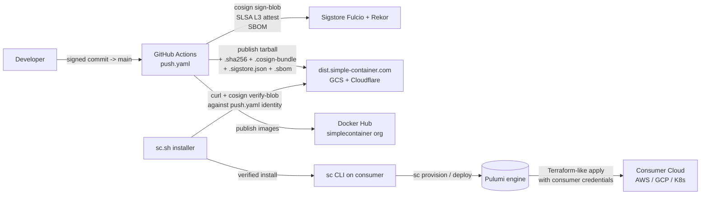

# System Architecture

Top-level view of Simple Container (`sc`): actors, actions, trust
boundaries, and how the build/release/consume chain hangs together.
This is the document for the "show me the system" Baseline check
(OpenSSF Baseline design-doc requirement). Deep-dive design records
for specific components live under [`docs/design/`](design/).

## Actors

| Actor | Lives at | Trust level |
|---|---|---|
| **Developer / Maintainer** | Local laptop; pushes to GitHub | Trusted; gated by branch protection + signed commits |
| **GitHub Actions runner** (build pipeline) | `simple-container-com/api` workflows | Trusted within Sigstore identity scope; cosign keyless cert binds output to this runner |
| **Sigstore / Fulcio / Rekor** | sigstore.dev | External — Mozilla CA-rooted; we trust the public transparency log |
| **dist.simple-container.com** | GCS bucket behind Cloudflare | Trusted distribution surface; Cloudflare DNSSEC + WAF |
| **Docker Hub `simplecontainer` org** | hub.docker.com | Trusted publish surface; org admin held by maintainers |
| **End-user CLI invoker** | Consumer laptop / CI runner | Untrusted environment; runs `sc` after `sc.sh` install verifies signatures |
| **Consumer Cloud Account** (AWS / GCP / K8s) | Customer's tenant | Provisioned by `sc` using credentials the consumer supplies; SC has no standing access |
| **Pulumi engine** | Local to the `sc` process | Embedded; trusted within the sc process boundary |
| **Cloudflare** | DNS + WAF for `simple-container.com` zone | Trusted infra surface; account-level admin held by maintainers |

## High-level actions

## Action sequences

### Release (maintainer pushes to `main`)

1. Maintainer opens PR; CI runs lint/test/Semgrep/CodeQL/fuzz; DCO check enforces `Signed-off-by:`.
2. Maintainer merges with signed commit. `push.yaml` fires on push-to-main.
3. `prepare` job calls `reecetech/version-increment` to compute the next calver.
4. `build-platforms` matrix builds `sc` per OS/arch, runs syft → CycloneDX SBOM, cosign sign-blob → bundle, `actions/attest-build-provenance` → SLSA Build L3 bundle.
5. `docker-build` matrix builds + signs each published image (caddy, kubectl, cloud-helpers, github-actions).
6. `docker-finalize` consolidates the dist bundle, runs `welder tag-release` (pushes the git tag), runs `welder deploy -e prod` (uploads to `dist.simple-container.com`), and (PR #270) runs `scripts/create-github-release.sh` to create the GitHub Release with all signed sidecars attached.

### Install (end user)

1. User runs `curl -sSL https://dist.simple-container.com/sc.sh | bash`.
2. `sc.sh` resolves the latest production tarball URL.
3. Downloads tarball + `.cosign-bundle` sidecar.
4. Runs `cosign verify-blob` against the production OIDC identity regex `^https://github\.com/simple-container-com/api/\.github/workflows/push\.yaml@refs/heads/main$`.
5. If verify passes (or cosign is absent and user opted into graceful fallback), extracts the binary and installs to `$BINDIR/sc`.
6. Optionally installs Pulumi (also SHA256-verified per PR #267).

### Provision (consumer runs `sc provision`)

1. `sc` reads consumer-side cfg files + secrets from environment / SSM / GCP Secret Manager (consumer-held credentials).
2. Computes the Pulumi stack inputs.
3. Invokes Pulumi engine in-process.
4. Pulumi applies against consumer's AWS/GCP/K8s account.
5. `sc` writes back outputs (URLs, secrets) into consumer's cfg.

## Trust boundaries

| Boundary | Crossing direction | Defense |
|---|---|---|
| **Dev → GH Actions** | Developer's signed commit reaches the build runner | Branch protection (signed commits required, ≥1 reviewer, DCO trailer enforced) |
| **GH Actions → Sigstore** | Build runner mints a cosign keyless cert via GitHub OIDC | Sigstore Fulcio validates the OIDC token; ephemeral cert bound to workflow identity |
| **Sigstore → dist** | Cosign bundle + SLSA attestation flow into the publish artifacts | Sigstore Rekor records every cert issuance in the public transparency log |
| **dist → end user** | Tarball + sidecars fetched from CDN | DNSSEC + Cloudflare WAF rate-limit; `sc.sh` verifies signatures before extraction |
| **sc CLI → consumer cloud** | `sc provision` calls cloud APIs with consumer credentials | SC has no standing credentials; consumer-supplied per-invocation |
| **External dep ingestion** | Go module proxy, pip index, Docker Hub, GitHub releases of installer tools | Hash-pinned (go.sum, --require-hashes, SHA digest); see [DEPENDENCIES.md](DEPENDENCIES.md) |

## Related design records

For deeper component-level designs, see:

- [`docs/design/cloud-api/01-system-architecture.md`](design/cloud-api/01-system-architecture.md) — cloud-api system architecture
- [`docs/design/cloud-api/02-database-design.md`](design/cloud-api/02-database-design.md) — database design
- [`docs/design/cloud-api/08-deployment-architecture.md`](design/cloud-api/08-deployment-architecture.md) — deployment architecture
- [`docs/design/container-security/component-design.md`](design/container-security/component-design.md) — container security component design
- [`docs/design/2026-04-07/branch-preview-workflow/architecture.md`](design/2026-04-07/branch-preview-workflow/architecture.md) — branch-preview pipeline
- Feature-specific design records under `docs/design/YYYY-MM-DD/`

## Related security documentation

- [SECURITY.md](SECURITY.md) — threat model (STRIDE) + attack vectors V1–V5 + responsible-disclosure channels
- [`../HARDENING.md`](../HARDENING.md) — phase-by-phase hardening tracker (Phase 1 image hardening → Phase 8 OpenSSF visibility)
- [`../SECURITY-CONTROLS.md`](../SECURITY-CONTROLS.md) — control matrix mapping STRIDE categories to specific controls
- [DEPENDENCIES.md](DEPENDENCIES.md) — dependency selection / obtaining / tracking
- [MAINTAINERS.md](MAINTAINERS.md) — project members with access to sensitive resources
