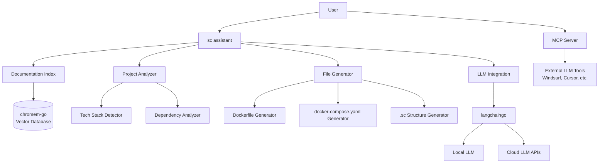

# AI-Powered Simple Container Onboarding Assistant - Implementation Plan

## 🎯 Project Overview

This plan outlines the implementation of an AI-powered project onboarding assistant for Simple Container, designed to provide a Windsurf-like experience for intelligent project setup and configuration guidance.

## 🏗️ Architecture Overview



## 🎯 Core Features

### 1. **AI Assistant Command (`sc assistant`)**
- Interactive chat interface within the CLI
- Context-aware conversation with project state
- Guided setup with step-by-step explanations
- Integration with existing Simple Container workflows

### 2. **MCP (Model Context Protocol) Interface**
- JSON-RPC server exposing Simple Container context
- Integration with external LLM tools (Windsurf, Cursor, etc.)
- Real-time project state synchronization
- Schema and example access for external tools

### 3. **Embedded Documentation Search**
- Build-time indexing of all documentation and examples
- Semantic search using embedded vector database
- Context-aware document retrieval
- Support for both exact and semantic matching

### 4. **Intelligent Project Analysis**
- Automatic detection of programming languages
- Framework and dependency analysis
- Architecture pattern recognition
- Best practice recommendations

### 5. **Automated File Generation**
- Smart Dockerfile creation based on detected tech stack
- docker-compose.yaml generation with service discovery
- Simple Container structure (.sc directory) creation
- Environment-specific configurations

## 🔧 Technical Implementation

### Phase 1: Foundation (4-5 weeks)

#### 1.1 Documentation Embedding System

**Dependencies:**
```go
require (
    github.com/philippgille/chromem-go v0.6.0
    github.com/tmc/langchaingo v0.1.12
)
```

**Core Components:**

```go
// pkg/assistant/embeddings/indexer.go
type DocumentationIndexer struct {
    vectorDB   *chromem.DB
    embedModel embeddings.Embedder
    chunks     []DocumentChunk
}

type DocumentChunk struct {
    ID       string
    Content  string
    Metadata map[string]string
    Vector   []float32
}

func (di *DocumentationIndexer) IndexDocuments(docsPath string) error
func (di *DocumentationIndexer) Search(query string, limit int) ([]DocumentChunk, error)
```

**Build Integration:**
```bash
# Add to welder.yaml
- name: generate-embeddings
  run: |
    go run cmd/embed-docs/main.go \
      --docs-path ./docs \
      --examples-path ./docs/docs/examples \
      --output ./pkg/assistant/embeddings/embedded_docs.go
```

#### 1.2 MCP Server Implementation

**Core Structure:**
```go
// pkg/assistant/mcp/server.go
type MCPServer struct {
    projectRoot string
    scConfig    *config.Config
    indexer     *embeddings.DocumentationIndexer
}

type MCPRequest struct {
    Method string      `json:"method"`
    Params interface{} `json:"params"`
    ID     string      `json:"id"`
}

type MCPResponse struct {
    Result interface{} `json:"result,omitempty"`
    Error  *MCPError   `json:"error,omitempty"`
    ID     string      `json:"id"`
}

// MCP Methods
func (s *MCPServer) GetProjectContext() (*ProjectContext, error)
func (s *MCPServer) SearchDocumentation(query string) ([]DocumentChunk, error)
func (s *MCPServer) GetSupportedResources() ([]ResourceInfo, error)
func (s *MCPServer) GenerateConfiguration(request GenerateConfigRequest) (*GeneratedConfig, error)
```

#### 1.3 CLI Integration

**New Assistant Command:**
```go
// pkg/cmd/cmd_assistant/assistant.go
type AssistantCmd struct {
    rootCmd    *root_cmd.RootCmd
    mcpServer  *mcp.MCPServer
    indexer    *embeddings.DocumentationIndexer
    analyzer   *analysis.ProjectAnalyzer
}

func NewAssistantCmd(rootCmd *root_cmd.RootCmd) *cobra.Command {
    cmd := &cobra.Command{
        Use:   "assistant",
        Short: "AI-powered project onboarding assistant",
        Long:  "Interactive assistant for Simple Container project setup and configuration",
    }
    
    cmd.AddCommand(
        newChatCmd(),      // Interactive chat mode
        newMCPCmd(),       // Start MCP server
        newSetupCmd(),     // Automated project setup
        newAnalyzeCmd(),   // Project analysis
    )
    
    return cmd
}
```

### Phase 2: Project Analysis & Generation (3-4 weeks)

#### 2.1 Project Analysis Engine

**Tech Stack Detection:**
```go
// pkg/assistant/analysis/detector.go
type ProjectAnalyzer struct {
    detectors []TechStackDetector
}

type TechStackDetector interface {
    Detect(projectPath string) (*TechStack, error)
    Priority() int
}

type TechStack struct {
    Language     string            `json:"language"`
    Framework    string            `json:"framework"`
    Runtime      string            `json:"runtime"`
    Dependencies []Dependency      `json:"dependencies"`
    Architecture string            `json:"architecture"`
    Metadata     map[string]string `json:"metadata"`
}

// Detector implementations
type NodeJSDetector struct{}
type PythonDetector struct{}
type GoDetector struct{}
type JavaDetector struct{}
type PHPDetector struct{}
type DockerDetector struct{}
```

**Analysis Implementation:**
```go
func (pa *ProjectAnalyzer) AnalyzeProject(projectPath string) (*ProjectAnalysis, error) {
    analysis := &ProjectAnalysis{
        Path:      projectPath,
        Timestamp: time.Now(),
    }
    
    // Detect tech stacks
    for _, detector := range pa.detectors {
        if stack, err := detector.Detect(projectPath); err == nil {
            analysis.TechStacks = append(analysis.TechStacks, *stack)
        }
    }
    
    // Analyze architecture patterns
    analysis.Architecture = pa.detectArchitecture(analysis.TechStacks)
    
    // Generate recommendations
    analysis.Recommendations = pa.generateRecommendations(analysis)
    
    return analysis, nil
}
```

#### 2.2 File Generation System

**Generator Framework:**
```go
// pkg/assistant/generation/generator.go
type FileGenerator struct {
    templates map[string]*template.Template
    analysis  *analysis.ProjectAnalysis
}

type GenerationRequest struct {
    ProjectPath string
    Analysis    *analysis.ProjectAnalysis
    Options     GenerationOptions
}

type GenerationOptions struct {
    Environment     string
    CloudProvider   string
    IncludeExamples bool
    DatabaseType    string
    CacheType       string
}

func (fg *FileGenerator) GenerateDockerfile(req GenerationRequest) (*GeneratedFile, error)
func (fg *FileGenerator) GenerateDockerCompose(req GenerationRequest) (*GeneratedFile, error)
func (fg *FileGenerator) GenerateSCStructure(req GenerationRequest) (*GeneratedFiles, error)
```

**Template System:**
```go
// Embed templates at build time
//go:embed templates/*.tmpl
var templateFS embed.FS

// Example Dockerfile template for Node.js
const nodeDockerfileTemplate = `
FROM node:{{.NodeVersion}}-alpine

WORKDIR /app

{{if .HasPackageLock}}
COPY package*.json ./
{{else}}
COPY package.json ./
{{if .HasYarnLock}}
COPY yarn.lock ./
{{end}}
{{end}}

RUN {{.PackageManager}} install{{if eq .PackageManager "npm"}} --only=production{{end}}

COPY . .

{{if .BuildCommand}}
RUN {{.BuildCommand}}
{{end}}

EXPOSE {{.Port}}

CMD ["{{.StartCommand}}"]
`
```

### Phase 3: Interactive Assistant (3-4 weeks)

#### 3.1 LLM Integration with langchaingo

**LLM Wrapper:**
```go
// pkg/assistant/llm/client.go
type LLMClient struct {
    provider Provider
    model    string
    config   Config
}

type Provider interface {
    Complete(ctx context.Context, prompt string, options ...Option) (*Response, error)
    Stream(ctx context.Context, prompt string, options ...Option) (<-chan Token, error)
}

// Support multiple providers
type OpenAIProvider struct {
    client *openai.Client
}

type ClaudeProvider struct {
    client *anthropic.Client
}

type LocalProvider struct {
    endpoint string
}
```

**Conversation Management:**
```go
// pkg/assistant/chat/conversation.go
type ConversationManager struct {
    history    []Message
    context    *ProjectContext
    llmClient  *llm.LLMClient
    indexer    *embeddings.DocumentationIndexer
}

type Message struct {
    Role      string                 `json:"role"`
    Content   string                 `json:"content"`
    Metadata  map[string]interface{} `json:"metadata,omitempty"`
    Timestamp time.Time              `json:"timestamp"`
}

func (cm *ConversationManager) ProcessMessage(input string) (*Response, error) {
    // 1. Search for relevant documentation
    docs, _ := cm.indexer.Search(input, 5)
    
    // 2. Build context-aware prompt
    prompt := cm.buildPrompt(input, docs)
    
    // 3. Get LLM response
    response, err := cm.llmClient.Complete(context.Background(), prompt)
    if err != nil {
        return nil, err
    }
    
    // 4. Post-process and validate
    return cm.processResponse(response)
}
```

#### 3.2 Interactive Chat Interface

**CLI Chat Implementation:**
```go
// pkg/assistant/chat/interface.go
type ChatInterface struct {
    conversation *ConversationManager
    printer      *color.Color
    scanner      *bufio.Scanner
}

func (ci *ChatInterface) StartInteractiveSession() error {
    ci.printWelcome()
    
    for {
        ci.printer.Print("You: ")
        if !ci.scanner.Scan() {
            break
        }
        
        input := strings.TrimSpace(ci.scanner.Text())
        if input == "" {
            continue
        }
        
        if input == "exit" || input == "quit" {
            break
        }
        
        response, err := ci.conversation.ProcessMessage(input)
        if err != nil {
            ci.printer.Println("Error:", err)
            continue
        }
        
        ci.printResponse(response)
    }
    
    return nil
}
```

### Phase 4: Integration & Testing (2-3 weeks)

#### 4.1 End-to-End Integration

**Main Assistant Command:**
```go
func runAssistantSetup(cmd *cobra.Command, args []string) error {
    // 1. Analyze current project
    analyzer := analysis.NewProjectAnalyzer()
    analysis, err := analyzer.AnalyzeProject(".")
    if err != nil {
        return err
    }
    
    // 2. Start interactive conversation
    conversation := chat.NewConversationManager(analysis)
    chatInterface := chat.NewChatInterface(conversation)
    
    fmt.Println("🤖 Simple Container AI Assistant")
    fmt.Println("I'll help you set up your project with Simple Container.")
    fmt.Println("Type 'help' for commands or 'exit' to quit.\n")
    
    return chatInterface.StartInteractiveSession()
}
```

#### 4.2 MCP Server Integration

**Server Startup:**
```go
func runMCPServer(cmd *cobra.Command, args []string) error {
    server := mcp.NewMCPServer()
    
    // Register handlers
    server.RegisterHandler("get_project_context", server.GetProjectContext)
    server.RegisterHandler("search_docs", server.SearchDocumentation)
    server.RegisterHandler("generate_config", server.GenerateConfiguration)
    server.RegisterHandler("analyze_project", server.AnalyzeProject)
    
    // Start JSON-RPC server
    return server.Listen(":9999")
}
```

## 📦 Dependencies and Build Integration

### New Dependencies to Add:

```go
require (
    // Vector database and embeddings
    github.com/philippgille/chromem-go v0.6.0
    
    // LLM integration
    github.com/tmc/langchaingo v0.1.12
    
    // Additional utilities
    github.com/go-git/go-git/v5 v5.13.1 // Already exists
    github.com/spf13/afero v1.14.0      // Already exists
    
    // Template engine enhancements
    github.com/Masterminds/sprig/v3 v3.2.3
    
    // JSON-RPC for MCP
    github.com/gorilla/rpc v1.2.0
    
    // Configuration parsing
    github.com/pelletier/go-toml/v2 v2.1.1
)
```

### Welder Integration:

```yaml
# Add to welder.yaml
tasks:
  - name: generate-embeddings
    description: "Generate documentation embeddings for AI assistant"
    run: |
      echo "Generating documentation embeddings..."
      go run cmd/embed-docs/main.go \
        --docs-path ./docs \
        --examples-path ./docs/docs/examples \
        --schemas-path ./docs/schemas \
        --output ./pkg/assistant/embeddings/embedded_docs.go
    dependencies: []

  - name: build-with-ai
    description: "Build with AI assistant features"
    run: |
      welder run generate-embeddings
      welder run build
    dependencies: ["generate-embeddings"]
```

## 🎯 User Experience Flow

### 1. **New Project Setup**
```bash
$ cd my-new-project
$ sc assistant setup

🤖 Simple Container AI Assistant
I'll help you set up your project with Simple Container.

Analyzing your project...
✅ Detected: Node.js application with Express.js framework
✅ Found: package.json with dependencies
✅ Architecture: Microservice pattern detected

I can help you create:
1. Dockerfile optimized for Node.js
2. docker-compose.yaml with development setup
3. Simple Container configuration (.sc directory)

Would you like me to proceed with the setup? (y/n): y
```

### 2. **Interactive Assistance**
```bash
$ sc assistant chat

🤖 Simple Container AI Assistant
How can I help you with your Simple Container setup?

You: How do I add a PostgreSQL database to my setup?

🤖: I can help you add PostgreSQL to your Simple Container configuration. Based on your current setup, I recommend:

1. **Add to your server.yaml resources:**
   ```yaml
   resources:
     staging:
       postgres-db:
         type: aws-rds-postgres
         name: myapp-postgres-staging
         instanceClass: db.t3.micro
         allocatedStorage: 20
         # ... (shows relevant example)
   ```

2. **Reference in your client.yaml:**
   ```yaml
   config:
     uses: [postgres-db]
     env:
       DATABASE_URL: "${resource:postgres-db.connectionString}"
   ```

Would you like me to generate these files for you?
```

### 3. **MCP Integration**
External tools like Windsurf can integrate via MCP:

```json
// MCP Request from Windsurf
{
  "method": "search_docs", 
  "params": {"query": "GCP GKE setup with database"},
  "id": "1"
}

// MCP Response
{
  "result": {
    "chunks": [
      {
        "content": "GKE Autopilot setup with Cloud SQL...",
        "metadata": {"source": "docs/guides/gke-autopilot.md", "relevance": 0.95}
      }
    ]
  },
  "id": "1"
}
```

## 📅 Implementation Timeline

### **Phase 1: Foundation (4-5 weeks)**
- **Week 1-2**: Documentation embedding system and build integration
- **Week 3**: MCP server implementation and JSON-RPC interface
- **Week 4-5**: CLI integration and basic assistant command

### **Phase 2: Analysis & Generation (3-4 weeks)**
- **Week 6-7**: Project analysis engine with tech stack detection
- **Week 8**: File generation system with templates
- **Week 9**: Integration testing and refinement

### **Phase 3: Interactive Assistant (3-4 weeks)**
- **Week 10-11**: LLM integration with langchaingo
- **Week 12**: Interactive chat interface and conversation management
- **Week 13**: Advanced features and prompt engineering

### **Phase 4: Polish & Launch (2-3 weeks)**
- **Week 14**: End-to-end testing and bug fixes
- **Week 15**: Documentation and examples
- **Week 16** (optional): Performance optimization and deployment

## 🚀 Success Metrics

1. **User Onboarding Time**: Reduce from 30+ minutes to under 5 minutes
2. **Configuration Accuracy**: 95%+ of generated configurations work without modification
3. **User Satisfaction**: Windsurf-like experience with contextual help
4. **Adoption Rate**: 80%+ of new users use the assistant for initial setup
5. **Documentation Discovery**: 90%+ accuracy in finding relevant docs

## 🔄 Future Enhancements

1. **Multi-modal Support**: Image analysis for architecture diagrams
2. **Advanced Code Analysis**: AST parsing for deeper insights
3. **Integration Ecosystem**: Plugins for popular IDEs
4. **Learning System**: Improve recommendations based on usage patterns
5. **Collaboration Features**: Team setup and shared configurations

This implementation plan provides a comprehensive foundation for building a world-class AI-powered onboarding experience for Simple Container, rivaling the sophistication of tools like Windsurf while maintaining the simplicity and power that Simple Container users expect.
