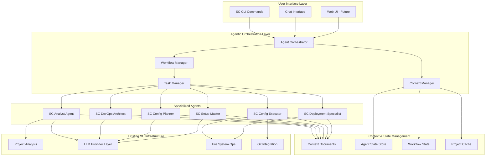
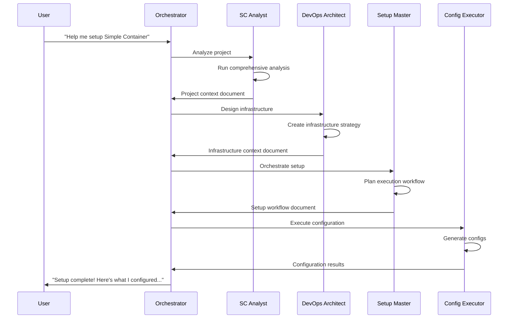
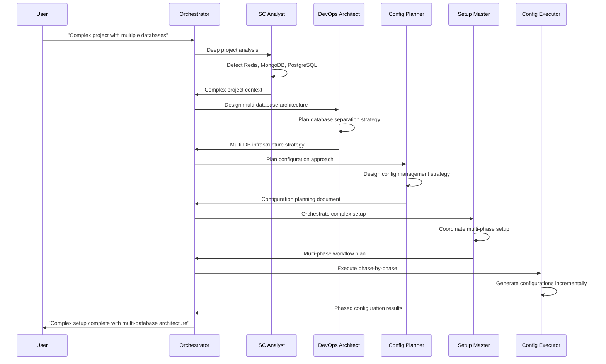

# BMAD-Inspired Architecture Design for Simple Container AI Assistant

## 🏗️ System Architecture Overview

This document specifies the technical architecture for implementing BMAD-inspired agentic capabilities within Simple Container's existing AI assistant framework.



## 📦 Core Components

### 1. Agent Orchestrator (`pkg/assistant/orchestrator/`)

**Responsibility**: Central coordination of agent workflows and user interactions.

```go
type AgentOrchestrator struct {
    workflowManager *WorkflowManager
    contextManager  *ContextManager
    taskManager     *TaskManager
    agents          map[string]Agent
    currentWorkflow *Workflow
    logger          logger.Logger
}

type Agent interface {
    ID() string
    Name() string
    Persona() AgentPersona
    Commands() []AgentCommand
    Execute(ctx context.Context, task *Task, context *AgentContext) (*TaskResult, error)
    CanHandle(task *Task) bool
}

// Core orchestration methods
func (o *AgentOrchestrator) ProcessUserRequest(request *UserRequest) (*WorkflowResponse, error)
func (o *AgentOrchestrator) ExecuteWorkflow(workflow *Workflow) error
func (o *AgentOrchestrator) HandoffToAgent(agentID string, task *Task, context *AgentContext) (*TaskResult, error)
```

### 2. Context Manager (`pkg/assistant/context/`)

**Responsibility**: Manage rich context documents and agent state persistence.

```go
type ContextManager struct {
    projectPath     string
    contextStorage  ContextStorage
    stateStore      AgentStateStore
    encryptor       crypto.Encryptor // For sensitive context data
}

type AgentContext struct {
    ProjectContext    *ProjectAnalysisContext
    PreviousResults   []*TaskResult
    UserPreferences   *UserPreferences
    WorkflowState     *WorkflowState
    ContextDocuments  map[string]*ContextDocument
    Metadata          map[string]interface{}
}

type ContextDocument struct {
    ID          string
    AgentID     string
    Title       string
    Content     string
    Metadata    map[string]interface{}
    CreatedAt   time.Time
    UpdatedAt   time.Time
    References  []string // References to other context docs
}

// Context management methods
func (cm *ContextManager) CreateContext(agentID string, task *Task) (*AgentContext, error)
func (cm *ContextManager) SaveContextDocument(doc *ContextDocument) error
func (cm *ContextManager) LoadContextDocument(id string) (*ContextDocument, error)
func (cm *ContextManager) TransferContext(fromAgent, toAgent string, context *AgentContext) error
```

### 3. Workflow Manager (`pkg/assistant/workflows/`)

**Responsibility**: Define and execute structured agent workflows.

```go
type WorkflowManager struct {
    workflows map[string]*Workflow
    templates map[string]*WorkflowTemplate
    logger    logger.Logger
}

type Workflow struct {
    ID          string
    Name        string
    Description string
    Phases      []*WorkflowPhase
    CurrentPhase int
    State       WorkflowState
    Context     *WorkflowContext
}

type WorkflowPhase struct {
    ID            string
    Name          string
    Description   string
    RequiredAgent string
    Tasks         []*Task
    Prerequisites []string
    Artifacts     []string
    NextPhase     string
}

type Task struct {
    ID            string
    Type          TaskType
    Description   string
    AgentID       string
    InputContext  *AgentContext
    OutputContext *AgentContext
    Dependencies  []string
    Status        TaskStatus
    Result        *TaskResult
}

// Workflow execution methods
func (wm *WorkflowManager) LoadWorkflow(workflowID string) (*Workflow, error)
func (wm *WorkflowManager) ExecuteWorkflow(workflow *Workflow) error
func (wm *WorkflowManager) AdvancePhase(workflow *Workflow) error
func (wm *WorkflowManager) PauseWorkflow(workflow *Workflow) error
```

### 4. Specialized Agents (`pkg/assistant/agents/`)

Each agent implements the `Agent` interface with specialized capabilities:

#### SC Analyst Agent (`sc_analyst.go`)
```go
type SCAnalystAgent struct {
    *BaseAgent
    projectAnalyzer *analysis.ProjectAnalyzer
    resourceDetectors map[string]analysis.ResourceDetector
}

func (a *SCAnalystAgent) Execute(ctx context.Context, task *Task, context *AgentContext) (*TaskResult, error) {
    switch task.Type {
    case TaskTypeAnalyzeProject:
        return a.executeProjectAnalysis(ctx, task, context)
    case TaskTypeDetectResources:
        return a.executeResourceDetection(ctx, task, context)
    case TaskTypeAssessComplexity:
        return a.executeComplexityAssessment(ctx, task, context)
    }
}
```

#### SC DevOps Architect (`sc_devops_architect.go`)
```go
type SCDevOpsArchitectAgent struct {
    *BaseAgent
    cloudProviders []clouds.CloudProvider
    templates      map[string]*InfrastructureTemplate
}

func (a *SCDevOpsArchitectAgent) Execute(ctx context.Context, task *Task, context *AgentContext) (*TaskResult, error) {
    switch task.Type {
    case TaskTypeDesignInfrastructure:
        return a.executeInfrastructureDesign(ctx, task, context)
    case TaskTypeSelectDeploymentStrategy:
        return a.executeDeploymentStrategy(ctx, task, context)
    case TaskTypeOptimizeResources:
        return a.executeResourceOptimization(ctx, task, context)
    }
}
```

#### SC Setup Master (`sc_setup_master.go`)
```go
type SCSetupMasterAgent struct {
    *BaseAgent
    orchestrator   *AgentOrchestrator
    workflowManager *WorkflowManager
}

func (a *SCSetupMasterAgent) Execute(ctx context.Context, task *Task, context *AgentContext) (*TaskResult, error) {
    switch task.Type {
    case TaskTypeOrchestrateSetup:
        return a.executeSetupOrchestration(ctx, task, context)
    case TaskTypeCoordinateAgents:
        return a.executeAgentCoordination(ctx, task, context)
    case TaskTypeValidateWorkflow:
        return a.executeWorkflowValidation(ctx, task, context)
    }
}
```

## 🗂️ Directory Structure

```
pkg/assistant/
├── orchestrator/           # Agent orchestration system
│   ├── orchestrator.go    # Main orchestrator implementation
│   ├── types.go           # Core types and interfaces  
│   └── registry.go        # Agent registry management
├── context/               # Context management system
│   ├── manager.go         # Context manager implementation
│   ├── documents.go       # Context document handling
│   ├── storage.go         # Context persistence layer
│   └── transfer.go        # Agent-to-agent context transfer
├── workflows/             # Workflow management system  
│   ├── manager.go         # Workflow manager implementation
│   ├── templates/         # Predefined workflow templates
│   │   ├── simple-setup.yaml
│   │   ├── complex-multidb.yaml
│   │   └── enterprise-setup.yaml
│   ├── phases.go          # Workflow phase management
│   └── execution.go       # Workflow execution engine
├── agents/                # Specialized agent implementations
│   ├── base_agent.go      # Base agent with common functionality  
│   ├── sc_analyst.go      # SC Analyst Agent
│   ├── sc_devops_architect.go  # SC DevOps Architect
│   ├── sc_config_planner.go    # SC Config Planner
│   ├── sc_setup_master.go      # SC Setup Master
│   ├── sc_config_executor.go   # SC Config Executor
│   └── sc_deployment_specialist.go # SC Deployment Specialist
├── tasks/                 # Task definitions and execution
│   ├── types.go           # Task type definitions
│   ├── executor.go        # Task execution engine
│   └── templates/         # Task templates
└── bmad/                  # BMAD-specific integration
    ├── integration.go     # Integration with existing assistant
    ├── compatibility.go   # Backward compatibility layer
    └── migration.go       # Migration utilities
```

## 💾 Context Document Schema

### Project Context Document
```yaml
# .sc-analysis/project-context.md
metadata:
  agent_id: "sc-analyst"
  task_id: "analyze-project-20241016-001"
  created_at: "2024-10-16T14:06:35Z"
  project_path: "/path/to/project"
  
project_analysis:
  language: "Go"
  framework: "Cobra CLI + Gin HTTP"
  architecture_pattern: "standard-web-app"
  complexity_score: 8.2
  project_size: "medium"
  
detected_resources:
  databases:
    - type: "redis"
      confidence: 0.80
      purpose: "cache"
      connection_pattern: "redis://redis:6379"
      sources: ["main.go", "config/redis.go"]
    - type: "mongodb"
      confidence: 0.80
      purpose: "primary_database"
      connection_pattern: "mongodb://mongo:27017/app"
      sources: ["models/", "repositories/"]
  
  storage:
    - type: "s3"
      confidence: 0.70
      purpose: "cloud_storage"
      access_pattern: "aws-sdk"
      sources: ["handlers/upload.go"]
  
  environment_variables:
    count: 17
    categories:
      service_config: 8
      authentication: 4
      development: 3
      database: 2
    critical_vars:
      - "DATABASE_URL"
      - "REDIS_URL"
      - "AWS_ACCESS_KEY_ID"
      - "JWT_SECRET"

recommendations:
  deployment_type: "single-image"
  infrastructure_needs:
    - "MongoDB Atlas connection"
    - "Redis cache instance"
    - "S3 bucket configuration" 
    - "Environment variable management"
  next_agent: "sc-devops-architect"
  handoff_context: "Complex multi-resource Go microservice requiring database, cache, and storage configuration"
```

### Infrastructure Strategy Document
```yaml
# .sc-analysis/infrastructure-strategy.md
metadata:
  agent_id: "sc-devops-architect"
  based_on: "project-context-20241016-001"
  created_at: "2024-10-16T14:07:12Z"
  
infrastructure_design:
  deployment_strategy:
    type: "single-image"
    rationale: "Go microservice with external dependencies suitable for containerized deployment"
    scaling_approach: "horizontal"
    
  resource_architecture:
    primary_database:
      resource_type: "mongodb-atlas"
      configuration:
        instance_size: "M10"
        region: "US_EAST_1"
        backup_enabled: true
    cache_layer:
      resource_type: "elasticache-redis" 
      configuration:
        node_type: "cache.t3.micro"
        num_cache_nodes: 1
    storage_layer:
      resource_type: "s3-bucket"
      configuration:
        versioning_enabled: true
        encryption_enabled: true
        
  secrets_strategy:
    management_approach: "sc-secrets"
    required_secrets:
      - "DATABASE_CONNECTION_STRING"
      - "REDIS_CONNECTION_STRING"
      - "AWS_ACCESS_CREDENTIALS"
      - "JWT_SIGNING_KEY"
    
  deployment_configuration:
    environment_variables:
      NODE_ENV: "production"
      PORT: "8080"
      LOG_LEVEL: "info"
    resource_limits:
      memory: "1Gi" 
      cpu: "500m"
    health_checks:
      readiness_probe: "/health"
      liveness_probe: "/health"

handoff_instructions:
  next_agent: "sc-setup-master"
  context_summary: "Infrastructure strategy defined for Go microservice with MongoDB, Redis, and S3"
  key_decisions:
    - "Single-image deployment selected for simplicity"
    - "Managed database services chosen for reliability"
    - "SC secrets management for sensitive configuration"
  execution_ready: true
```

## 🔄 Agent Workflow Patterns

### Standard Setup Workflow


### Complex Multi-Database Workflow


## 🔌 Integration with Existing Systems

### LLM Provider Integration
```go
// Agents use existing LLM provider system
type BaseAgent struct {
    llmProvider llm.Provider
    logger      logger.Logger
    config      *AgentConfig
}

func (a *BaseAgent) GenerateResponse(ctx context.Context, prompt string, context *AgentContext) (string, error) {
    // Build context-enriched prompt
    enrichedPrompt := a.buildContextualPrompt(prompt, context)
    
    // Use existing LLM provider
    messages := []llm.Message{
        {Role: "system", Content: a.getSystemPrompt()},
        {Role: "user", Content: enrichedPrompt},
    }
    
    response, err := a.llmProvider.Chat(ctx, messages)
    if err != nil {
        return "", fmt.Errorf("LLM generation failed: %w", err)
    }
    
    return response.Content, nil
}
```

### Project Analysis Integration
```go
// SC Analyst Agent leverages existing analysis system
func (a *SCAnalystAgent) executeProjectAnalysis(ctx context.Context, task *Task, context *AgentContext) (*TaskResult, error) {
    // Use existing project analysis system
    projectPath := context.ProjectContext.Path
    analysisResult, err := a.projectAnalyzer.AnalyzeProject(ctx, projectPath)
    if err != nil {
        return nil, fmt.Errorf("project analysis failed: %w", err)
    }
    
    // Create enhanced context document
    contextDoc := &ContextDocument{
        ID:      fmt.Sprintf("project-analysis-%s", time.Now().Format("20060102-150405")),
        AgentID: a.ID(),
        Title:   "Project Analysis Results",
        Content: a.formatAnalysisResults(analysisResult),
        Metadata: map[string]interface{}{
            "analysis_version": analysisResult.Version,
            "confidence_score": analysisResult.ConfidenceScore,
            "resource_count":   len(analysisResult.Resources.Databases) + len(analysisResult.Resources.Storage),
        },
    }
    
    return &TaskResult{
        Success:     true,
        Message:     "Project analysis completed successfully",
        Artifacts:   []string{contextDoc.ID},
        NextActions: []string{"infrastructure-design"},
    }, nil
}
```

## 🎯 Performance Considerations

### Context Document Caching
- Context documents cached in memory for active workflows
- Disk persistence for workflow state across sessions
- Automatic cleanup of stale context documents

### Agent State Management
- Stateless agent design with context injection
- Workflow state persisted separately from agent state
- Efficient context transfer using references rather than full copying

### LLM Provider Optimization
- Context-aware prompt caching to reduce token usage
- Specialized prompts per agent role to improve response quality
- Batch processing for related tasks to improve efficiency

---

**Next Steps**: Review this architecture and proceed to [`IMPLEMENTATION_ROADMAP.md`](./IMPLEMENTATION_ROADMAP.md) for detailed implementation planning.
