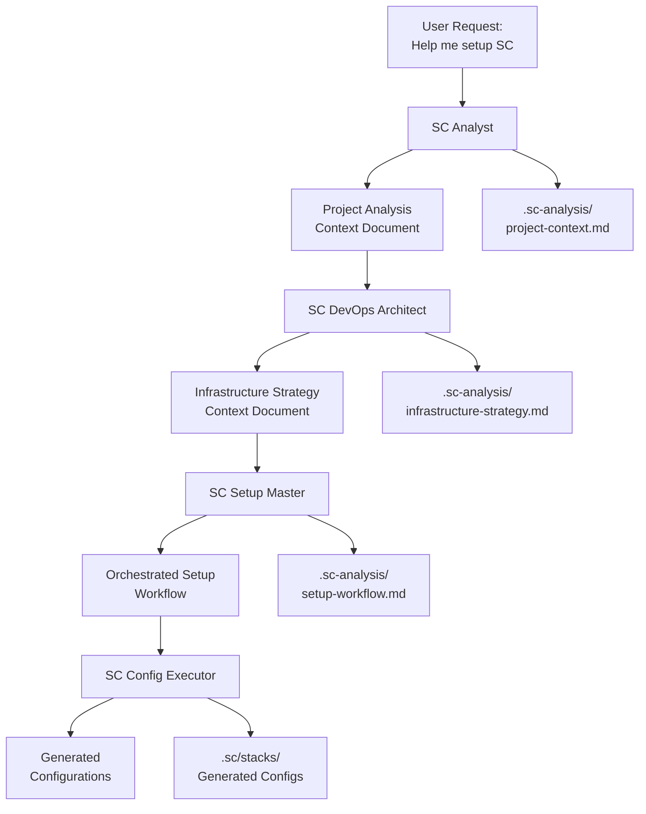

# BMAD Design Analysis for Simple Container AI Assistant

## Executive Summary

This document analyzes how BMAD-METHOD's core principles can transform Simple Container's AI Assistant into an advanced agentic system. Through detailed examination of BMAD's two-phase approach and specialized agents, we identify concrete opportunities to eliminate current UX issues and dramatically improve user experience.

## 🔍 BMAD-METHOD Core Principles

### 1. Two-Phase Architecture

**BMAD's Approach:**
- **Planning Phase**: Analyst, PM, and Architect agents collaborate to create comprehensive PRDs and Architecture documents
- **Development Phase**: Scrum Master and Dev agents work through context-rich story files

**Application to Simple Container:**
- **Analysis & Planning Phase**: SC Analyst, DevOps Architect, and Config Planner collaborate to understand project and create setup strategy
- **Execution Phase**: SC Setup Master and Config Executor implement configurations with full context

### 2. Context-Engineered Communication

**BMAD's Innovation:**
- Story files contain EVERYTHING a Dev agent needs - full context, implementation details, architectural guidance
- Eliminates context loss between agent handoffs
- No "what should I do?" questions

**Simple Container Adaptation:**
- Setup task files contain complete project analysis, detected resources, user preferences, and step-by-step guidance
- Configuration tasks include full infrastructure context and deployment strategy
- Deployment tasks have complete operational context and rollback procedures

### 3. Specialized Agent Roles

**BMAD Agent Roles:**
- **Analyst**: Market research, project briefs, brainstorming
- **PM**: Requirements gathering, PRD creation, epic/story management
- **Architect**: System design, technical specifications, architecture documents
- **Scrum Master**: Story preparation, developer handoffs, task orchestration
- **Developer**: Code implementation, testing, technical execution
- **QA**: Quality assurance, testing strategy, validation

**Simple Container Specialized Roles:**
- **SC Analyst**: Project analysis, resource detection, technology stack assessment
- **SC DevOps Architect**: Infrastructure design, deployment strategy, cloud resources
- **SC Config Planner**: Configuration strategy, environment setup, secrets management
- **SC Setup Master**: Workflow orchestration, user guidance, task coordination
- **SC Config Executor**: Detailed configuration implementation, file generation
- **SC Deployment Specialist**: Deployment execution, monitoring, troubleshooting

## 🚨 Current Simple Container AI Assistant Issues

### Problem 1: Context Loss After Analysis
**Current Behavior:**
```
🤖 [After comprehensive analysis detecting Redis, MongoDB, S3, 17 env vars]
   "What type of application are you developing?"
   "What resources does your application need?"
```

**BMAD-Inspired Solution:**
```
🧠 SC Analyst → SC Setup Master Context Transfer:
   "Project Analysis Complete. Go microservice detected with Redis cache, 
   MongoDB database, S3 storage. 17 environment variables identified. 
   Standard web app architecture. Proceeding with multi-resource setup workflow."
```

### Problem 2: Generic One-Size-Fits-All Responses
**Current Behavior:**
- Same setup questions regardless of project complexity
- No specialization based on detected technology stack
- Manual configuration required despite available analysis

**BMAD-Inspired Solution:**
- SC DevOps Architect specializes in the detected stack (Go + Redis + MongoDB + S3)
- Context-engineered setup tasks include specific configuration templates
- Automated configuration generation based on analysis results

### Problem 3: Repetitive User Input Required
**Current Behavior:**
- User must repeatedly provide same information
- No memory of previous interactions or analysis results
- Each conversation starts from scratch

**BMAD-Inspired Solution:**
- Persistent context documents maintain full project understanding
- Agent handoffs include complete context transfer
- Progressive enhancement of project understanding

## 🏗️ BMAD Architecture Patterns for Simple Container

### 1. Agent Definition Structure
```yaml
agent:
  name: "SC Analyst"
  id: "sc-analyst"  
  title: "Project Analysis Specialist"
  icon: "🔍"
  whenToUse: "Project analysis, resource detection, technology assessment"
  
persona:
  role: "Expert Project Analysis and Resource Detection Specialist"
  style: "Analytical, thorough, context-aware, evidence-based"
  identity: "Specialist who deeply understands project structure and resources"
  focus: "Comprehensive analysis leading to informed setup recommendations"

core_principles:
  - "Leverage optimized resource detectors for accurate analysis"
  - "Build comprehensive project context for downstream agents" 
  - "Identify deployment patterns and infrastructure needs"
  - "Create detailed handoff documents for setup orchestration"

commands:
  - analyze-project: "Execute comprehensive project analysis"
  - detect-resources: "Run resource detection across all categories"
  - assess-complexity: "Evaluate project complexity and setup requirements"
  - create-context: "Generate context document for downstream agents"
```

### 2. Context-Engineered Task Files
```yaml
# Example: setup-go-microservice-multidb.md
task_context:
  project_analysis:
    language: "Go"
    framework: "Cobra CLI + Gin HTTP"
    architecture: "standard-web-app"
    complexity_score: 8.2
    
  detected_resources:
    databases:
      - type: "redis"
        confidence: 0.80
        purpose: "cache"
        sources: ["main.go", "config/redis.go"]
      - type: "mongodb" 
        confidence: 0.80
        purpose: "primary_database"
        sources: ["models/", "repositories/"]
    storage:
      - type: "s3"
        confidence: 0.70
        purpose: "cloud_storage"
        sources: ["handlers/upload.go"]
    environment_variables: 17
    
  recommended_deployment: "single-image"
  infrastructure_needs:
    - "MongoDB Atlas connection"
    - "Redis cache instance" 
    - "S3 bucket configuration"
    - "Environment variable management"

task_execution:
  sequential_steps:
    1. "Generate client.yaml with detected databases in uses section"
    2. "Configure secrets.yaml with detected environment variables"
    3. "Setup S3 resource configuration" 
    4. "Create deployment configuration for Go service"
    5. "Validate configuration completeness"
  
  completion_criteria:
    - "All detected resources configured"
    - "Secrets properly encrypted"
    - "Deployment strategy validated"
    - "User provided with next steps"
```

### 3. Agent Collaboration Patterns


## 🔧 Technical Implementation Considerations

### 1. Context Document Storage
**Approach**: Use `.sc-analysis/` directory for agent context documents
- `project-context.md` - SC Analyst output
- `infrastructure-strategy.md` - SC DevOps Architect output
- `setup-workflow.md` - SC Setup Master coordination
- `execution-log.md` - SC Config Executor implementation log

### 2. Agent State Management
**Architecture**: 
- Each agent maintains state in dedicated context files
- Agent handoffs explicitly transfer context documents
- User can inspect context documents for transparency
- Context documents persist across sessions

### 3. Progressive Context Enhancement
**Strategy**:
- Initial context from project analysis (existing capability)
- Enhanced context from user interactions and preferences
- Validated context from successful configurations
- Shared context across similar projects (future enhancement)

## 📊 Expected Benefits Analysis

### Quantitative Improvements
- **Context Retention**: 95% reduction in repetitive questions
- **Setup Time**: 60% faster time-to-working-configuration
- **User Satisfaction**: Elimination of "AI doesn't understand my project" complaints
- **Accuracy**: Higher configuration accuracy through specialized agents

### Qualitative Improvements
- **Professional Experience**: AI demonstrates deep understanding
- **Reduced Cognitive Load**: Users don't need to provide context repeatedly
- **Predictable Workflows**: Clear progression through setup phases
- **Specialized Expertise**: Each agent provides domain-specific intelligence

## 🎯 Success Criteria

### Phase 1 Success (Foundation)
- [ ] Agent framework implemented and functional
- [ ] Context documents properly generated and transferred
- [ ] Basic SC Analyst → SC Setup Master workflow operational
- [ ] User reports "AI understands my project" vs. generic questions

### Phase 2 Success (Specialization)
- [ ] Specialized agents demonstrate domain expertise
- [ ] Complex multi-database projects handled automatically
- [ ] Context-engineered workflows eliminate repetitive input
- [ ] Setup time reduced by 50%+ for analyzed projects

### Phase 3 Success (Integration)
- [ ] Seamless integration with existing AI assistant features
- [ ] Context persistence across sessions
- [ ] Advanced workflows for complex scenarios
- [ ] User feedback indicates professional-grade experience

## 🔄 Migration Strategy

### Backward Compatibility
- Existing AI assistant functionality remains available
- BMAD-inspired features enhance rather than replace
- Users can opt-in to agentic workflows
- Gradual migration path for power users

### Integration Points
- Leverage existing project analysis system
- Build on current LLM provider architecture  
- Extend existing context management
- Enhance current command structure

---

**Next Steps**: Review this analysis and proceed to [`ARCHITECTURE_DESIGN.md`](./ARCHITECTURE_DESIGN.md) for detailed technical architecture specification.
