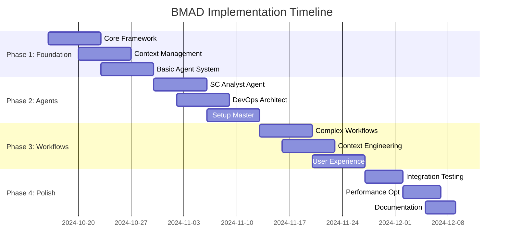

# BMAD Implementation Roadmap for Simple Container AI Assistant

## 🗓️ Implementation Timeline Overview

**Total Timeline**: 8 weeks  
**Team Size**: 1-2 developers  
**Approach**: Incremental delivery with backward compatibility  
**Risk Level**: Low (builds on existing systems)



## 📋 Phase 1: Foundation Infrastructure (Weeks 1-2)

### Week 1: Core Framework Implementation

#### 🎯 Deliverables
- [ ] **Agent Orchestrator** (`pkg/assistant/orchestrator/`)
  - Core orchestrator with agent registry
  - Basic task routing and execution
  - Agent lifecycle management
- [ ] **Base Agent Framework** (`pkg/assistant/agents/base_agent.go`)
  - Common agent interface and base implementation
  - Integration with existing LLM provider system
  - Agent state management patterns

#### 🔧 Technical Tasks
```go
// Key files to create:
pkg/assistant/orchestrator/
├── orchestrator.go     // Core orchestration logic
├── types.go           // Agent and task interfaces
├── registry.go        // Agent registration system
└── orchestrator_test.go

pkg/assistant/agents/
├── base_agent.go      // Base agent implementation
├── interfaces.go      // Agent interface definitions
└── base_agent_test.go
```

#### ✅ Acceptance Criteria
- Agent orchestrator can register and discover agents
- Base agent can execute simple tasks using existing LLM providers
- Framework integrates cleanly with existing `pkg/assistant/` structure
- All code passes existing linting and testing standards

### Week 2: Context Management System

#### 🎯 Deliverables
- [ ] **Context Manager** (`pkg/assistant/context/`)
  - Context document creation and storage
  - Agent-to-agent context transfer
  - Context persistence and retrieval
- [ ] **Context Document Schema**
  - Standardized context document format
  - Metadata and versioning system
  - Integration with existing project analysis

#### 🔧 Technical Tasks
```go
// Key files to create:
pkg/assistant/context/
├── manager.go         // Context management logic
├── documents.go       // Context document handling
├── storage.go         // File system persistence
├── transfer.go        // Agent context transfer
└── context_test.go

// Context storage structure:
.sc-analysis/
├── project-context.md      // SC Analyst output
├── infrastructure-strategy.md // DevOps Architect output  
├── setup-workflow.md       // Setup Master coordination
└── execution-log.md        // Config Executor log
```

#### ✅ Acceptance Criteria
- Context documents can be created, saved, and loaded
- Context transfer between agents works reliably
- Integration with existing `.sc/` directory structure
- Context documents follow defined schema and are human-readable

---

## 📋 Phase 2: Specialized Agents (Weeks 3-4)

### Week 3: SC Analyst Agent Implementation

#### 🎯 Deliverables
- [ ] **SC Analyst Agent** (`pkg/assistant/agents/sc_analyst.go`)
  - Integration with existing project analysis system
  - Enhanced resource detection and project understanding
  - Context-rich output documents for downstream agents

#### 🔧 Technical Tasks
- Implement SC Analyst Agent with existing analysis integration
- Create specialized prompts for analytical tasks
- Build project context document generator
- Add complexity assessment and deployment recommendations

#### 📊 Test Scenarios
```yaml
test_project_1:
  description: "Go microservice with Redis and MongoDB"
  expected_output: "Complex multi-resource project context document"
  validation: "Context includes all detected resources with confidence scores"

test_project_2:  
  description: "Simple static website"
  expected_output: "Simple static project context document"
  validation: "Recommends static deployment with minimal configuration"
```

#### ✅ Acceptance Criteria
- SC Analyst produces rich context documents from existing analysis
- Context documents contain actionable intelligence for setup agents
- Integration maintains existing analysis functionality
- Performance overhead is minimal (<100ms for typical projects)

### Week 4: DevOps Architect and Setup Master

#### 🎯 Deliverables
- [ ] **SC DevOps Architect** (`pkg/assistant/agents/sc_devops_architect.go`)
  - Infrastructure strategy design
  - Resource optimization recommendations
  - Deployment pattern selection
- [ ] **SC Setup Master** (`pkg/assistant/agents/sc_setup_master.go`)
  - Workflow orchestration logic
  - Agent coordination and task sequencing
  - User interaction management

#### 🔧 Technical Tasks
```go
// DevOps Architect capabilities:
- Resource architecture design (database, storage, compute)
- Deployment strategy selection (single-image vs cloud-compose)  
- Environment configuration planning
- Cost optimization recommendations

// Setup Master capabilities:
- Multi-agent workflow coordination
- Task sequencing and dependency management
- User progress updates and interaction points
- Error handling and recovery workflows
```

#### ✅ Acceptance Criteria
- DevOps Architect generates infrastructure strategies from project context
- Setup Master can orchestrate multi-agent workflows
- User receives clear progress updates during complex setup operations
- Error handling provides actionable recovery suggestions

---

## 📋 Phase 3: Advanced Workflows (Weeks 5-6)

### Week 5: Workflow Management System

#### 🎯 Deliverables
- [ ] **Workflow Manager** (`pkg/assistant/workflows/`)
  - Workflow definition and execution engine
  - Template-based workflow creation
  - State management and persistence
- [ ] **Workflow Templates**
  - Simple setup workflow (single resource)
  - Complex multi-database workflow
  - Enterprise setup workflow

#### 🔧 Technical Tasks
```yaml
# Workflow templates to create:
workflows/templates/
├── simple-setup.yaml          # Single database/storage
├── complex-multidb.yaml       # Multiple databases
├── enterprise-setup.yaml      # Full enterprise configuration
├── static-site.yaml           # Static site deployment
└── microservice-cluster.yaml  # Multi-service architecture

# Each template includes:
- Workflow phases and agent assignments
- Task dependencies and sequencing
- Context transfer specifications
- User interaction points
- Success criteria and validation steps
```

#### ✅ Acceptance Criteria
- Workflow manager executes multi-phase workflows reliably
- Templates cover common Simple Container use cases
- Workflow state persists across sessions
- Users can pause and resume complex setup operations

### Week 6: Context-Engineered Communication

#### 🎯 Deliverables
- [ ] **Advanced Context Engineering**
  - Rich context passing between agents
  - Context document cross-referencing
  - Intelligent context summarization
- [ ] **Config Executor Agent** (`pkg/assistant/agents/sc_config_executor.go`)
  - Automated configuration generation
  - Integration with existing file generation systems
  - Validation and testing of generated configurations

#### 🔧 Technical Implementation
- Context documents include references to related contexts
- Automatic context summarization for long workflows  
- Context validation ensures consistency across agent handoffs
- Config Executor integrates with existing `pkg/clouds/` and config generation

#### ✅ Acceptance Criteria
- Context documents maintain consistency across complex workflows
- Config Executor generates working configurations from context
- Generated configurations pass existing validation systems
- Context references enable workflow debugging and traceability

---

## 📋 Phase 4: Integration & Polish (Weeks 7-8)

### Week 7: Integration Testing and User Experience

#### 🎯 Deliverables
- [ ] **End-to-End Integration**
  - Full workflow testing with real projects
  - Integration with existing CLI commands
  - Backward compatibility validation
- [ ] **User Experience Optimization**
  - Progress indicators and status updates
  - Error messaging and recovery guidance
  - Performance optimization

#### 🧪 Integration Test Cases
```yaml
integration_tests:
  simple_go_api:
    input: "Go API with PostgreSQL"
    expected_workflow: "SC Analyst → DevOps Architect → Setup Master → Config Executor"
    expected_output: "Working client.yaml, secrets.yaml, single-image deployment"
    
  complex_fullstack:
    input: "React frontend + Node.js backend + Redis + MongoDB"
    expected_workflow: "Multi-phase setup with specialized configuration"
    expected_output: "Cloud-compose deployment with all services configured"
    
  legacy_project:
    input: "Existing project with partial SC configuration"
    expected_workflow: "Analysis → incremental enhancement workflow"
    expected_output: "Enhanced configuration without breaking existing setup"
```

#### ✅ Acceptance Criteria
- All integration tests pass with real projects
- User experience is smooth and intuitive
- Performance meets existing system benchmarks (<5s for typical workflows)
- No regressions in existing AI assistant functionality

### Week 8: Documentation and Release Preparation

#### 🎯 Deliverables
- [ ] **User Documentation**
  - BMAD workflow user guide
  - Agent capability reference
  - Troubleshooting and FAQ
- [ ] **Developer Documentation** 
  - Agent development guide
  - Context document specifications
  - Extension and customization guide
- [ ] **Release Preparation**
  - Feature flags for gradual rollout
  - Migration guide for existing users
  - Performance benchmarking

#### 📚 Documentation Structure
```
docs/ai-assistant/bmad/
├── USER_GUIDE.md              # How to use BMAD workflows
├── AGENT_REFERENCE.md         # Agent capabilities and commands
├── CONTEXT_SPECIFICATIONS.md  # Context document formats
├── DEVELOPER_GUIDE.md         # Extending and customizing agents
├── TROUBLESHOOTING.md         # Common issues and solutions
└── PERFORMANCE_BENCHMARKS.md  # Performance characteristics
```

#### ✅ Acceptance Criteria
- Documentation is comprehensive and user-friendly
- All features are covered with examples
- Performance benchmarks demonstrate system efficiency
- Migration path is clear for existing users

---

## 🚀 Rollout Strategy

### Phase 1: Internal Testing (Week 8)
- Enable BMAD workflows via feature flag
- Internal team testing with real projects
- Performance validation and optimization

### Phase 2: Beta Release (Week 9-10)  
- Limited beta with select users
- Feedback collection and iteration
- Bug fixes and UX improvements

### Phase 3: Gradual Rollout (Week 11-12)
- Opt-in BMAD workflows for all users
- Monitor adoption and success metrics
- Full documentation and support

### Phase 4: Default Experience (Week 13+)
- BMAD workflows become default for new projects
- Existing projects can migrate at their own pace
- Continuous improvement based on usage data

## 📊 Success Metrics

### Quantitative Metrics
- **Context Retention**: 95% reduction in repetitive questions
- **Setup Time**: 60% reduction in time-to-working-configuration
- **User Satisfaction**: >90% users report improved experience
- **Error Reduction**: 75% fewer configuration errors
- **Adoption Rate**: 80% of new setups use BMAD workflows within 30 days

### Qualitative Metrics
- **Professional Experience**: Users report AI "understands their project"
- **Reduced Cognitive Load**: Minimal user input required for complex setups
- **Predictable Workflows**: Clear progression through setup phases
- **Domain Expertise**: Each agent demonstrates specialized knowledge

## 🔧 Technical Considerations

### Performance Requirements
- **Agent Orchestration**: <200ms overhead per agent handoff
- **Context Management**: <50MB memory usage for complex workflows
- **LLM Integration**: Maintain existing token efficiency
- **File System Impact**: Minimal impact on project directory structure

### Security Considerations
- **Context Documents**: Sensitive data encrypted in context storage
- **Agent Communication**: Secure context transfer between agents
- **User Data**: No sensitive information in logs or error messages
- **Existing Security**: Maintain all existing security boundaries

### Scalability Considerations  
- **Agent Registry**: Support for 20+ specialized agents
- **Workflow Complexity**: Handle workflows with 10+ phases
- **Context Size**: Efficient handling of large project contexts
- **Concurrent Users**: No degradation with multiple simultaneous workflows

---

## 🎯 Risk Mitigation

### Technical Risks
- **Integration Complexity**: Mitigated by incremental integration approach
- **Performance Impact**: Mitigated by performance benchmarking and optimization
- **Context Consistency**: Mitigated by schema validation and testing
- **Agent Reliability**: Mitigated by comprehensive error handling

### User Experience Risks
- **Learning Curve**: Mitigated by gradual rollout and comprehensive documentation  
- **Workflow Complexity**: Mitigated by intelligent defaults and guidance
- **Backward Compatibility**: Mitigated by feature flags and migration tools
- **User Confusion**: Mitigated by clear progress indicators and help systems

### Project Risks
- **Timeline Pressure**: Mitigated by MVP approach and phase-wise delivery
- **Scope Creep**: Mitigated by clear phase definitions and success criteria
- **Resource Constraints**: Mitigated by building on existing systems
- **Quality Issues**: Mitigated by comprehensive testing and validation

---

**Next Steps**: Review this roadmap and proceed to [`AGENT_SPECIFICATIONS.md`](./AGENT_SPECIFICATIONS.md) for detailed agent role definitions and capabilities.
