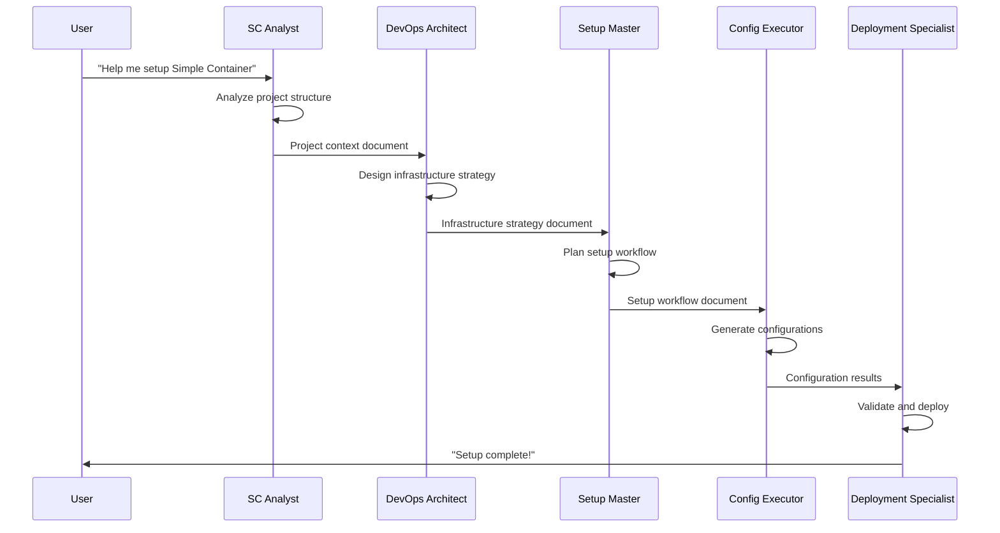
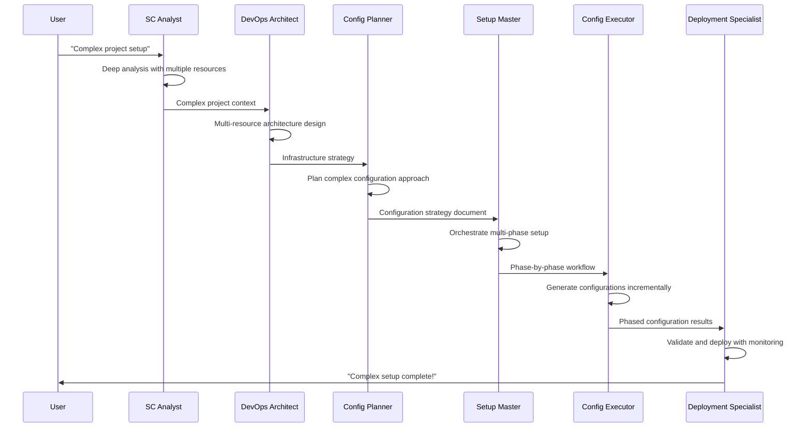
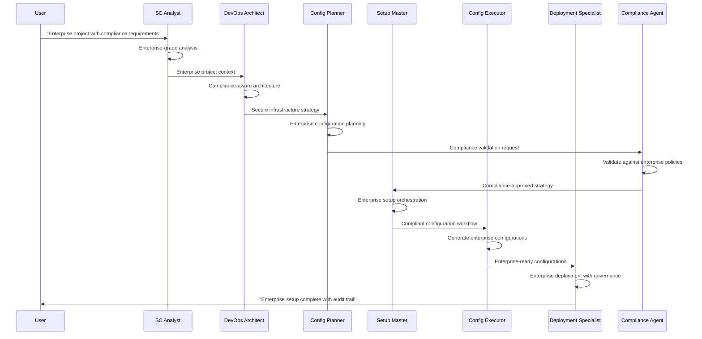
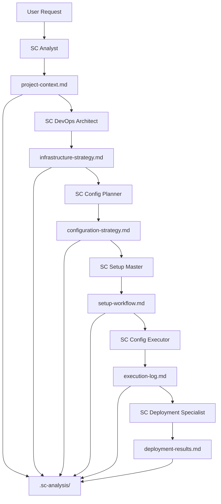
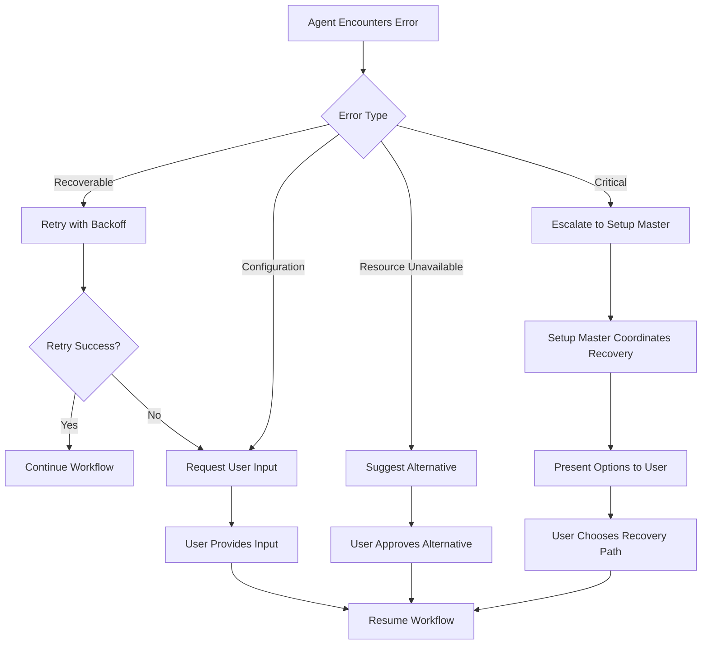

# BMAD Workflow Patterns for Simple Container

## 🔄 Overview

This document defines the workflow patterns and interaction models for the BMAD-inspired Simple Container agentic system. These patterns ensure consistent, predictable, and efficient collaboration between specialized agents.

## 🎯 Core Workflow Principles

### 1. Context-Engineered Handoffs
- **Rich Context Transfer**: Each agent receives complete context from previous phases
- **No Information Loss**: Context documents preserve all relevant project understanding
- **Explicit Handoff Instructions**: Clear guidance on what the next agent should focus on

### 2. Stateless Agent Design
- **Externalized State**: Agent state stored in context documents, not agent memory
- **Reproducible Execution**: Same context + task = same result
- **Scalable Architecture**: Agents can be distributed or replicated

### 3. Progressive Enhancement
- **Layered Context Building**: Each agent adds specialized knowledge to the context
- **Validation at Each Step**: Progress validated before advancing to next phase
- **Graceful Degradation**: Fallback patterns when agents encounter issues

---

## 🏗️ Standard Workflow Patterns

### Pattern 1: Simple Setup Workflow

**Use Case**: Single resource projects (e.g., Go API with PostgreSQL)



**Characteristics**:
- **Duration**: 5-10 minutes
- **Context Documents**: 3-4 documents
- **User Interactions**: 1-2 interaction points
- **Complexity**: Low to Medium

### Pattern 2: Complex Multi-Resource Workflow

**Use Case**: Complex projects (e.g., Full-stack app with multiple databases, queues, storage)



**Characteristics**:
- **Duration**: 15-30 minutes
- **Context Documents**: 5-7 documents
- **User Interactions**: 3-5 interaction points
- **Complexity**: High

### Pattern 3: Enterprise Setup Workflow

**Use Case**: Enterprise projects with compliance, security, and governance requirements



**Characteristics**:
- **Duration**: 30-60 minutes
- **Context Documents**: 7-10 documents
- **User Interactions**: 5-8 interaction points
- **Complexity**: Enterprise

---

## 📋 Context Document Flow Patterns

### Context Document Lifecycle



### Context Document Schema

```yaml
# Universal Context Document Header
metadata:
  agent_id: "sc-analyst"
  task_id: "analyze-project-20241016-001"
  created_at: "2024-10-16T14:40:00Z"
  based_on: ["user-request"] # or ["previous-context-doc-id"]
  project_path: "/path/to/project"
  
# Agent-specific content sections
content:
  # Each agent defines their own content structure
  
# Standardized handoff section
handoff_instructions:
  next_agent: "sc-devops-architect"
  context_summary: "Brief summary for next agent"
  key_decisions: ["decision1", "decision2"]
  ready_for_next_phase: true
  
# Validation and quality metrics
validation:
  confidence_score: 0.95
  completeness_score: 0.88
  validation_errors: []
```

---

## 🎛️ User Interaction Patterns

### Pattern 1: Guided Setup with Minimal Input

```yaml
interaction_pattern: "guided_minimal"
user_input_points:
  - phase: "initial_confirmation"
    message: "I'll setup your {detected_stack}. This will take about {estimated_time}. Proceed?"
    input_type: "confirmation"
    
  - phase: "secrets_collection" 
    message: "I need some sensitive values that will be encrypted securely"
    input_type: "secrets_form"
    
  - phase: "deployment_preferences"
    message: "Choose your deployment preferences:"
    input_type: "options_selection"
```

### Pattern 2: Expert Mode with Detailed Control

```yaml
interaction_pattern: "expert_detailed"
user_input_points:
  - phase: "analysis_validation"
    message: "I detected these resources. Would you like to modify any detections?"
    input_type: "analysis_review"
    
  - phase: "infrastructure_review"
    message: "Here's my recommended infrastructure. Review and approve/modify?"
    input_type: "strategy_review"
    
  - phase: "configuration_validation"
    message: "Generated configurations ready. Review before deployment?"
    input_type: "configuration_review"
```

### Pattern 3: Hands-Off Automation

```yaml
interaction_pattern: "automated"
user_input_points:
  - phase: "initial_confirmation"
    message: "Fully automated setup for {detected_stack}. Proceed with best practices?"
    input_type: "single_confirmation"
    
  # No other user interactions - fully automated based on analysis
```

---

## 🚨 Error Handling and Recovery Patterns

### Pattern 1: Graceful Degradation



### Error Recovery Strategies

```yaml
error_recovery_strategies:
  network_connectivity:
    detection: "Connection timeouts during resource validation"
    recovery_steps:
      - "Retry with exponential backoff"
      - "Check network connectivity"
      - "Suggest alternative endpoints"
    user_action: "Verify internet connection and retry"
    
  invalid_credentials:
    detection: "Authentication failures during resource setup"
    recovery_steps:
      - "Validate credential format"
      - "Request credential re-entry"
      - "Suggest credential sources"
    user_action: "Re-enter valid credentials"
    
  resource_conflicts:
    detection: "Resource naming conflicts or availability issues"
    recovery_steps:
      - "Generate alternative resource names"
      - "Check resource availability"
      - "Present alternatives to user"
    user_action: "Approve alternative names or resolve conflicts"
```

---

## 🔄 Agent Coordination Patterns

### Pattern 1: Sequential Handoff (Standard)

```go
type SequentialWorkflow struct {
    phases []WorkflowPhase
    currentPhase int
    context *WorkflowContext
}

func (w *SequentialWorkflow) ExecuteNextPhase() error {
    if w.currentPhase >= len(w.phases) {
        return errors.New("workflow complete")
    }
    
    phase := w.phases[w.currentPhase]
    agent := w.getAgent(phase.AgentID)
    
    result, err := agent.Execute(phase.Task, w.context)
    if err != nil {
        return w.handleError(err, phase)
    }
    
    w.context.AddResult(result)
    w.currentPhase++
    
    return nil
}
```

### Pattern 2: Parallel Execution (Advanced)

```go
type ParallelWorkflow struct {
    phases map[string]WorkflowPhase
    dependencies map[string][]string
    context *WorkflowContext
}

func (w *ParallelWorkflow) ExecutePhases() error {
    readyPhases := w.getReadyPhases()
    
    var wg sync.WaitGroup
    errorChan := make(chan error, len(readyPhases))
    
    for _, phase := range readyPhases {
        wg.Add(1)
        go func(p WorkflowPhase) {
            defer wg.Done()
            agent := w.getAgent(p.AgentID)
            result, err := agent.Execute(p.Task, w.context)
            if err != nil {
                errorChan <- err
                return
            }
            w.context.AddResult(result)
        }(phase)
    }
    
    wg.Wait()
    close(errorChan)
    
    for err := range errorChan {
        if err != nil {
            return err
        }
    }
    
    return nil
}
```

### Pattern 3: Dynamic Workflow Adaptation

```go
type AdaptiveWorkflow struct {
    workflow *Workflow
    context *WorkflowContext
    analyzer *WorkflowAnalyzer
}

func (w *AdaptiveWorkflow) Execute() error {
    for !w.workflow.IsComplete() {
        // Analyze current context and adapt workflow
        adaptations := w.analyzer.AnalyzeContext(w.context)
        w.applyAdaptations(adaptations)
        
        // Execute next optimal phase
        nextPhase := w.selectOptimalPhase()
        err := w.executePhase(nextPhase)
        if err != nil {
            return w.handleAdaptiveError(err)
        }
    }
    
    return nil
}
```

---

## 📊 Performance Patterns

### Pattern 1: Context Caching

```go
type ContextCache struct {
    cache map[string]*ContextDocument
    ttl   map[string]time.Time
}

func (c *ContextCache) Get(contextID string) (*ContextDocument, bool) {
    if time.Now().After(c.ttl[contextID]) {
        delete(c.cache, contextID)
        delete(c.ttl, contextID)
        return nil, false
    }
    
    doc, exists := c.cache[contextID]
    return doc, exists
}

func (c *ContextCache) Set(contextID string, doc *ContextDocument, ttl time.Duration) {
    c.cache[contextID] = doc
    c.ttl[contextID] = time.Now().Add(ttl)
}
```

### Pattern 2: Agent Pool Management

```go
type AgentPool struct {
    agents map[string][]Agent
    mutex  sync.RWMutex
}

func (p *AgentPool) GetAgent(agentType string) (Agent, error) {
    p.mutex.Lock()
    defer p.mutex.Unlock()
    
    agents := p.agents[agentType]
    if len(agents) == 0 {
        return p.createAgent(agentType)
    }
    
    // Get least busy agent
    agent := p.selectOptimalAgent(agents)
    return agent, nil
}
```

## 🎯 Success Metrics for Workflows

### Quantitative Metrics
- **Workflow Completion Rate**: >98% successful completion
- **Average Setup Time**: 50% reduction vs. manual setup
- **Context Accuracy**: >95% accurate context transfer between agents
- **User Satisfaction**: >90% positive feedback
- **Error Recovery Rate**: >95% successful error recovery

### Qualitative Metrics
- **User Experience**: Seamless, professional interaction
- **Context Quality**: Rich, actionable context documents
- **Agent Specialization**: Clear domain expertise demonstrated
- **Workflow Predictability**: Consistent, reliable progression

---

**Next Steps**: Review these workflow patterns and proceed to [`CONTEXT_MANAGEMENT.md`](./CONTEXT_MANAGEMENT.md) for detailed context engineering strategies.
