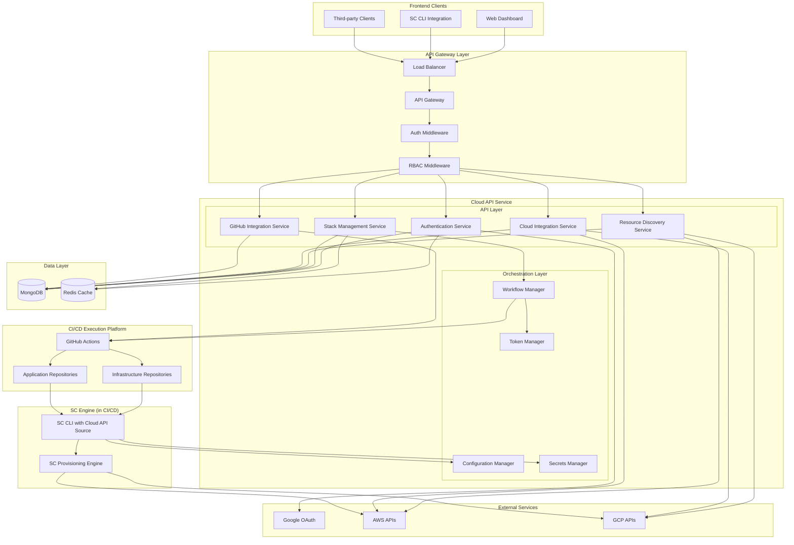
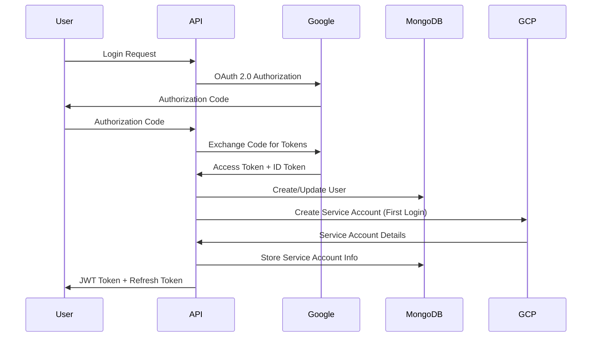

# Simple Container Cloud API - System Architecture

## Overview

The Simple Container Cloud API is a RESTful web service that provides multi-tenant, web-based management for Simple Container infrastructure and application deployments. It transforms the CLI-based workflow into a scalable, organization-friendly service with proper authentication, authorization, and cloud provider integrations.

## High-Level Architecture



## Technology Stack

### Backend Service
- **Language**: Go (1.21+)
- **Framework**: Gin HTTP framework
- **Architecture**: Microservices-ready monolith with clear service boundaries
- **Configuration**: Viper for configuration management
- **Logging**: Structured logging with logrus/zap

### Database & Storage
- **Primary Database**: MongoDB 7.0+
  - Document-based storage for flexible configuration schemas
  - Transaction support for multi-document operations
  - Built-in sharding for horizontal scaling
- **Caching Layer**: Redis 7.0+
  - Session storage
  - API rate limiting
  - Configuration caching
- **File Storage**: Local filesystem with cloud backup integration

### Authentication & Security
- **OAuth Provider**: Google OAuth 2.0
- **Token Management**: JWT with refresh token rotation
- **Session Storage**: Redis-based sessions
- **RBAC**: Custom role-based access control system
- **API Security**: Rate limiting, input validation, CORS

### Cloud Integrations
- **AWS SDK**: v2 for service account management and resource discovery
- **Google Cloud SDK**: Latest for GCP service account automation
- **Simple Container Engine**: Direct integration with existing provisioning engine

### Deployment & Operations
- **Containerization**: Docker with multi-stage builds
- **Orchestration**: Kubernetes-ready with health checks
- **Monitoring**: Prometheus metrics, health endpoints
- **Documentation**: OpenAPI 3.0 specification

## Core Components

### 1. Authentication Service

**Responsibilities:**
- User registration and authentication via Google OAuth
- JWT token management and validation
- Session lifecycle management
- Multi-factor authentication support (future)

**Key Features:**
- Google OAuth 2.0 integration
- Automatic GCP service account creation upon first login
- JWT token issuance with role-based claims
- Session management with Redis backing

### 2. Stack Management Service

**Responsibilities:**
- Parent stack lifecycle management (CRUD operations)
- Client stack lifecycle management (CRUD operations)
- Stack relationship management (parent-client linking)
- Configuration validation and schema enforcement
- GitHub workflow orchestration for deployments

**Key Features:**
- Configuration management with SC API package validation
- Support for all existing SC configuration patterns
- Real-time validation using SC's configuration schemas
- GitHub Actions workflow generation and triggering
- Short-lived token generation for CI/CD access

### 3. Resource Discovery Service

**Responsibilities:**
- Cloud resource discovery and cataloging
- Resource adoption workflow management
- Resource relationship mapping
- Cost and usage tracking integration

**Key Features:**
- Multi-cloud resource discovery (AWS, GCP)
- Existing infrastructure adoption workflows
- Resource tagging and organization
- Integration with SC's compute processors

### 4. Cloud Integration Service

**Responsibilities:**
- Automated cloud service account provisioning
- IAM role and policy management
- Cloud provider API integrations
- Resource discovery and cataloging

**Key Features:**
- Automated GCP service account creation with proper IAM roles
- AWS IAM user/role provisioning
- Service account key management and rotation
- Cloud resource discovery for adoption workflows

### 5. GitHub Integration Service

**Responsibilities:**
- GitHub repository authorization and management
- Infrastructure repository creation and maintenance
- GitHub Actions workflow generation
- Workflow orchestration and status tracking

**Key Features:**
- GitHub App integration for secure repository access
- Automated infrastructure repository setup
- Dynamic workflow generation based on stack configurations
- Repository scanning and deployment configuration assistance

## Data Architecture

### Document Storage Strategy

```yaml
# MongoDB Collections Structure
organizations/           # Customer/company entities
users/                  # Individual user accounts
projects/               # Logical groupings of stacks
parent_stacks/          # Infrastructure definitions (server.yaml)
client_stacks/          # Application configurations (client.yaml)
stack_secrets/          # Encrypted secrets (secrets.yaml)
cloud_accounts/         # Cloud provider service accounts
resources/              # Discovered and managed resources
audit_logs/             # Activity and change tracking
sessions/               # User session data (also cached in Redis)
```

### Configuration Storage

Simple Container configurations are stored as flexible documents that maintain full compatibility with existing SC schemas:

```go
type StoredParentStack struct {
    ID             primitive.ObjectID `bson:"_id,omitempty"`
    OrganizationID primitive.ObjectID `bson:"organization_id"`
    ProjectID      primitive.ObjectID `bson:"project_id"`
    Name           string             `bson:"name"`
    Description    string             `bson:"description"`
    
    // Direct SC server.yaml storage
    ServerConfig   api.ServerDescriptor `bson:"server_config"`
    
    // Metadata
    CreatedBy      primitive.ObjectID   `bson:"created_by"`
    CreatedAt      time.Time           `bson:"created_at"`
    UpdatedAt      time.Time           `bson:"updated_at"`
    Version        int32               `bson:"version"`
    
    // Access control
    Owners         []primitive.ObjectID `bson:"owners"`
    Permissions    map[string][]string  `bson:"permissions"`
}
```

## Integration with Simple Container Core

### GitHub Actions Orchestration

The Cloud API orchestrates provisioning through GitHub Actions rather than direct execution:

```go
// GitHub Actions orchestration with SC engine
import (
    "github.com/simple-container-com/api/pkg/api"
    "github.com/google/go-github/v57/github"
)

type StackService struct {
    github      *GitHubIntegrationService
    tokenMgr    *TokenService
    configMgr   *api.ConfigManager
}

func (s *StackService) ProvisionStack(ctx context.Context, stackID string, environment string) error {
    // 1. Generate short-lived workflow token
    token, err := s.tokenMgr.GenerateWorkflowToken(ctx, &WorkflowTokenRequest{
        Purpose:     "infrastructure",
        StackID:     stackID,
        Environment: environment,
        Permissions: []string{"parent_stacks.read", "stack_secrets.read"},
    })
    if err != nil {
        return err
    }
    
    // 2. Trigger GitHub Actions workflow
    return s.github.DispatchWorkflow(ctx, &WorkflowDispatchRequest{
        StackID:     stackID,
        Environment: environment,
        EventType:   "provision-infrastructure",
        Token:       token.Token,
    })
}
```

### Configuration Management

Manages configurations centrally while enabling GitHub Actions access:

```go
// Configuration management with CI/CD integration
func (s *StackService) ValidateStackConfig(config *api.ServerDescriptor) error {
    // SC provides built-in validation
    return api.ValidateServerDescriptor(config)
}

// Configuration delivery to CI/CD workflows
func (s *ConfigService) GetStackConfigForWorkflow(ctx context.Context, token string, stackID string) (*api.ServerDescriptor, error {
    // 1. Validate workflow token and permissions
    claims, err := s.validateWorkflowToken(ctx, token)
    if err != nil {
        return nil, err
    }
    
    // 2. Check token scope allows access to this stack
    if claims.StackID != stackID {
        return nil, ErrInsufficientPermissions
    }
    
    // 3. Return configuration for CI/CD consumption
    return s.loadStackConfig(ctx, stackID, claims.Environment)
}
```

## Security Architecture

### Authentication Flow



### Authorization Model

```yaml
# RBAC Permission Structure
Permissions:
  # Infrastructure Management (Parent Stacks)
  parent_stacks:
    - create
    - read
    - update
    - delete
    - provision
    
  # Application Management (Client Stacks)
  client_stacks:
    - create
    - read
    - update
    - delete
    - deploy
    
  # Resource Management
  resources:
    - discover
    - adopt
    - manage
    - delete
    
  # Organization Management
  organization:
    - manage_users
    - manage_billing
    - manage_settings

# Built-in Roles
Roles:
  infrastructure_manager:
    permissions: [parent_stacks.*, resources.*, organization.manage_settings]
    
  developer:
    permissions: [client_stacks.*, resources.read, resources.discover]
    
  admin:
    permissions: ["*"]
```

## API Design Principles

### RESTful Resource Design
- Resource-based URLs (e.g., `/api/v1/organizations/{org_id}/parent-stacks`)
- HTTP methods for operations (GET, POST, PUT, DELETE)
- Consistent response formats with proper HTTP status codes
- Pagination for list operations

### Error Handling
```go
type APIError struct {
    Code    string `json:"code"`
    Message string `json:"message"`
    Details any    `json:"details,omitempty"`
    TraceID string `json:"trace_id"`
}
```

### Versioning Strategy
- URL path versioning (`/api/v1/`)
- Backward compatibility guarantee within major versions
- Deprecation notices with migration paths

## Scalability Considerations

### Horizontal Scaling
- Stateless service design with external session storage
- Database connection pooling and read replicas
- Redis clustering for cache layer
- Load balancer with health checks

### Performance Optimizations
- Configuration caching in Redis
- Lazy loading of stack relationships
- Async operations for long-running provisioning tasks
- Database indexing strategy for common queries

### Monitoring & Observability
- Structured logging with correlation IDs
- Prometheus metrics for service health
- Health check endpoints for load balancers
- Audit trail for all configuration changes

## Development & Deployment

### Project Structure
```
cmd/
  cloud-api/                 # Main service binary
internal/
  auth/                      # Authentication service
  stacks/                    # Stack management service
  resources/                 # Resource discovery service
  cloud/                     # Cloud integration service
  models/                    # Database models
  middleware/                # HTTP middleware
  config/                    # Configuration management
pkg/
  api/                       # Public API types
  client/                    # API client library
docs/
  api/                       # OpenAPI specifications
  deployment/                # Deployment guides
```

### Configuration Management
```yaml
# config.yaml
server:
  port: 8080
  read_timeout: 30s
  write_timeout: 30s

database:
  mongodb:
    url: "mongodb://localhost:27017"
    database: "simple_container_cloud"
  redis:
    url: "redis://localhost:6379"

auth:
  google:
    client_id: "${GOOGLE_CLIENT_ID}"
    client_secret: "${GOOGLE_CLIENT_SECRET}"
  jwt:
    secret: "${JWT_SECRET}"
    expiry: 24h

cloud:
  gcp:
    project_id: "${GCP_PROJECT_ID}"
    credentials_path: "${GCP_CREDENTIALS_PATH}"
  aws:
    region: "${AWS_REGION}"
    access_key_id: "${AWS_ACCESS_KEY_ID}"
    secret_access_key: "${AWS_SECRET_ACCESS_KEY}"
```

This architecture provides a solid foundation for building a scalable, secure, and maintainable Simple Container Cloud API that leverages existing SC components while adding essential multi-tenant and web-based capabilities.
