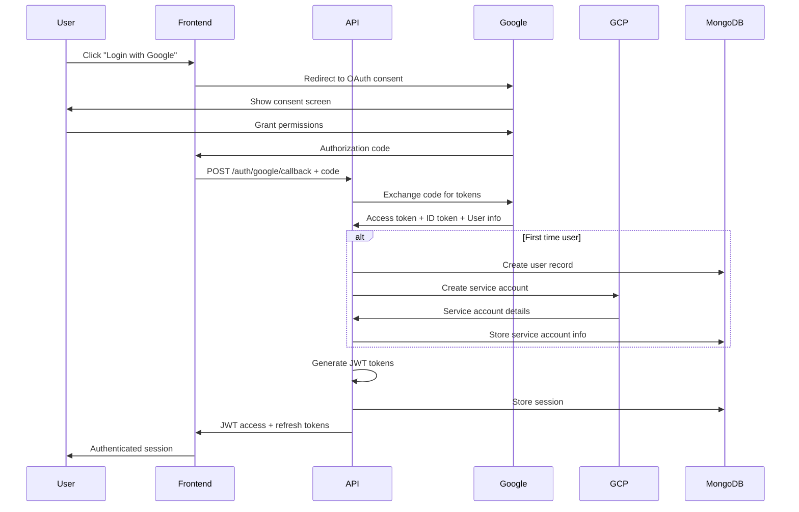

# Simple Container Cloud API - Authentication & RBAC

## Overview

The Simple Container Cloud API implements a comprehensive authentication and authorization system designed to support multi-tenant organizations while maintaining the critical distinction between infrastructure management and application development roles. The system ensures that DevOps teams maintain control over shared infrastructure while enabling developers to independently manage their application deployments.

## Authentication Architecture

### OAuth 2.0 Integration

The API uses Google OAuth 2.0 as the primary authentication provider with automatic cloud service account provisioning.



### JWT Token Management

```go
type TokenClaims struct {
    jwt.RegisteredClaims
    
    // User Information
    UserID         string   `json:"user_id"`
    Email          string   `json:"email"`
    Name           string   `json:"name"`
    
    // Organization Context
    OrganizationID string   `json:"org_id"`
    Role           string   `json:"role"`
    Permissions    []string `json:"permissions"`
    
    // Session Information
    SessionID      string   `json:"session_id"`
    TokenType      string   `json:"token_type"` // "access" or "refresh"
    
    // Security
    IPAddress      string   `json:"ip_address"`
    UserAgent      string   `json:"user_agent"`
}

// Token Configuration
type TokenConfig struct {
    AccessTokenTTL  time.Duration // 1 hour
    RefreshTokenTTL time.Duration // 30 days
    SigningKey      []byte
    Algorithm       string        // HS256 or RS256
}
```

### Automatic GCP Service Account Provisioning

When a user authenticates for the first time, the system automatically provisions a GCP service account:

```go
func (s *AuthService) provisionGCPServiceAccount(ctx context.Context, user *User) error {
    // Generate service account name based on user email
    saName := generateServiceAccountName(user.Email, user.OrganizationID)
    
    // Create service account in GCP
    sa, err := s.gcpClient.CreateServiceAccount(ctx, &gcpiam.CreateServiceAccountRequest{
        Name: fmt.Sprintf("projects/%s", s.gcpProjectID),
        ServiceAccount: &gcpiam.ServiceAccount{
            Name:        saName,
            DisplayName: fmt.Sprintf("Simple Container - %s", user.Name),
            Description: "Automatically provisioned service account for Simple Container Cloud API",
        },
    })
    if err != nil {
        return fmt.Errorf("failed to create service account: %w", err)
    }
    
    // Apply default IAM roles for Simple Container operations
    roles := []string{
        "roles/storage.admin",           // GCS bucket management
        "roles/container.admin",         // GKE cluster management
        "roles/compute.admin",          // Compute resource management
        "roles/cloudsql.admin",         // Cloud SQL management
        "roles/redis.admin",            // Redis management
    }
    
    for _, role := range roles {
        if err := s.assignRole(ctx, sa.Email, role); err != nil {
            return fmt.Errorf("failed to assign role %s: %w", role, err)
        }
    }
    
    // Generate service account key
    key, err := s.gcpClient.CreateServiceAccountKey(ctx, &gcpiam.CreateServiceAccountKeyRequest{
        Name: sa.Name,
        ServiceAccountKey: &gcpiam.ServiceAccountKey{
            KeyAlgorithm: gcpiam.ServiceAccountKeyAlgorithm_KEY_ALG_RSA_2048,
        },
    })
    if err != nil {
        return fmt.Errorf("failed to create service account key: %w", err)
    }
    
    // Store encrypted service account details
    cloudAccount := &CloudAccount{
        OrganizationID: user.OrganizationID,
        UserID:         user.ID,
        Provider:       "gcp",
        ServiceAccount: ServiceAccountDetails{
            Email:     sa.Email,
            ProjectID: s.gcpProjectID,
            KeyID:     extractKeyID(key.Name),
            KeyData:   s.encryptServiceAccountKey(key.PrivateKeyData),
        },
        CreatedAt: time.Now(),
    }
    
    return s.db.CloudAccounts().InsertOne(ctx, cloudAccount)
}
```

## Role-Based Access Control (RBAC)

### Core Principles

1. **Infrastructure vs Application Separation**: Clear distinction between infrastructure management (parent stacks) and application deployment (client stacks)
2. **Organization Isolation**: Complete data isolation between organizations
3. **Principle of Least Privilege**: Users receive minimum permissions necessary for their role
4. **Hierarchical Permissions**: Permissions can be inherited and extended at project level

### Built-in Roles

#### Infrastructure Manager
Full control over infrastructure and the ability to manage parent stacks that define shared resources.

```yaml
infrastructure_manager:
  description: "DevOps engineers responsible for infrastructure management"
  permissions:
    # Parent Stack Management (Full Access)
    - parent_stacks.create
    - parent_stacks.read
    - parent_stacks.update  
    - parent_stacks.delete
    - parent_stacks.provision
    - parent_stacks.destroy
    
    # Resource Management (Full Access)
    - resources.discover
    - resources.adopt
    - resources.manage
    - resources.delete
    - resources.provision
    
    # Client Stack Management (Read + Limited Write)
    - client_stacks.read
    - client_stacks.create      # Can help developers set up stacks
    - client_stacks.update      # Can modify client configurations
    
    # Secrets Management (Full Access to Infrastructure Secrets)
    - secrets.read_parent
    - secrets.write_parent
    - secrets.rotate_parent
    
    # Organization Management
    - organization.manage_settings
    - organization.view_usage
    - organization.manage_billing
    
    # Advanced Operations
    - deployments.approve       # Can approve production deployments
    - audit_logs.read
    - cloud_accounts.manage
```

#### Developer
Application-focused role with ability to manage client stacks and consume infrastructure.

```yaml
developer:
  description: "Software developers deploying applications"
  permissions:
    # Client Stack Management (Full Access)
    - client_stacks.create
    - client_stacks.read
    - client_stacks.update
    - client_stacks.delete
    - client_stacks.deploy
    - client_stacks.rollback
    
    # Parent Stack Management (Read Only)
    - parent_stacks.read        # Can see available infrastructure
    
    # Resource Management (Read + Limited Access)
    - resources.read           # Can see available resources
    - resources.discover       # Can discover resources for integration
    
    # Secrets Management (Limited to Client Secrets)
    - secrets.read_client
    - secrets.write_client
    
    # Deployment Management
    - deployments.create
    - deployments.monitor
    
    # Basic Organization Access
    - organization.view_basic
```

#### Project Admin
Enhanced permissions within a specific project context.

```yaml
project_admin:
  description: "Project leaders with enhanced permissions within their project"
  inherits: [developer]
  additional_permissions:
    # User Management within Project
    - project.manage_users
    - project.manage_permissions
    
    # Advanced Client Stack Operations
    - client_stacks.manage_all  # Can manage all client stacks in project
    
    # Project Configuration
    - project.manage_settings
    - project.manage_integrations
    
    # Approval Workflows
    - deployments.approve_staging
```

#### Organization Admin
Top-level administrative access across the organization.

```yaml
organization_admin:
  description: "Organization administrators with full access"
  permissions:
    - "*"                      # Full access to all resources
  restrictions:
    # Even admins cannot access certain sensitive operations without MFA
    - requires_mfa: [secrets.write_parent, cloud_accounts.delete, organization.delete]
```

### Permission System Architecture

```go
type Permission struct {
    Resource string `json:"resource"` // "parent_stacks", "client_stacks", "resources"
    Action   string `json:"action"`   // "create", "read", "update", "delete", "provision"
    Context  string `json:"context"`  // "organization", "project", "own"
}

type Role struct {
    ID           string       `bson:"_id"`
    Name         string       `bson:"name"`
    Description  string       `bson:"description"`
    Permissions  []Permission `bson:"permissions"`
    Inherits     []string     `bson:"inherits"`     // Role inheritance
    IsSystemRole bool         `bson:"is_system_role"` // Built-in vs custom
    CreatedAt    time.Time    `bson:"created_at"`
}

type UserPermission struct {
    UserID         primitive.ObjectID `bson:"user_id"`
    OrganizationID primitive.ObjectID `bson:"organization_id"`
    ProjectID      *primitive.ObjectID `bson:"project_id,omitempty"` // Project-specific permissions
    Role           string             `bson:"role"`
    CustomPerms    []Permission       `bson:"custom_permissions"`   // Additional permissions
    GrantedBy      primitive.ObjectID `bson:"granted_by"`
    GrantedAt      time.Time          `bson:"granted_at"`
    ExpiresAt      *time.Time         `bson:"expires_at,omitempty"`
}
```

### Permission Evaluation Engine

```go
type PermissionEvaluator struct {
    db    *mongo.Database
    cache *redis.Client
}

func (pe *PermissionEvaluator) HasPermission(ctx context.Context, userID, orgID string, resource, action string, targetID *string) (bool, error) {
    // 1. Load user permissions from cache or database
    userPerms, err := pe.getUserPermissions(ctx, userID, orgID)
    if err != nil {
        return false, err
    }
    
    // 2. Evaluate organization-level permissions
    if pe.evaluatePermission(userPerms.OrganizationPermissions, resource, action) {
        return true, nil
    }
    
    // 3. If target is project-specific, check project permissions
    if targetID != nil {
        projectPerms := pe.getProjectPermissions(userPerms, *targetID)
        if pe.evaluatePermission(projectPerms, resource, action) {
            return true, nil
        }
    }
    
    // 4. Check ownership permissions
    if pe.isOwner(ctx, userID, targetID) {
        ownerPerms := pe.getOwnerPermissions(resource)
        return pe.evaluatePermission(ownerPerms, resource, action), nil
    }
    
    return false, nil
}

func (pe *PermissionEvaluator) evaluatePermission(permissions []Permission, resource, action string) bool {
    for _, perm := range permissions {
        // Wildcard matching
        if perm.Resource == "*" || perm.Resource == resource {
            if perm.Action == "*" || perm.Action == action {
                return true
            }
        }
    }
    return false
}
```

### Permission Middleware

```go
func RequirePermission(resource, action string) gin.HandlerFunc {
    return func(c *gin.Context) {
        // Extract user context from JWT
        userCtx, exists := c.Get("user")
        if !exists {
            c.JSON(http.StatusUnauthorized, gin.H{"error": "Authentication required"})
            c.Abort()
            return
        }
        
        user := userCtx.(*UserContext)
        
        // Extract target resource ID from URL parameters
        var targetID *string
        if id := c.Param("id"); id != "" {
            targetID = &id
        }
        
        // Check permission
        hasPermission, err := permissionEvaluator.HasPermission(
            c.Request.Context(),
            user.UserID,
            user.OrganizationID,
            resource,
            action,
            targetID,
        )
        
        if err != nil {
            c.JSON(http.StatusInternalServerError, gin.H{"error": "Permission check failed"})
            c.Abort()
            return
        }
        
        if !hasPermission {
            c.JSON(http.StatusForbidden, gin.H{
                "error": "Insufficient permissions",
                "required": fmt.Sprintf("%s.%s", resource, action),
            })
            c.Abort()
            return
        }
        
        c.Next()
    }
}

// Usage in routes
r.POST("/parent-stacks", 
    RequireAuth(),
    RequirePermission("parent_stacks", "create"),
    createParentStackHandler)
    
r.DELETE("/parent-stacks/:id", 
    RequireAuth(),
    RequirePermission("parent_stacks", "delete"),
    deleteParentStackHandler)
```

## Security Features

### Multi-Factor Authentication (MFA)

```go
type MFAConfig struct {
    Enabled    bool      `bson:"enabled"`
    Secret     string    `bson:"secret"`      // Encrypted TOTP secret
    BackupCodes []string `bson:"backup_codes"` // Encrypted backup codes
    LastUsed   time.Time `bson:"last_used"`
}

func (s *AuthService) EnableMFA(ctx context.Context, userID string) (*MFASetupResponse, error) {
    // Generate TOTP secret
    secret := make([]byte, 32)
    rand.Read(secret)
    
    // Generate backup codes
    backupCodes := s.generateBackupCodes(10)
    
    // Encrypt sensitive data
    encryptedSecret := s.encrypt(secret)
    encryptedBackupCodes := s.encryptBackupCodes(backupCodes)
    
    // Store MFA configuration
    mfaConfig := &MFAConfig{
        Enabled:     true,
        Secret:      encryptedSecret,
        BackupCodes: encryptedBackupCodes,
    }
    
    // Return setup information to user
    return &MFASetupResponse{
        Secret:      base32.StdEncoding.EncodeToString(secret),
        QRCode:      s.generateQRCode(userID, secret),
        BackupCodes: backupCodes, // Show once, then encrypt
    }, nil
}
```

### Session Management

```go
type SessionManager struct {
    redis   *redis.Client
    db      *mongo.Database
    config  *SessionConfig
}

type SessionConfig struct {
    MaxActiveSessions int           // 5 concurrent sessions per user
    IdleTimeout      time.Duration // 30 minutes
    AbsoluteTimeout  time.Duration // 8 hours
    RequireReauth    []string      // Operations requiring re-authentication
}

func (sm *SessionManager) CreateSession(ctx context.Context, user *User, clientInfo *ClientInfo) (*Session, error) {
    // Check concurrent session limit
    activeSessions := sm.getActiveSessions(ctx, user.ID)
    if len(activeSessions) >= sm.config.MaxActiveSessions {
        // Invalidate oldest session
        sm.invalidateOldestSession(ctx, user.ID)
    }
    
    // Create new session
    session := &Session{
        SessionID:    generateSecureID(),
        UserID:       user.ID,
        IPAddress:    clientInfo.IPAddress,
        UserAgent:    clientInfo.UserAgent,
        CreatedAt:    time.Now(),
        ExpiresAt:    time.Now().Add(sm.config.AbsoluteTimeout),
        LastAccessed: time.Now(),
        Status:       "active",
    }
    
    // Store in both Redis (for fast access) and MongoDB (for persistence)
    sm.redis.Set(ctx, "session:"+session.SessionID, session, sm.config.AbsoluteTimeout)
    sm.db.Collection("sessions").InsertOne(ctx, session)
    
    return session, nil
}
```

### API Rate Limiting

```go
type RateLimiter struct {
    redis  *redis.Client
    limits map[string]RateLimit
}

type RateLimit struct {
    Requests   int           // Number of requests
    Window     time.Duration // Time window
    BurstLimit int          // Burst allowance
}

// Rate limits by user role and operation type
var DefaultRateLimits = map[string]RateLimit{
    "auth":              {Requests: 5, Window: time.Minute, BurstLimit: 10},
    "read_operations":   {Requests: 1000, Window: time.Minute, BurstLimit: 200},
    "write_operations":  {Requests: 100, Window: time.Minute, BurstLimit: 50},
    "provision_operations": {Requests: 10, Window: time.Minute, BurstLimit: 5},
}

func RateLimitMiddleware() gin.HandlerFunc {
    return gin.HandlerFunc(func(c *gin.Context) {
        user := getUserFromContext(c)
        operation := getOperationType(c)
        
        key := fmt.Sprintf("rate_limit:%s:%s", user.ID, operation)
        
        allowed, err := rateLimiter.Allow(c.Request.Context(), key, operation)
        if err != nil {
            c.JSON(http.StatusInternalServerError, gin.H{"error": "Rate limit check failed"})
            c.Abort()
            return
        }
        
        if !allowed {
            c.JSON(http.StatusTooManyRequests, gin.H{
                "error": "Rate limit exceeded",
                "retry_after": rateLimiter.GetRetryAfter(key),
            })
            c.Abort()
            return
        }
        
        c.Next()
    })
}
```

## Audit and Compliance

### Comprehensive Audit Logging

Every operation is logged with complete context:

```go
type AuditLogger struct {
    db *mongo.Database
}

func (al *AuditLogger) LogEvent(ctx context.Context, event *AuditEvent) error {
    // Enrich event with request context
    if reqCtx := getRequestContext(ctx); reqCtx != nil {
        event.RequestID = reqCtx.RequestID
        event.IPAddress = reqCtx.IPAddress
        event.UserAgent = reqCtx.UserAgent
        event.Endpoint = reqCtx.Endpoint
    }
    
    // Add timestamp and correlation ID
    event.Timestamp = time.Now()
    event.CorrelationID = getCorrelationID(ctx)
    
    // Store audit event
    _, err := al.db.Collection("audit_logs").InsertOne(ctx, event)
    return err
}

// Audit middleware for automatic logging
func AuditMiddleware() gin.HandlerFunc {
    return gin.HandlerFunc(func(c *gin.Context) {
        start := time.Now()
        
        // Process request
        c.Next()
        
        // Log the operation
        user := getUserFromContext(c)
        auditEvent := &AuditEvent{
            EventType:      getEventType(c),
            EventCategory:  getEventCategory(c),
            Actor:          user.ToAuditActor(),
            Target:         extractTarget(c),
            Result:         getResult(c),
            Duration:       time.Since(start),
            OrganizationID: user.OrganizationID,
        }
        
        auditLogger.LogEvent(c.Request.Context(), auditEvent)
    })
}
```

### Privacy and Data Protection

```go
type DataProtectionService struct {
    encryptor *crypto.AESEncryptor
    db        *mongo.Database
}

// GDPR-compliant data export
func (dps *DataProtectionService) ExportUserData(ctx context.Context, userID string) (*UserDataExport, error) {
    // Collect all user data across collections
    userData := &UserDataExport{
        UserID:    userID,
        ExportedAt: time.Now(),
    }
    
    // User profile data
    user, _ := dps.getUser(ctx, userID)
    userData.Profile = user.ToExportFormat()
    
    // Stack configurations (sanitized)
    stacks, _ := dps.getUserStacks(ctx, userID)
    userData.Stacks = sanitizeStacksForExport(stacks)
    
    // Audit logs
    auditLogs, _ := dps.getUserAuditLogs(ctx, userID)
    userData.AuditLogs = auditLogs
    
    return userData, nil
}

// GDPR-compliant data deletion
func (dps *DataProtectionService) DeleteUserData(ctx context.Context, userID string) error {
    // This requires careful orchestration to maintain referential integrity
    session, err := dps.db.Client().StartSession()
    if err != nil {
        return err
    }
    defer session.EndSession(ctx)
    
    return mongo.WithSession(ctx, session, func(sc mongo.SessionContext) error {
        // 1. Remove user from organizations
        dps.removeFromOrganizations(sc, userID)
        
        // 2. Transfer ownership of stacks to organization admins
        dps.transferStackOwnership(sc, userID)
        
        // 3. Anonymize audit logs (keep for compliance)
        dps.anonymizeAuditLogs(sc, userID)
        
        // 4. Delete user record
        dps.deleteUser(sc, userID)
        
        // 5. Delete associated cloud accounts
        dps.deleteCloudAccounts(sc, userID)
        
        return nil
    })
}
```

This authentication and RBAC system provides enterprise-grade security while maintaining the flexibility needed for Simple Container's infrastructure-application separation model. The automatic cloud service account provisioning ensures users can immediately begin managing cloud resources upon authentication, while the comprehensive audit system ensures full compliance with security and regulatory requirements.
