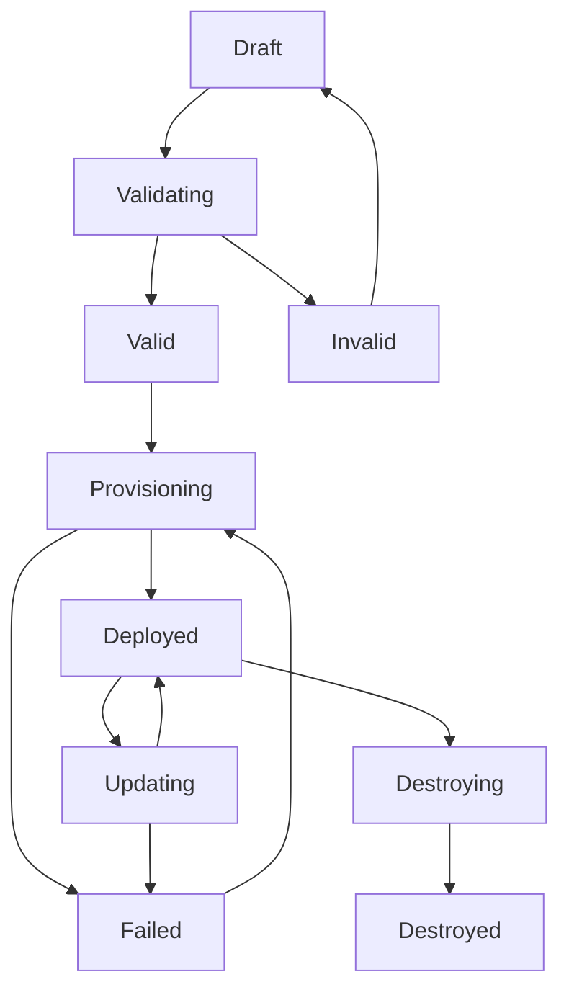

# Simple Container Cloud API - Stack Management APIs

## Overview

This document provides detailed specifications for stack lifecycle management operations, covering both parent stacks (infrastructure) and client stacks (applications). These APIs orchestrate GitHub Actions workflows to execute Simple Container provisioning and deployment operations while providing centralized configuration management and multi-tenant capabilities.

## Stack Lifecycle Management

### Parent Stack Operations

Parent stacks represent infrastructure definitions managed by DevOps teams. They follow a structured lifecycle from creation through deployment and maintenance.



#### Create Parent Stack

**Endpoint:** `POST /api/v1/organizations/{org_id}/projects/{project_id}/parent-stacks`

```go
type CreateParentStackRequest struct {
    Name         string                    `json:"name" validate:"required,alphanum_dash"`
    DisplayName  string                    `json:"display_name" validate:"required"`
    Description  string                    `json:"description"`
    ServerConfig api.ServerDescriptor      `json:"server_config" validate:"required"`
    GitConfig    *GitIntegrationConfig     `json:"git_config,omitempty"`
    
    // Access control during creation
    Owners       []string                  `json:"owners,omitempty"`       // User IDs
    Editors      []string                  `json:"editors,omitempty"`      // User IDs  
    Viewers      []string                  `json:"viewers,omitempty"`      // User IDs
}

type GitIntegrationConfig struct {
    RepositoryURL string `json:"repository_url"`
    Branch        string `json:"branch"`
    Path          string `json:"path"`          // Path within repo to server.yaml
    AutoSync      bool   `json:"auto_sync"`
}
```

**Implementation Logic:**
```go
func (s *StackService) CreateParentStack(ctx context.Context, orgID, projectID string, req *CreateParentStackRequest) (*ParentStack, error) {
    // 1. Validate user permissions
    if !s.rbac.HasPermission(ctx, "parent_stacks.create", orgID, &projectID) {
        return nil, ErrInsufficientPermissions
    }
    
    // 2. Validate server configuration using SC's validation
    if err := api.ValidateServerDescriptor(&req.ServerConfig); err != nil {
        return nil, fmt.Errorf("invalid server configuration: %w", err)
    }
    
    // 3. Check for name conflicts within project
    if exists, err := s.repo.ParentStackExists(ctx, orgID, projectID, req.Name); err != nil {
        return nil, err
    } else if exists {
        return nil, ErrParentStackNameExists
    }
    
    // 4. Validate resource references and dependencies
    if err := s.validateResourceDependencies(ctx, &req.ServerConfig); err != nil {
        return nil, fmt.Errorf("resource validation failed: %w", err)
    }
    
    // 5. Create stack record with initial status
    stack := &ParentStack{
        OrganizationID: orgID,
        ProjectID:      projectID,
        Name:           req.Name,
        DisplayName:    req.DisplayName,
        Description:    req.Description,
        ServerConfig:   req.ServerConfig,
        GitConfig:      req.GitConfig,
        Status:         StatusDraft,
        Owners:         append(req.Owners, getCurrentUserID(ctx)),
        Editors:        req.Editors,
        Viewers:        req.Viewers,
        CreatedBy:      getCurrentUserID(ctx),
        CreatedAt:      time.Now(),
        Version:        1,
    }
    
    // 6. Store in database with transaction
    if err := s.repo.CreateParentStack(ctx, stack); err != nil {
        return nil, err
    }
    
    // 7. Log audit event
    s.audit.LogEvent(ctx, &AuditEvent{
        EventType:      "parent_stack_created",
        EventCategory:  "stack_management",
        TargetID:       stack.ID,
        TargetName:     stack.Name,
        Changes:        map[string]interface{}{"action": "create"},
    })
    
    return stack, nil
}
```

#### Validate Parent Stack Configuration

**Endpoint:** `POST /api/v1/organizations/{org_id}/projects/{project_id}/parent-stacks/validate`

```go
type ValidateParentStackRequest struct {
    ServerConfig api.ServerDescriptor `json:"server_config" validate:"required"`
    Environment  string               `json:"environment,omitempty"`  // Validate specific environment
}

type ValidationResult struct {
    Valid    bool                     `json:"valid"`
    Errors   []ValidationError        `json:"errors,omitempty"`
    Warnings []ValidationWarning      `json:"warnings,omitempty"`
    
    // Resource analysis
    ResourceAnalysis struct {
        TotalResources    int                      `json:"total_resources"`
        ResourcesByType   map[string]int           `json:"resources_by_type"`
        EstimatedCost     *CostEstimate           `json:"estimated_cost,omitempty"`
        Dependencies      []ResourceDependency     `json:"dependencies"`
    } `json:"resource_analysis"`
    
    // Template analysis  
    TemplateAnalysis struct {
        TemplateCount     int                     `json:"template_count"`
        SupportedTypes    []string               `json:"supported_types"`
        CloudProviders    []string               `json:"cloud_providers"`
    } `json:"template_analysis"`
}

type ValidationError struct {
    Code     string      `json:"code"`
    Message  string      `json:"message"`
    Path     string      `json:"path"`      // JSON path to problematic field
    Details  interface{} `json:"details,omitempty"`
}
```

#### Provision Parent Stack

**Endpoint:** `POST /api/v1/organizations/{org_id}/projects/{project_id}/parent-stacks/{stack_id}/provision`

```go
type ProvisionParentStackRequest struct {
    Environment      string            `json:"environment" validate:"required"`
    SkipPreview      bool              `json:"skip_preview"`
    TimeoutMinutes   int               `json:"timeout_minutes" validate:"min=5,max=120"`
    ForceRecreate    bool              `json:"force_recreate"`     // Destroy and recreate resources
    
    // Resource selection
    ResourceFilter   *ResourceFilter   `json:"resource_filter,omitempty"`
    
    // Approval workflow
    RequireApproval  bool              `json:"require_approval"`
    ApproverUserIDs  []string          `json:"approver_user_ids,omitempty"`
}

type ResourceFilter struct {
    IncludeResources []string `json:"include_resources,omitempty"` // Resource names to include
    ExcludeResources []string `json:"exclude_resources,omitempty"` // Resource names to exclude
    ResourceTypes    []string `json:"resource_types,omitempty"`    // Resource types to filter
}
```

**Implementation with GitHub Actions Orchestration:**
```go
func (s *StackService) ProvisionParentStack(ctx context.Context, stackID string, req *ProvisionParentStackRequest) (*ProvisionOperation, error) {
    // 1. Load and validate stack
    stack, err := s.repo.GetParentStack(ctx, stackID)
    if err != nil {
        return nil, err
    }
    
    // 2. Check permissions
    if !s.rbac.HasPermission(ctx, "parent_stacks.provision", stack.OrganizationID, &stack.ProjectID) {
        return nil, ErrInsufficientPermissions
    }
    
    // 3. Ensure infrastructure repository exists
    infraRepo, err := s.github.EnsureInfrastructureRepository(ctx, stack)
    if err != nil {
        return nil, fmt.Errorf("failed to setup infrastructure repository: %w", err)
    }
    
    // 4. Create operation record
    operation := &ProvisionOperation{
        ID:                generateOperationID(),
        Type:              "provision_parent",
        StackID:           stackID,
        Environment:       req.Environment,
        Status:            StatusPending,
        StartedAt:         time.Now(),
        StartedBy:         getCurrentUserID(ctx),
        Parameters:        req,
        EstimatedDuration: s.estimateProvisioningDuration(stack),
        GitHubRepository:  infraRepo.FullName,
    }
    
    if err := s.repo.CreateOperation(ctx, operation); err != nil {
        return nil, err
    }
    
    // 5. Generate short-lived token for GitHub workflow
    token, err := s.tokenService.GenerateWorkflowToken(ctx, &WorkflowTokenRequest{
        Purpose:       "infrastructure",
        StackID:       stackID,
        Environment:   req.Environment,
        OperationID:   operation.ID,
        Permissions:   []string{"parent_stacks.read", "stack_secrets.read", "operations.report"},
        WorkflowRunID: 0, // Will be updated by GitHub webhook
    })
    if err != nil {
        return nil, fmt.Errorf("failed to generate workflow token: %w", err)
    }
    
    // 6. Trigger GitHub Actions workflow
    err = s.github.DispatchWorkflow(ctx, &WorkflowDispatchRequest{
        Repository:  infraRepo,
        EventType:   "provision-infrastructure",
        Environment: req.Environment,
        Payload: map[string]interface{}{
            "operation_id": operation.ID,
            "stack_id":     stackID,
            "environment":  req.Environment,
            "skip_preview": req.SkipPreview,
            "timeout_minutes": req.TimeoutMinutes,
        },
        Token: token.Token,
    })
    
    if err != nil {
        // Update operation status on failure
        s.updateOperationStatus(ctx, operation.ID, StatusFailed, fmt.Sprintf("Failed to trigger GitHub workflow: %v", err))
        return nil, fmt.Errorf("failed to trigger provisioning workflow: %w", err)
    }
    
    // 7. Update operation status to indicate workflow dispatched
    s.updateOperationStatus(ctx, operation.ID, StatusRunning, "GitHub Actions workflow dispatched")
    
    return operation, nil
}

// Configuration and secrets delivery for GitHub workflows
func (s *ConfigService) GetStackConfigForWorkflow(ctx context.Context, token, stackID, environment string) (*StackWorkflowConfig, error) {
    // 1. Validate workflow token
    claims, err := s.validateWorkflowToken(ctx, token)
    if err != nil {
        return nil, ErrInvalidWorkflowToken
    }
    
    // 2. Check token scope
    if claims.StackID != stackID || claims.Environment != environment {
        return nil, ErrInsufficientPermissions
    }
    
    // 3. Load stack configuration
    stack, err := s.repo.GetParentStack(ctx, stackID)
    if err != nil {
        return nil, err
    }
    
    // 4. Load secrets for the environment
    secrets, err := s.secretsService.GetStackSecrets(ctx, stackID, environment)
    if err != nil {
        return nil, err
    }
    
    // 5. Return configuration package for GitHub workflow
    return &StackWorkflowConfig{
        ServerConfig: stack.ServerConfig,
        Secrets:      secrets,
        Environment:  environment,
        StackName:    stack.Name,
    }, nil
}

// Operation status reporting from GitHub workflows
func (s *OperationService) ReportWorkflowProgress(ctx context.Context, token, operationID string, progress *WorkflowProgress) error {
    // 1. Validate workflow token
    claims, err := s.validateWorkflowToken(ctx, token)
    if err != nil {
        return ErrInvalidWorkflowToken
    }
    
    // 2. Update operation progress
    operation, err := s.repo.GetOperation(ctx, operationID)
    if err != nil {
        return err
    }
    
    // 3. Update progress in database
    operation.Progress = &OperationProgress{
        Phase:             progress.Phase,
        CurrentStep:       progress.CurrentStep,
        CompletionPercent: progress.CompletionPercent,
        Message:           progress.Message,
        LastUpdated:       time.Now(),
    }
    
    return s.repo.UpdateOperation(ctx, operation)
}
```

### Client Stack Operations

Client stacks represent application deployments that consume infrastructure from parent stacks.

#### Create Client Stack

**Endpoint:** `POST /api/v1/organizations/{org_id}/projects/{project_id}/client-stacks`

```go
type CreateClientStackRequest struct {
    Name               string                   `json:"name" validate:"required,alphanum_dash"`
    DisplayName        string                   `json:"display_name" validate:"required"`
    Description        string                   `json:"description"`
    
    // Parent stack relationship
    ParentStackID      string                   `json:"parent_stack_id" validate:"required"`
    ParentEnvironment  string                   `json:"parent_environment"`  // Optional override
    
    // SC configuration
    ClientConfig       api.ClientDescriptor     `json:"client_config" validate:"required"`
    DockerCompose      map[string]interface{}   `json:"docker_compose"`
    DockerfileContent  string                   `json:"dockerfile_content"`
    
    // Git integration
    GitRepository      *GitRepositoryConfig     `json:"git_repository,omitempty"`
    
    // Access control
    Owners             []string                 `json:"owners,omitempty"`
    Collaborators      []CollaboratorConfig     `json:"collaborators,omitempty"`
}

type GitRepositoryConfig struct {
    URL            string `json:"url"`
    Branch         string `json:"branch"`
    DockerfilePath string `json:"dockerfile_path"`
    ComposePath    string `json:"compose_path"`
}

type CollaboratorConfig struct {
    UserID      string   `json:"user_id"`
    Role        string   `json:"role"`        // "read", "write"
    Permissions []string `json:"permissions,omitempty"`
}
```

**Implementation:**
```go
func (s *StackService) CreateClientStack(ctx context.Context, orgID, projectID string, req *CreateClientStackRequest) (*ClientStack, error) {
    // 1. Validate permissions
    if !s.rbac.HasPermission(ctx, "client_stacks.create", orgID, &projectID) {
        return nil, ErrInsufficientPermissions
    }
    
    // 2. Validate parent stack exists and user has access
    parentStack, err := s.repo.GetParentStack(ctx, req.ParentStackID)
    if err != nil {
        return nil, fmt.Errorf("parent stack not found: %w", err)
    }
    
    if !s.rbac.HasPermission(ctx, "parent_stacks.read", parentStack.OrganizationID, &parentStack.ProjectID) {
        return nil, ErrInsufficientPermissions
    }
    
    // 3. Validate client configuration
    if err := api.ValidateClientDescriptor(&req.ClientConfig); err != nil {
        return nil, fmt.Errorf("invalid client configuration: %w", err)
    }
    
    // 4. Validate docker-compose configuration
    if err := s.validateDockerCompose(req.DockerCompose); err != nil {
        return nil, fmt.Errorf("invalid docker-compose configuration: %w", err)
    }
    
    // 5. Check resource references against parent stack
    if err := s.validateClientResourceUsage(ctx, parentStack, &req.ClientConfig); err != nil {
        return nil, fmt.Errorf("resource validation failed: %w", err)
    }
    
    // 6. Create client stack record
    stack := &ClientStack{
        OrganizationID:    orgID,
        ProjectID:         projectID,
        Name:              req.Name,
        DisplayName:       req.DisplayName,
        Description:       req.Description,
        ParentStackID:     req.ParentStackID,
        ParentEnvironment: req.ParentEnvironment,
        ClientConfig:      req.ClientConfig,
        DockerCompose:     req.DockerCompose,
        DockerfileContent: req.DockerfileContent,
        GitRepository:     req.GitRepository,
        Owners:            append(req.Owners, getCurrentUserID(ctx)),
        Collaborators:     req.Collaborators,
        CreatedBy:         getCurrentUserID(ctx),
        CreatedAt:         time.Now(),
        Version:           1,
        Status:            StatusDraft,
    }
    
    return s.repo.CreateClientStack(ctx, stack)
}
```

#### Deploy Client Stack

**Endpoint:** `POST /api/v1/organizations/{org_id}/projects/{project_id}/client-stacks/{stack_id}/deploy`

```go
type DeployClientStackRequest struct {
    Environment         string            `json:"environment" validate:"required"`
    GitCommit           string            `json:"git_commit,omitempty"`
    TimeoutMinutes      int               `json:"timeout_minutes" validate:"min=5,max=60"`
    RollbackOnFailure   bool              `json:"rollback_on_failure"`
    
    // Deployment strategy
    Strategy            DeploymentStrategy `json:"strategy"`
    
    // Environment overrides
    EnvironmentOverrides map[string]string `json:"environment_overrides,omitempty"`
    
    // Resource requirements
    ResourceRequirements *ResourceRequirements `json:"resource_requirements,omitempty"`
}

type DeploymentStrategy struct {
    Type                string `json:"type"`     // "rolling", "blue_green", "canary"
    MaxUnavailable      string `json:"max_unavailable,omitempty"`     // "25%" or "1"
    MaxSurge            string `json:"max_surge,omitempty"`           // "25%" or "1"
    ProgressDeadline    int    `json:"progress_deadline,omitempty"`   // seconds
}

type ResourceRequirements struct {
    CPU     string `json:"cpu"`        // "100m", "0.5", "2"
    Memory  string `json:"memory"`     // "128Mi", "256Mi", "1Gi"
    Storage string `json:"storage,omitempty"`    // "1Gi", "10Gi"
}
```

**GitHub Actions Orchestration for Client Deployment:**
```go
func (s *StackService) DeployClientStack(ctx context.Context, stackID string, req *DeployClientStackRequest) (*DeploymentOperation, error) {
    // 1. Load client stack and validate permissions
    clientStack, err := s.repo.GetClientStack(ctx, stackID)
    if err != nil {
        return nil, err
    }
    
    if !s.rbac.HasPermission(ctx, "client_stacks.deploy", clientStack.OrganizationID, &clientStack.ProjectID) {
        return nil, ErrInsufficientPermissions
    }
    
    // 2. Get application repository information
    appRepo, err := s.github.GetApplicationRepository(ctx, clientStack.GitHubRepositoryID)
    if err != nil {
        return nil, fmt.Errorf("application repository not found: %w", err)
    }
    
    // 3. Create deployment operation
    operation := &DeploymentOperation{
        ID:                generateOperationID(),
        Type:              "deploy_client",
        StackID:           stackID,
        Environment:       req.Environment,
        GitCommit:         req.GitCommit,
        Strategy:          req.Strategy,
        Status:            StatusPending,
        StartedAt:         time.Now(),
        StartedBy:         getCurrentUserID(ctx),
        GitHubRepository:  appRepo.FullName,
    }
    
    if err := s.repo.CreateOperation(ctx, operation); err != nil {
        return nil, err
    }
    
    // 4. Generate short-lived token for deployment workflow
    token, err := s.tokenService.GenerateWorkflowToken(ctx, &WorkflowTokenRequest{
        Purpose:       "deployment",
        StackID:       stackID,
        Environment:   req.Environment,
        OperationID:   operation.ID,
        Permissions:   []string{"client_stacks.read", "client_stacks.deploy", "deployments.report"},
        WorkflowRunID: 0,
    })
    if err != nil {
        return nil, fmt.Errorf("failed to generate workflow token: %w", err)
    }
    
    // 5. Trigger GitHub Actions deployment workflow
    err = s.github.DispatchWorkflow(ctx, &WorkflowDispatchRequest{
        Repository:  appRepo,
        EventType:   "deploy-service",
        Environment: req.Environment,
        Payload: map[string]interface{}{
            "operation_id":         operation.ID,
            "stack_id":             stackID,
            "environment":          req.Environment,
            "git_commit":           req.GitCommit,
            "deployment_strategy":  req.Strategy,
            "environment_overrides": req.EnvironmentOverrides,
        },
        Token: token.Token,
    })
    
    if err != nil {
        s.updateOperationStatus(ctx, operation.ID, StatusFailed, fmt.Sprintf("Failed to trigger deployment workflow: %v", err))
        return nil, fmt.Errorf("failed to trigger deployment workflow: %w", err)
    }
    
    // 6. Update operation status
    s.updateOperationStatus(ctx, operation.ID, StatusRunning, "GitHub Actions deployment workflow dispatched")
    
    return operation, nil
}

// Client stack configuration delivery for deployment workflows
func (s *ConfigService) GetClientStackConfigForWorkflow(ctx context.Context, token, stackID, environment string) (*ClientWorkflowConfig, error) {
    // 1. Validate workflow token
    claims, err := s.validateWorkflowToken(ctx, token)
    if err != nil {
        return nil, ErrInvalidWorkflowToken
    }
    
    // 2. Check token scope
    if claims.StackID != stackID || claims.Environment != environment {
        return nil, ErrInsufficientPermissions
    }
    
    // 3. Load client stack and parent stack
    clientStack, err := s.repo.GetClientStack(ctx, stackID)
    if err != nil {
        return nil, err
    }
    
    parentStack, err := s.repo.GetParentStack(ctx, clientStack.ParentStackID)
    if err != nil {
        return nil, err
    }
    
    // 4. Load merged configuration
    mergedConfig, err := s.mergeStackConfigurations(ctx, clientStack, parentStack, environment)
    if err != nil {
        return nil, err
    }
    
    // 5. Return configuration package for deployment workflow
    return &ClientWorkflowConfig{
        ClientConfig:         clientStack.ClientConfig,
        ParentStackConfig:    parentStack.ServerConfig,
        MergedConfiguration:  mergedConfig,
        DockerCompose:        clientStack.DockerCompose,
        Environment:          environment,
        StackName:           clientStack.Name,
        ParentStackName:     parentStack.Name,
    }, nil
}

// Deployment status reporting from GitHub workflows
func (s *DeploymentService) ReportDeploymentStatus(ctx context.Context, token, operationID string, status *DeploymentStatus) error {
    // 1. Validate workflow token
    claims, err := s.validateWorkflowToken(ctx, token)
    if err != nil {
        return ErrInvalidWorkflowToken
    }
    
    // 2. Update deployment operation
    operation, err := s.repo.GetDeploymentOperation(ctx, operationID)
    if err != nil {
        return err
    }
    
    // 3. Update deployment status and endpoints
    operation.Status = status.Status
    operation.CompletedAt = &status.CompletedAt
    operation.DeployedEndpoints = status.Endpoints
    operation.GitCommit = status.GitCommit
    operation.WorkflowRunID = status.WorkflowRunID
    
    if status.Status == StatusCompleted {
        // Update client stack with deployment information
        clientStack, _ := s.repo.GetClientStack(ctx, operation.StackID)
        clientStack.LastDeployment = &LastDeployment{
            Environment:  operation.Environment,
            GitCommit:    status.GitCommit,
            DeployedAt:   status.CompletedAt,
            Endpoints:    status.Endpoints,
        }
        s.repo.UpdateClientStack(ctx, clientStack)
    }
    
    return s.repo.UpdateDeploymentOperation(ctx, operation)
}
```

## Stack Configuration Management

### Configuration Validation

The API provides comprehensive validation of Simple Container configurations before deployment:

```go
type ConfigurationValidator struct {
    scValidator    *api.ConfigValidator
    cloudValidator map[string]CloudValidator
}

func (cv *ConfigurationValidator) ValidateParentStackConfig(ctx context.Context, config *api.ServerDescriptor) (*ValidationResult, error) {
    result := &ValidationResult{
        Valid:    true,
        Errors:   []ValidationError{},
        Warnings: []ValidationWarning{},
    }
    
    // 1. Basic schema validation using SC's validator
    if err := cv.scValidator.ValidateServerDescriptor(config); err != nil {
        result.Valid = false
        result.Errors = append(result.Errors, ValidationError{
            Code:    "SCHEMA_VALIDATION_ERROR",
            Message: err.Error(),
            Path:    extractJSONPath(err),
        })
    }
    
    // 2. Resource dependency validation
    if depErrors := cv.validateResourceDependencies(config); len(depErrors) > 0 {
        result.Valid = false
        result.Errors = append(result.Errors, depErrors...)
    }
    
    // 3. Cloud provider configuration validation
    for provider, validator := range cv.cloudValidator {
        if providerErrors := validator.ValidateResources(config, provider); len(providerErrors) > 0 {
            result.Errors = append(result.Errors, providerErrors...)
            result.Valid = false
        }
    }
    
    // 4. Cost estimation
    if costEstimate, err := cv.estimateStackCost(config); err == nil {
        result.ResourceAnalysis.EstimatedCost = costEstimate
    }
    
    // 5. Resource analysis
    cv.analyzeResources(config, result)
    cv.analyzeTemplates(config, result)
    
    return result, nil
}
```

### Configuration Merging

For client stack deployments, configurations are merged from parent and client stacks:

```go
func (s *StackService) mergeStackConfigurations(ctx context.Context, clientStack *ClientStack, parentStack *ParentStack, environment string) (*api.MergedConfiguration, error) {
    // 1. Extract parent configuration for the environment
    parentEnvConfig := s.extractParentEnvironmentConfig(parentStack, environment)
    
    // 2. Extract client configuration for the environment
    clientEnvConfig, exists := clientStack.ClientConfig.Stacks[environment]
    if !exists {
        return nil, fmt.Errorf("client stack has no configuration for environment %s", environment)
    }
    
    // 3. Validate resource usage (client can only use resources from parent)
    if err := s.validateResourceUsage(clientEnvConfig.Config.Uses, parentEnvConfig.Resources); err != nil {
        return nil, err
    }
    
    // 4. Merge configurations using SC's merger
    merger := api.NewConfigurationMerger()
    mergedConfig, err := merger.MergeConfigurations(&api.MergeRequest{
        ParentConfig:  parentEnvConfig,
        ClientConfig:  clientEnvConfig,
        Environment:   environment,
        ResolveSecrets: true,
    })
    
    if err != nil {
        return nil, fmt.Errorf("failed to merge configurations: %w", err)
    }
    
    // 5. Apply client-specific overrides
    s.applyClientOverrides(mergedConfig, clientStack)
    
    return mergedConfig, nil
}
```

## Operation Monitoring and Management

### Operation Status Tracking

All long-running operations (provisioning, deployment) provide real-time status updates:

```go
type Operation struct {
    ID                string            `json:"id"`
    Type              string            `json:"type"`
    StackID           string            `json:"stack_id"`
    Environment       string            `json:"environment"`
    Status            string            `json:"status"`
    Progress          *OperationProgress `json:"progress,omitempty"`
    StartedAt         time.Time         `json:"started_at"`
    CompletedAt       *time.Time        `json:"completed_at,omitempty"`
    Duration          string            `json:"duration"`
    StartedBy         string            `json:"started_by"`
    Result            string            `json:"result,omitempty"`
    ErrorMessage      string            `json:"error_message,omitempty"`
    Logs              []OperationLog    `json:"logs"`
    ResourcesAffected []ResourceChange  `json:"resources_affected"`
}

type OperationProgress struct {
    Phase             string    `json:"phase"`
    CurrentStep       string    `json:"current_step"`
    CompletionPercent int       `json:"completion_percent"`
    Message          string    `json:"message"`
    EstimatedTimeLeft string   `json:"estimated_time_left,omitempty"`
    LastUpdated       time.Time `json:"last_updated"`
}

type OperationLog struct {
    Timestamp time.Time `json:"timestamp"`
    Level     string    `json:"level"`
    Message   string    `json:"message"`
    Source    string    `json:"source"`
    Details   map[string]interface{} `json:"details,omitempty"`
}
```

### Operation Cancellation

**Endpoint:** `POST /api/v1/operations/{operation_id}/cancel`

```go
func (s *OperationService) CancelOperation(ctx context.Context, operationID string) error {
    operation, err := s.repo.GetOperation(ctx, operationID)
    if err != nil {
        return err
    }
    
    // Check if operation is cancellable
    if !s.isCancellable(operation.Status) {
        return ErrOperationNotCancellable
    }
    
    // Check permissions
    if !s.rbac.CanCancelOperation(ctx, operation) {
        return ErrInsufficientPermissions
    }
    
    // Send cancellation signal to running operation
    if err := s.signalCancellation(ctx, operationID); err != nil {
        return err
    }
    
    // Update operation status
    return s.repo.UpdateOperationStatus(ctx, operationID, StatusCancelling, "Cancellation requested by user")
}
```

This comprehensive stack management API provides full lifecycle control over Simple Container deployments while maintaining compatibility with existing CLI workflows and ensuring proper multi-tenant isolation and access control.
