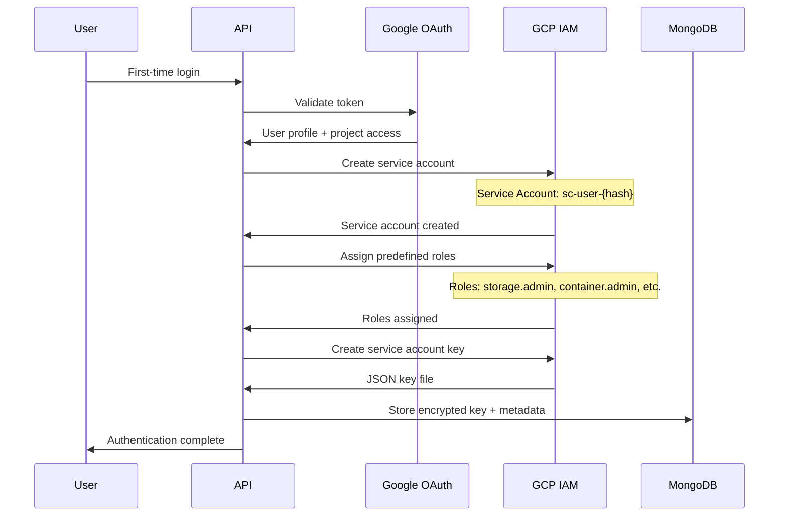

# Simple Container Cloud API - Cloud Integrations

## Overview

The Simple Container Cloud API provides seamless integration with major cloud providers (AWS, GCP) through automated service account provisioning, resource discovery, and lifecycle management. The system automatically creates and manages cloud credentials for users upon authentication, enabling immediate infrastructure management capabilities.

## Google Cloud Platform Integration

### Automatic Service Account Provisioning

When a user authenticates with Google OAuth for the first time, the system automatically provisions a GCP service account with appropriate permissions for Simple Container operations.



#### Service Account Creation Logic

```go
type GCPIntegrationService struct {
    iamClient     *admin.Service
    rmClient      *cloudresourcemanager.Service
    encryptor     *crypto.AESEncryptor
    db            *mongo.Database
    logger        *logrus.Logger
}

func (g *GCPIntegrationService) ProvisionServiceAccount(ctx context.Context, user *User, projectID string) (*GCPServiceAccount, error) {
    // 1. Generate unique service account ID
    saID := g.generateServiceAccountID(user.Email)
    
    // 2. Create service account
    sa := &admin.ServiceAccount{
        AccountId:   saID,
        DisplayName: fmt.Sprintf("Simple Container - %s", user.Name),
        Description: "Auto-provisioned service account for Simple Container Cloud API",
    }
    
    createdSA, err := g.iamClient.Projects.ServiceAccounts.Create(
        fmt.Sprintf("projects/%s", projectID), 
        &admin.CreateServiceAccountRequest{ServiceAccount: sa},
    ).Context(ctx).Do()
    
    if err != nil {
        return nil, fmt.Errorf("failed to create service account: %w", err)
    }
    
    // 3. Assign predefined roles for Simple Container operations
    roles := g.getSimpleContainerRoles()
    for _, role := range roles {
        if err := g.assignRole(ctx, createdSA.Email, projectID, role); err != nil {
            g.logger.Warnf("Failed to assign role %s to %s: %v", role, createdSA.Email, err)
            // Continue with other roles rather than failing entirely
        }
    }
    
    // 4. Create service account key
    key, err := g.iamClient.Projects.ServiceAccounts.Keys.Create(
        createdSA.Name,
        &admin.CreateServiceAccountKeyRequest{
            KeyAlgorithm: "KEY_ALG_RSA_2048",
        },
    ).Context(ctx).Do()
    
    if err != nil {
        // Clean up created service account
        g.iamClient.Projects.ServiceAccounts.Delete(createdSA.Name).Context(ctx).Do()
        return nil, fmt.Errorf("failed to create service account key: %w", err)
    }
    
    // 5. Encrypt and store key data
    keyData, err := base64.StdEncoding.DecodeString(key.PrivateKeyData)
    if err != nil {
        return nil, fmt.Errorf("failed to decode key data: %w", err)
    }
    
    encryptedKey, err := g.encryptor.Encrypt(keyData)
    if err != nil {
        return nil, fmt.Errorf("failed to encrypt key data: %w", err)
    }
    
    // 6. Store service account information
    gcpAccount := &GCPServiceAccount{
        UserID:          user.ID,
        OrganizationID:  user.OrganizationID,
        ProjectID:       projectID,
        ServiceAccount: ServiceAccountDetails{
            Email:           createdSA.Email,
            UniqueID:        createdSA.UniqueId,
            KeyID:           extractKeyID(key.Name),
            EncryptedKeyData: encryptedKey,
        },
        Permissions: ServiceAccountPermissions{
            Roles:           roles,
            LastValidated:   time.Now(),
            Status:          "active",
        },
        CreatedAt:       time.Now(),
    }
    
    if err := g.db.Collection("cloud_accounts").InsertOne(ctx, gcpAccount); err != nil {
        return nil, fmt.Errorf("failed to store service account: %w", err)
    }
    
    return gcpAccount, nil
}

func (g *GCPIntegrationService) getSimpleContainerRoles() []string {
    return []string{
        "roles/storage.admin",                  // GCS bucket management
        "roles/container.admin",               // GKE cluster management  
        "roles/compute.admin",                 // Compute Engine resources
        "roles/cloudsql.admin",                // Cloud SQL management
        "roles/redis.admin",                   // Redis memorystore
        "roles/pubsub.admin",                  // Pub/Sub topics/subscriptions
        "roles/artifactregistry.admin",        // Artifact Registry
        "roles/dns.admin",                     // Cloud DNS (if used)
        "roles/secretmanager.admin",           // Secret Manager
        "roles/iam.serviceAccountTokenCreator", // Token creation for workload identity
    }
}
```

#### Custom IAM Role for Fine-Grained Permissions

For enhanced security, the system can create custom IAM roles with minimal required permissions:

```go
func (g *GCPIntegrationService) createCustomSimpleContainerRole(ctx context.Context, projectID string) error {
    role := &admin.Role{
        RoleId:      "simple_container_operator",
        Title:       "Simple Container Operator",
        Description: "Custom role for Simple Container operations with minimal required permissions",
        Stage:       "GA",
        IncludedPermissions: []string{
            // Storage permissions
            "storage.buckets.create",
            "storage.buckets.delete", 
            "storage.buckets.get",
            "storage.buckets.list",
            "storage.buckets.update",
            "storage.objects.*",
            
            // Container/GKE permissions
            "container.clusters.create",
            "container.clusters.delete",
            "container.clusters.get",
            "container.clusters.list",
            "container.clusters.update",
            "container.operations.*",
            
            // Compute permissions (for networking, service accounts)
            "compute.networks.create",
            "compute.subnetworks.create",
            "compute.firewalls.create",
            "compute.addresses.create",
            "compute.routers.create",
            
            // Cloud SQL permissions
            "cloudsql.instances.create",
            "cloudsql.instances.delete",
            "cloudsql.instances.get",
            "cloudsql.instances.list",
            "cloudsql.instances.update",
            
            // Redis permissions
            "redis.instances.create",
            "redis.instances.delete",
            "redis.instances.get",
            "redis.instances.list",
            "redis.instances.update",
        },
    }
    
    _, err := g.iamClient.Projects.Roles.Create(
        fmt.Sprintf("projects/%s", projectID),
        &admin.CreateRoleRequest{Role: role},
    ).Context(ctx).Do()
    
    return err
}
```

### GCP Resource Discovery

The system can discover existing GCP resources for adoption into Simple Container management:

```go
type GCPResourceDiscovery struct {
    clients map[string]interface{} // Service clients for different GCP services
}

func (d *GCPResourceDiscovery) DiscoverResources(ctx context.Context, request *ResourceDiscoveryRequest) ([]*DiscoveredResource, error) {
    var resources []*DiscoveredResource
    
    // Discover GKE clusters
    if contains(request.ResourceTypes, "gcp-gke-autopilot-cluster") {
        gkeResources, err := d.discoverGKEClusters(ctx, request.ProjectID, request.Regions)
        if err != nil {
            return nil, err
        }
        resources = append(resources, gkeResources...)
    }
    
    // Discover GCS buckets  
    if contains(request.ResourceTypes, "gcp-bucket") {
        bucketResources, err := d.discoverGCSBuckets(ctx, request.ProjectID)
        if err != nil {
            return nil, err
        }
        resources = append(resources, bucketResources...)
    }
    
    // Discover Cloud SQL instances
    if contains(request.ResourceTypes, "gcp-cloudsql-postgres") {
        sqlResources, err := d.discoverCloudSQLInstances(ctx, request.ProjectID, request.Regions)
        if err != nil {
            return nil, err
        }
        resources = append(resources, sqlResources...)
    }
    
    // Apply filters
    return d.applyFilters(resources, request.Filters), nil
}

func (d *GCPResourceDiscovery) discoverGKEClusters(ctx context.Context, projectID string, regions []string) ([]*DiscoveredResource, error) {
    containerClient, err := container.NewService(ctx)
    if err != nil {
        return nil, err
    }
    
    var resources []*DiscoveredResource
    
    for _, region := range regions {
        // List clusters in region
        clusters, err := containerClient.Projects.Locations.Clusters.List(
            fmt.Sprintf("projects/%s/locations/%s", projectID, region),
        ).Context(ctx).Do()
        
        if err != nil {
            continue // Skip region on error, don't fail entire discovery
        }
        
        for _, cluster := range clusters.Clusters {
            resource := &DiscoveredResource{
                CloudProvider:  "gcp",
                ResourceID:     cluster.Name,
                ResourceType:   "gcp-gke-autopilot-cluster", 
                ResourceName:   cluster.Name,
                Region:        region,
                Status:        strings.ToLower(cluster.Status),
                Configuration: map[string]interface{}{
                    "location":        cluster.Location,
                    "node_version":    cluster.CurrentNodeVersion,
                    "master_version":  cluster.CurrentMasterVersion,
                    "autopilot":       cluster.Autopilot.Enabled,
                    "network":         cluster.Network,
                    "subnetwork":      cluster.Subnetwork,
                },
                Tags:          convertGCPLabels(cluster.ResourceLabels),
                DiscoveredAt:  time.Now(),
                DiscoveredBy:  "api_discovery",
            }
            
            // Determine if cluster can be managed by Simple Container
            resource.Metadata = map[string]interface{}{
                "manageable": d.isClusterManageable(cluster),
                "adoption_requirements": d.getAdoptionRequirements(cluster),
            }
            
            resources = append(resources, resource)
        }
    }
    
    return resources, nil
}
```

## AWS Integration

### IAM User/Role Provisioning

For AWS integration, the system creates IAM users or assumes roles with appropriate policies:

```go
type AWSIntegrationService struct {
    iamClient   *iam.IAM
    stsClient   *sts.STS
    encryptor   *crypto.AESEncryptor
    db          *mongo.Database
}

func (a *AWSIntegrationService) ProvisionIAMUser(ctx context.Context, user *User) (*AWSAccount, error) {
    // 1. Create IAM user
    userName := a.generateIAMUserName(user.Email)
    
    createUserInput := &iam.CreateUserInput{
        UserName: aws.String(userName),
        Tags: []*iam.Tag{
            {
                Key:   aws.String("Purpose"),
                Value: aws.String("SimpleContainerCloudAPI"),
            },
            {
                Key:   aws.String("UserEmail"),
                Value: aws.String(user.Email),
            },
            {
                Key:   aws.String("CreatedAt"),
                Value: aws.String(time.Now().Format(time.RFC3339)),
            },
        },
    }
    
    iamUser, err := a.iamClient.CreateUserWithContext(ctx, createUserInput)
    if err != nil {
        return nil, fmt.Errorf("failed to create IAM user: %w", err)
    }
    
    // 2. Create and attach policy
    policyARN, err := a.createSimpleContainerPolicy(ctx)
    if err != nil {
        // Clean up user
        a.iamClient.DeleteUserWithContext(ctx, &iam.DeleteUserInput{UserName: aws.String(userName)})
        return nil, fmt.Errorf("failed to create policy: %w", err)
    }
    
    // Attach policy to user
    _, err = a.iamClient.AttachUserPolicyWithContext(ctx, &iam.AttachUserPolicyInput{
        UserName:  aws.String(userName),
        PolicyArn: aws.String(policyARN),
    })
    if err != nil {
        return nil, fmt.Errorf("failed to attach policy: %w", err)
    }
    
    // 3. Create access keys
    accessKeyResult, err := a.iamClient.CreateAccessKeyWithContext(ctx, &iam.CreateAccessKeyInput{
        UserName: aws.String(userName),
    })
    if err != nil {
        return nil, fmt.Errorf("failed to create access key: %w", err)
    }
    
    // 4. Encrypt and store credentials
    encryptedSecretKey, err := a.encryptor.Encrypt([]byte(*accessKeyResult.AccessKey.SecretAccessKey))
    if err != nil {
        return nil, fmt.Errorf("failed to encrypt secret key: %w", err)
    }
    
    awsAccount := &AWSAccount{
        UserID:         user.ID,
        OrganizationID: user.OrganizationID,
        IAMUser: IAMUserDetails{
            UserName:        userName,
            UserARN:         *iamUser.User.Arn,
            AccessKeyID:     *accessKeyResult.AccessKey.AccessKeyId,
            EncryptedSecret: encryptedSecretKey,
            PolicyARN:       policyARN,
        },
        Permissions: IAMPermissions{
            Policies:      []string{policyARN},
            LastValidated: time.Now(),
            Status:        "active",
        },
        CreatedAt:   time.Now(),
    }
    
    return awsAccount, nil
}

func (a *AWSIntegrationService) createSimpleContainerPolicy(ctx context.Context) (string, error) {
    policyName := "SimpleContainerCloudAPIPolicy"
    policyDocument := `{
        "Version": "2012-10-17",
        "Statement": [
            {
                "Effect": "Allow",
                "Action": [
                    "s3:*",
                    "ecs:*",
                    "ecr:*",
                    "rds:*",
                    "lambda:*",
                    "cloudfront:*",
                    "route53:*",
                    "secretsmanager:*",
                    "kms:*",
                    "iam:GetRole",
                    "iam:PassRole",
                    "iam:CreateRole",
                    "iam:AttachRolePolicy",
                    "logs:*",
                    "cloudwatch:*"
                ],
                "Resource": "*"
            }
        ]
    }`
    
    createPolicyInput := &iam.CreatePolicyInput{
        PolicyName:     aws.String(policyName),
        PolicyDocument: aws.String(policyDocument),
        Description:    aws.String("Policy for Simple Container Cloud API operations"),
    }
    
    policy, err := a.iamClient.CreatePolicyWithContext(ctx, createPolicyInput)
    if err != nil {
        return "", err
    }
    
    return *policy.Policy.Arn, nil
}
```

### AWS Resource Discovery

```go
func (d *AWSResourceDiscovery) DiscoverECSClusters(ctx context.Context, region string) ([]*DiscoveredResource, error) {
    ecsClient := ecs.New(session.New(&aws.Config{Region: aws.String(region)}))
    
    // List all clusters
    clusterARNs, err := ecsClient.ListClustersWithContext(ctx, &ecs.ListClustersInput{})
    if err != nil {
        return nil, err
    }
    
    if len(clusterARNs.ClusterArns) == 0 {
        return nil, nil
    }
    
    // Get cluster details
    clusters, err := ecsClient.DescribeClustersWithContext(ctx, &ecs.DescribeClustersInput{
        Clusters: clusterARNs.ClusterArns,
    })
    if err != nil {
        return nil, err
    }
    
    var resources []*DiscoveredResource
    for _, cluster := range clusters.Clusters {
        resource := &DiscoveredResource{
            CloudProvider: "aws",
            ResourceID:    *cluster.ClusterName,
            ResourceType:  "aws-ecs-cluster",
            ResourceName:  *cluster.ClusterName,
            Region:        region,
            Status:        strings.ToLower(*cluster.Status),
            Configuration: map[string]interface{}{
                "capacity_providers": cluster.CapacityProviders,
                "running_tasks":      *cluster.RunningTasksCount,
                "pending_tasks":      *cluster.PendingTasksCount,
                "active_services":    *cluster.ActiveServicesCount,
            },
            Tags:         convertECSTags(cluster.Tags),
            DiscoveredAt: time.Now(),
            DiscoveredBy: "api_discovery",
        }
        
        resources = append(resources, resource)
    }
    
    return resources, nil
}
```

## Multi-Cloud Resource Management

### Unified Resource Interface

The system provides a unified interface for managing resources across cloud providers:

```go
type CloudResourceManager struct {
    gcpService *GCPIntegrationService
    awsService *AWSIntegrationService
    db         *mongo.Database
}

func (crm *CloudResourceManager) ProvisionResource(ctx context.Context, request *ResourceProvisionRequest) (*ProvisionOperation, error) {
    switch request.CloudProvider {
    case "gcp":
        return crm.provisionGCPResource(ctx, request)
    case "aws":
        return crm.provisionAWSResource(ctx, request)
    default:
        return nil, fmt.Errorf("unsupported cloud provider: %s", request.CloudProvider)
    }
}

func (crm *CloudResourceManager) AdoptExistingResource(ctx context.Context, request *ResourceAdoptionRequest) error {
    // 1. Validate resource exists and is accessible
    resource, err := crm.validateResourceForAdoption(ctx, request)
    if err != nil {
        return err
    }
    
    // 2. Create Simple Container configuration for the resource
    scConfig, err := crm.generateSCConfigForResource(resource, request.AdoptionConfig)
    if err != nil {
        return err
    }
    
    // 3. Update parent stack to include adopted resource
    parentStack, err := crm.db.Collection("parent_stacks").FindOne(ctx, bson.M{
        "_id": request.ParentStackID,
    }).Decode(&ParentStack{})
    if err != nil {
        return err
    }
    
    // Add resource to parent stack configuration
    if parentStack.ServerConfig.Resources.Resources == nil {
        parentStack.ServerConfig.Resources.Resources = make(map[string]api.PerEnvResourcesDescriptor)
    }
    
    envConfig := parentStack.ServerConfig.Resources.Resources[request.Environment]
    if envConfig.Resources == nil {
        envConfig.Resources = make(map[string]api.ResourceDescriptor)
    }
    
    envConfig.Resources[resource.ResourceName] = api.ResourceDescriptor{
        Type:   resource.ResourceType,
        Config: api.Config{Config: scConfig},
    }
    
    parentStack.ServerConfig.Resources.Resources[request.Environment] = envConfig
    
    // 4. Update database
    _, err = crm.db.Collection("parent_stacks").UpdateOne(ctx,
        bson.M{"_id": request.ParentStackID},
        bson.M{"$set": bson.M{
            "server_config": parentStack.ServerConfig,
            "updated_at":    time.Now(),
            "version":       parentStack.Version + 1,
        }},
    )
    
    return err
}
```

## Cloud Cost Monitoring

### Cost Estimation and Tracking

```go
type CloudCostService struct {
    gcpBilling  *cloudbilling.Service
    awsCostExpl *costexplorer.CostExplorer
    db          *mongo.Database
}

func (ccs *CloudCostService) EstimateStackCost(ctx context.Context, stackConfig *api.ServerDescriptor) (*CostEstimate, error) {
    estimate := &CostEstimate{
        Currency: "USD",
        Period:   "monthly",
    }
    
    // Analyze each resource in the stack
    for envName, envConfig := range stackConfig.Resources.Resources {
        for resName, resConfig := range envConfig.Resources {
            resourceCost, err := ccs.estimateResourceCost(ctx, resConfig.Type, resConfig.Config)
            if err != nil {
                // Log warning but don't fail the estimation
                continue
            }
            
            estimate.Total += resourceCost.MonthlyEstimate
            estimate.Breakdown = append(estimate.Breakdown, CostBreakdown{
                ResourceName: resName,
                ResourceType: resConfig.Type,
                Environment:  envName,
                MonthlyCost:  resourceCost.MonthlyEstimate,
                Details:      resourceCost.Details,
            })
        }
    }
    
    return estimate, nil
}

func (ccs *CloudCostService) GetActualCosts(ctx context.Context, organizationID string, period CostPeriod) (*ActualCostReport, error) {
    // Get all cloud accounts for organization
    cloudAccounts, err := ccs.getOrganizationCloudAccounts(ctx, organizationID)
    if err != nil {
        return nil, err
    }
    
    report := &ActualCostReport{
        OrganizationID: organizationID,
        Period:        period,
        GeneratedAt:   time.Now(),
    }
    
    // Collect costs from each cloud provider
    for _, account := range cloudAccounts {
        switch account.Provider {
        case "gcp":
            gcpCosts, err := ccs.getGCPCosts(ctx, account, period)
            if err != nil {
                continue // Log error but continue with other accounts
            }
            report.ProviderCosts = append(report.ProviderCosts, gcpCosts)
            
        case "aws":
            awsCosts, err := ccs.getAWSCosts(ctx, account, period)
            if err != nil {
                continue
            }
            report.ProviderCosts = append(report.ProviderCosts, awsCosts)
        }
    }
    
    // Calculate totals
    for _, providerCost := range report.ProviderCosts {
        report.TotalCost += providerCost.Total
    }
    
    return report, nil
}
```

## Security and Compliance

### Credential Rotation

```go
func (g *GCPIntegrationService) RotateServiceAccountKey(ctx context.Context, userID, accountID string) error {
    // 1. Get current service account details
    account, err := g.getServiceAccount(ctx, userID, accountID)
    if err != nil {
        return err
    }
    
    // 2. Create new service account key
    newKey, err := g.iamClient.Projects.ServiceAccounts.Keys.Create(
        account.ServiceAccount.Email,
        &admin.CreateServiceAccountKeyRequest{
            KeyAlgorithm: "KEY_ALG_RSA_2048",
        },
    ).Context(ctx).Do()
    if err != nil {
        return fmt.Errorf("failed to create new service account key: %w", err)
    }
    
    // 3. Encrypt new key data
    keyData, _ := base64.StdEncoding.DecodeString(newKey.PrivateKeyData)
    encryptedKey, err := g.encryptor.Encrypt(keyData)
    if err != nil {
        return fmt.Errorf("failed to encrypt new key: %w", err)
    }
    
    // 4. Update database with new key
    _, err = g.db.Collection("cloud_accounts").UpdateOne(ctx,
        bson.M{"_id": accountID},
        bson.M{"$set": bson.M{
            "service_account.key_id":           extractKeyID(newKey.Name),
            "service_account.encrypted_key_data": encryptedKey,
            "service_account.last_rotated":     time.Now(),
            "updated_at":                       time.Now(),
        }},
    )
    if err != nil {
        return err
    }
    
    // 5. Delete old key (after a grace period)
    go func() {
        time.Sleep(5 * time.Minute) // Grace period for existing operations
        g.iamClient.Projects.ServiceAccounts.Keys.Delete(
            fmt.Sprintf("%s/keys/%s", account.ServiceAccount.Email, account.ServiceAccount.KeyID),
        ).Context(context.Background()).Do()
    }()
    
    return nil
}
```

### Compliance Monitoring

```go
type ComplianceMonitor struct {
    gcpService *GCPIntegrationService
    awsService *AWSIntegrationService
    db         *mongo.Database
}

func (cm *ComplianceMonitor) CheckCompliance(ctx context.Context, organizationID string) (*ComplianceReport, error) {
    report := &ComplianceReport{
        OrganizationID: organizationID,
        CheckedAt:      time.Now(),
        Standards:      []string{"SOC2", "GDPR", "HIPAA"},
    }
    
    // Check cloud account compliance
    accounts, err := cm.getCloudAccounts(ctx, organizationID)
    if err != nil {
        return nil, err
    }
    
    for _, account := range accounts {
        accountCompliance := cm.checkAccountCompliance(ctx, account)
        report.AccountCompliance = append(report.AccountCompliance, accountCompliance)
        
        if !accountCompliance.Compliant {
            report.OverallCompliant = false
        }
    }
    
    // Check resource compliance
    resources, err := cm.getOrganizationResources(ctx, organizationID)
    if err != nil {
        return nil, err
    }
    
    for _, resource := range resources {
        resourceCompliance := cm.checkResourceCompliance(ctx, resource)
        report.ResourceCompliance = append(report.ResourceCompliance, resourceCompliance)
        
        if !resourceCompliance.Compliant {
            report.OverallCompliant = false
        }
    }
    
    return report, nil
}
```

This comprehensive cloud integration system provides seamless, secure, and compliant management of multi-cloud resources while maintaining the simplicity that Simple Container users expect.
