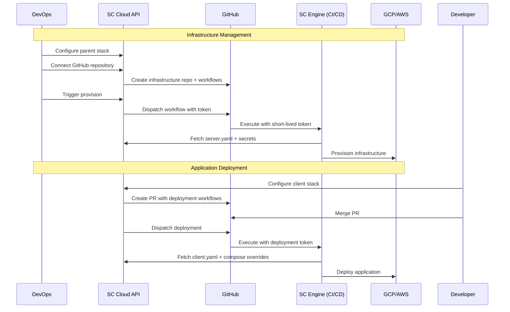

# Simple Container Cloud API - CI/CD Integration

## Overview

The Simple Container Cloud API integrates with GitHub to orchestrate CI/CD workflows while maintaining centralized configuration management. This hybrid approach enables GitHub Actions to execute deployments using configurations and secrets managed by the SC Cloud API.

## Architecture Flow



## GitHub Integration

### GitHub App Setup

SC Cloud uses a GitHub App for repository access and workflow management:

```go
type GitHubIntegrationService struct {
    client       *github.Client
    appTransport *ghinstallation.Transport
    db           *mongo.Database
}

func (gis *GitHubIntegrationService) AuthorizeRepository(ctx context.Context, userID, repoOwner, repoName, purpose string) (*GitHubRepository, error) {
    // Verify repository access, store authorization
    // Purpose: "infrastructure" or "deployment"
}
```

### Infrastructure Repository Management

For DevOps teams, SC Cloud creates infrastructure repositories:

```go
func (gis *GitHubIntegrationService) CreateInfrastructureRepository(ctx context.Context, parentStack *ParentStack) error {
    // 1. Create private repository: {stack-name}-infrastructure
    // 2. Setup repository structure (README, .gitignore, sc-config.yaml)
    // 3. Generate GitHub Actions workflows for provision/destroy/plan
    // 4. Store repository metadata
}
```

Generated workflows use short-lived tokens to access SC Cloud API:

```yaml
# .github/workflows/provision-infrastructure.yml
name: Provision Infrastructure
on:
  repository_dispatch:
    types: [provision-infrastructure]
  workflow_dispatch:

jobs:
  provision:
    runs-on: ubuntu-latest
    steps:
    - uses: actions/checkout@v4
    - uses: simple-container-com/setup-sc@v1
    
    - name: Configure SC Cloud API
      run: |
        echo "${{ secrets.SC_CLOUD_TOKEN }}" | sc cloud auth login --token-stdin
        sc cloud config set api-url "${{ secrets.SC_CLOUD_API_URL }}"
    
    - name: Download configuration
      run: |
        sc cloud stack download --stack-id "${{ vars.STACK_ID }}" --environment "${{ inputs.environment }}"
    
    - name: Provision
      run: sc provision --config-source cloud-api --stack-id "${{ vars.STACK_ID }}"
```

## Short-Lived Token System

### Workflow Token Generation

```go
type WorkflowToken struct {
    Token         string            `json:"token"`
    ExpiresAt     time.Time         `json:"expires_at"`  // 2 hours max
    Permissions   []string          `json:"permissions"`
    Scope         map[string]string `json:"scope"`       // Stack/environment limits
}

func (ts *TokenService) GenerateWorkflowToken(ctx context.Context, request *WorkflowTokenRequest) (*WorkflowToken, error) {
    // 1. Validate limited permissions based on purpose (infrastructure/deployment)
    // 2. Generate JWT with 2-hour expiration
    // 3. Include scope restrictions (stack_id, environment)
    // 4. Store for tracking and revocation
}
```

### Token-Based API Access

```go
func (wam *WorkflowAuthMiddleware) AuthenticateWorkflowToken() gin.HandlerFunc {
    return func(c *gin.Context) {
        // 1. Extract Bearer token
        // 2. Validate JWT and check expiration
        // 3. Verify token not revoked
        // 4. Set workflow context with permissions/scope
    }
}
```

## SC CLI Cloud Integration

### Configuration Source Resolution

Modified SC CLI supports cloud API as configuration source:

```go
type CloudAPIConfigSource struct {
    client  *CloudAPIClient
    token   string
    stackID string
}

func (cs *CloudAPIConfigSource) LoadServerConfig(ctx context.Context, stackName, environment string) (*api.ServerDescriptor, error) {
    // Download server.yaml from SC Cloud API using workflow token
}

func (cs *CloudAPIConfigSource) LoadSecrets(ctx context.Context, stackName, environment string) (*api.SecretsDescriptor, error) {
    // Download secrets from SC Cloud API with token-based access
}
```

CLI commands support cloud API mode:

```bash
# Traditional file-based
sc provision --stacks-dir ./config --profile production

# Cloud API mode (used in CI/CD)  
sc provision --config-source cloud-api --stack-id "stack-123" --environment production
sc deploy --config-source cloud-api --stack-id "client-456" --environment staging
```

## Developer Repository Integration

### Repository Scanning

SC Cloud scans developer repositories to generate deployment configurations:

```go
func (rs *RepositoryScanner) ScanDeveloperRepository(ctx context.Context, repo *GitHubRepository) (*RepositoryScanResult, error) {
    // 1. Analyze repository structure via GitHub API
    // 2. Detect project type (Node.js, Python, Go, etc.)
    // 3. Check for existing Dockerfile/docker-compose.yaml
    // 4. Generate deployment recommendations
}
```

### Deployment Workflow Generation

Creates pull requests with SC-integrated workflows:

```go
func (gis *GitHubIntegrationService) CreateDeploymentWorkflowPR(ctx context.Context, clientStack *ClientStack, scan *RepositoryScanResult) error {
    // 1. Create feature branch: sc-deployment-setup-{timestamp}
    // 2. Generate deployment workflow (.github/workflows/deploy.yml)
    // 3. Create SC-enhanced docker-compose.yaml
    // 4. Add SC configuration file (sc-config.yaml)
    // 5. Create pull request with description
}
```

Generated deployment workflow:

```yaml
# .github/workflows/deploy.yml
name: Deploy Application
on:
  repository_dispatch:
    types: [deploy-service]
  push:
    branches: [main]
    
jobs:
  deploy:
    runs-on: ubuntu-latest
    steps:
    - uses: actions/checkout@v4
    - uses: simple-container-com/setup-sc@v1
    
    - name: Download SC configuration
      run: |
        sc cloud stack download --stack-id "${{ vars.CLIENT_STACK_ID }}" --stack-type client
    
    - name: Merge configurations
      run: |
        sc compose merge --local docker-compose.yaml --sc-config ./sc-config/client.yaml
    
    - name: Deploy
      run: sc deploy --config-source cloud-api --stack-id "${{ vars.CLIENT_STACK_ID }}"
```

## Hybrid Configuration Strategy

### Configuration Layering

```go
type HybridConfigManager struct {
    cloudAPI   *CloudAPIClient
    fileSystem *FileSystemConfig
}

func (hcm *HybridConfigManager) LoadMergedConfiguration(ctx context.Context, request *ConfigLoadRequest) (*MergedConfiguration, error) {
    // 1. Load base configuration from SC Cloud API (authoritative)
    cloudConfig, err := hcm.cloudAPI.GetStackConfiguration(ctx, request)
    
    // 2. Load local overrides from repository (if exists)
    localOverrides, err := hcm.fileSystem.LoadLocalOverrides(request.LocalConfigPath)
    
    // 3. Merge with precedence rules:
    //    - Secrets/credentials: Cloud API only (security)
    //    - Resource definitions: Cloud API only (consistency)
    //    - Application config: Local overrides allowed
    //    - Environment variables: Local overrides allowed
    
    return hcm.merger.MergeConfigurations(cloudConfig, localOverrides, mergeRules)
}
```

### Configuration Precedence Rules

| Configuration Type | Source Priority | Rationale |
|-------------------|----------------|-----------|
| **Secrets & Credentials** | Cloud API Only | Security & centralized management |
| **Resource Definitions** | Cloud API Only | Infrastructure consistency |
| **Parent Stack References** | Cloud API Only | Dependency management |
| **Application Configuration** | Local Override Allowed | Development flexibility |
| **Environment Variables** | Local Override Allowed | Development/testing needs |
| **Docker Compose Services** | Local Override Allowed | Service customization |

### Local Override Example

```yaml
# Repository: docker-compose.override.yaml
# Developers can override application-specific settings
version: '3.8'
services:
  app:
    environment:
      - DEBUG=true
      - LOG_LEVEL=debug
    volumes:
      - ./src:/app/src:ro  # Development hot-reload
    ports:
      - "3000:3000"        # Local development port
      
# SC Cloud API provides:
# - Database connections (via parent stack resources)
# - Redis configuration
# - External service URLs
# - Production environment variables
```

## Triggering Workflows

### Infrastructure Provisioning

```go
func (scs *StackService) TriggerInfrastructureProvisioning(ctx context.Context, stackID, environment string) error {
    // 1. Generate short-lived workflow token
    token, err := scs.tokenService.GenerateWorkflowToken(ctx, &WorkflowTokenRequest{
        Purpose:     "infrastructure",
        StackID:     stackID,
        Environment: environment,
        Permissions: []string{"parent_stacks.read", "stack_secrets.read", "operations.report"},
    })
    
    // 2. Dispatch repository workflow
    return scs.github.DispatchWorkflow(ctx, &WorkflowDispatchRequest{
        Repository: stackRepo,
        EventType:  "provision-infrastructure",
        Payload: map[string]interface{}{
            "environment":    environment,
            "operation_id":   operationID,
            "stack_id":       stackID,
        },
        Token: token.Token,
    })
}
```

### Application Deployment

```go
func (dcs *DeploymentService) TriggerDeployment(ctx context.Context, clientStackID, environment, gitCommit string) error {
    // Generate deployment token with limited scope
    token, err := dcs.tokenService.GenerateWorkflowToken(ctx, &WorkflowTokenRequest{
        Purpose:     "deployment",
        StackID:     clientStackID,
        Environment: environment,
        Permissions: []string{"client_stacks.read", "client_stacks.deploy", "deployments.report"},
    })
    
    // Dispatch deployment workflow
    return dcs.github.DispatchWorkflow(ctx, &WorkflowDispatchRequest{
        Repository: clientRepo,
        EventType:  "deploy-service", 
        Payload: map[string]interface{}{
            "environment": environment,
            "git_commit":  gitCommit,
            "stack_id":    clientStackID,
        },
        Token: token.Token,
    })
}
```

This CI/CD integration design maintains Simple Container's ease-of-use while providing enterprise-grade configuration management, security, and workflow orchestration through GitHub Actions.
