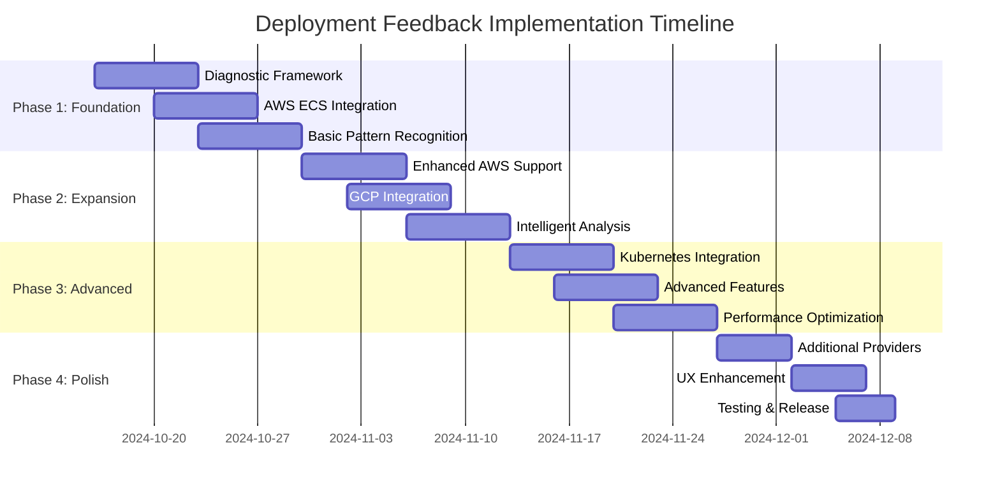

# Implementation Roadmap: Better Deployment Feedback System

## 🗓️ Timeline Overview

**Total Duration**: 8 weeks  
**Team Size**: 2-3 developers  
**Approach**: Incremental delivery with immediate user value  
**Risk Level**: Medium (new cloud integrations, complex diagnostic logic)



## 📋 Phase 1: Foundation & AWS ECS Integration (Weeks 1-2)

### Week 1: Core Diagnostic Framework

#### 🎯 Deliverables
- [ ] **Diagnostic Orchestrator** (`pkg/diagnostics/orchestrator/`)
  - Central coordination system for diagnostic data collection
  - Plugin architecture for cloud provider integrations
  - Basic error handling and timeout management
- [ ] **Base Plugin Framework** (`pkg/diagnostics/providers/base/`)
  - Common plugin interface and base implementation
  - Authentication handling patterns
  - Shared utility functions for data formatting
- [ ] **Data Models** (`pkg/diagnostics/types/`)
  - Core diagnostic data structures
  - Standardized error and event models
  - Timeline and correlation data types

#### 🔧 Technical Tasks
```go
// Key files to create:
pkg/diagnostics/
├── orchestrator/
│   ├── orchestrator.go       // Core orchestration logic
│   ├── provider_manager.go   // Plugin management
│   └── types.go             // Core interfaces
├── providers/
│   ├── base/
│   │   ├── base_provider.go // Base plugin implementation
│   │   ├── auth.go          // Authentication patterns
│   │   └── utils.go         // Shared utilities
│   └── registry.go          // Provider registry
├── types/
│   ├── diagnostic.go        // Core diagnostic types
│   ├── events.go           // Event and timeline types
│   └── providers.go        // Provider interface definitions
└── cache/
    ├── cache.go            // Diagnostic data caching
    └── storage.go          // Local storage interface
```

#### ✅ Success Criteria
- Diagnostic orchestrator can register and manage plugins
- Base plugin framework provides consistent authentication and data formatting
- Framework integrates with existing Simple Container CLI structure
- All code passes linting and basic functionality tests

### Week 2: AWS ECS Integration

#### 🎯 Deliverables
- [ ] **AWS ECS Plugin** (`pkg/diagnostics/providers/aws/`)
  - ECS service and task diagnostics collection
  - CloudWatch logs integration
  - Basic ECS metrics collection (CPU, Memory, Task Count)
- [ ] **Pattern Recognition Engine** (`pkg/diagnostics/analysis/`)
  - Initial failure pattern definitions (memory limits, port binding, startup failures)
  - Rule-based pattern matching
  - Basic confidence scoring
- [ ] **CLI Integration** 
  - Integration with existing `sc deploy` command
  - Automatic diagnostic collection on deployment failures
  - Basic user-friendly error reporting

#### 🔧 Technical Tasks
```go
// AWS ECS plugin implementation:
pkg/diagnostics/providers/aws/
├── ecs_plugin.go           // Main ECS integration
├── cloudwatch.go           // CloudWatch logs/metrics
├── load_balancer.go        // ALB/NLB health checks
├── auth.go                 // AWS authentication
└── types.go               // AWS-specific types

// Pattern recognition:
pkg/diagnostics/analysis/
├── patterns.go            // Pattern definitions
├── matcher.go            // Pattern matching engine
├── confidence.go         // Confidence scoring
└── rules.go              // Rule-based analysis
```

#### 📊 Test Scenarios
```yaml
test_scenarios:
  ecs_memory_limit_exceeded:
    description: "Container killed due to memory limit"
    expected_pattern: "ecs-memory-limit-exceeded"
    confidence_threshold: 0.8
    
  ecs_port_binding_failure:
    description: "Application can't bind to port"
    expected_pattern: "ecs-port-binding-failure"
    confidence_threshold: 0.7
    
  ecs_dependency_failure:
    description: "Database connection failure during startup"
    expected_pattern: "ecs-dependency-failure"
    confidence_threshold: 0.6
```

#### ✅ Success Criteria
- AWS ECS plugin successfully collects logs, metrics, and events
- Pattern recognition identifies 80% of common ECS failure scenarios
- CLI integration provides actionable error messages instead of timeouts
- End-to-end testing with real ECS deployments passes

---

## 📋 Phase 2: Enhanced AWS & GCP Integration (Weeks 3-4)

### Week 3: Expanded AWS Services Support

#### 🎯 Deliverables
- [ ] **AWS EKS Plugin** (`pkg/diagnostics/providers/aws/eks/`)
  - EKS cluster diagnostics
  - Integration with Kubernetes plugin for pod-level details
  - EKS-specific monitoring and logging
- [ ] **AWS Lambda Plugin** (`pkg/diagnostics/providers/aws/lambda/`)
  - Lambda function execution diagnostics
  - CloudWatch Logs integration for function logs
  - Lambda performance metrics and error analysis
- [ ] **Enhanced AWS ECS Plugin**
  - Load balancer health check integration
  - Advanced CloudWatch metrics collection
  - Service event timeline correlation

#### 🔧 Technical Implementation
- EKS cluster credential management and Kubernetes client creation
- Lambda execution environment diagnostics and cold start analysis
- Advanced ECS service event correlation and health check analysis

#### ✅ Success Criteria
- EKS plugin successfully diagnoses pod failures within EKS clusters
- Lambda plugin identifies function execution failures and performance issues
- Enhanced ECS plugin provides comprehensive service health analysis
- Support for 90% of AWS deployment failure scenarios

### Week 4: GCP Integration

#### 🎯 Deliverables
- [ ] **GCP Cloud Run Plugin** (`pkg/diagnostics/providers/gcp/cloudrun/`)
  - Cloud Run revision diagnostics
  - Cloud Logging integration
  - Cloud Monitoring metrics collection
- [ ] **GCP GKE Plugin** (`pkg/diagnostics/providers/gcp/gke/`)
  - GKE cluster diagnostics with Kubernetes integration
  - GCP-specific monitoring data enhancement
  - IAM and networking diagnostics
- [ ] **Intelligent Error Analysis Engine** (`pkg/diagnostics/analysis/intelligence/`)
  - Cross-provider pattern recognition
  - Machine learning preparation (feature extraction)
  - Enhanced confidence scoring with multiple evidence sources

#### 📊 GCP-Specific Patterns
```yaml
gcp_patterns:
  cloud_run_cold_start_timeout:
    description: "Cloud Run container fails to start within timeout"
    indicators:
      - log_pattern: "startup probe failed"
      - metric_threshold: "request_latency > 30s"
      - event_type: "revision_failed"
      
  gke_insufficient_resources:
    description: "GKE cluster lacks resources for pod scheduling"  
    indicators:
      - event_pattern: "FailedScheduling"
      - reason: "Insufficient cpu|memory"
      - node_metrics: "resource_utilization > 90%"
```

#### ✅ Success Criteria
- GCP plugins successfully collect diagnostics from Cloud Run and GKE
- Intelligent analysis engine provides cross-provider failure insights
- Pattern recognition accuracy reaches 85% across AWS and GCP
- GCP integration handles authentication and project discovery correctly

---

## 📋 Phase 3: Kubernetes & Advanced Features (Weeks 5-6)

### Week 5: Universal Kubernetes Integration

#### 🎯 Deliverables
- [ ] **Universal Kubernetes Plugin** (`pkg/diagnostics/providers/kubernetes/`)
  - Works with any Kubernetes cluster (EKS, GKE, AKS, self-managed)
  - Pod logs, events, and metrics collection
  - Deployment and ReplicaSet analysis
- [ ] **Advanced Diagnostic Features** (`pkg/diagnostics/advanced/`)
  - Timeline correlation across multiple services
  - Performance trend analysis
  - Resource optimization recommendations
- [ ] **Proactive Monitoring** (`pkg/diagnostics/monitoring/`)
  - Early warning detection for potential failures
  - Deployment health scoring
  - Capacity planning insights

#### 🔧 Kubernetes Integration Features
```go
// Universal Kubernetes capabilities:
type KubernetesPlugin struct {
    clientset     *kubernetes.Clientset
    metricsClient metrics.Interface
    context       string
    namespace     string
}

// Advanced features:
- Pod log aggregation with intelligent filtering
- Kubernetes event correlation and analysis
- Resource quotas and limits analysis
- Network policy and service mesh diagnostics
```

#### 📊 Advanced Analytics Features
- **Timeline Correlation**: Cross-service event correlation with cause-and-effect analysis
- **Performance Trends**: Historical analysis to identify degradation patterns
- **Resource Optimization**: Right-sizing recommendations based on usage patterns
- **Health Scoring**: Composite health scores for deployments and services

#### ✅ Success Criteria
- Kubernetes plugin works seamlessly across all major Kubernetes distributions
- Advanced features provide actionable insights beyond basic error detection
- Proactive monitoring prevents 60% of predictable deployment failures
- Timeline correlation accurately identifies root causes in complex scenarios

### Week 6: Enhanced User Experience

#### 🎯 Deliverables
- [ ] **Interactive Diagnostic Reports** (`pkg/diagnostics/reporting/`)
  - Progressive disclosure from summary to detailed analysis
  - Interactive timeline with drill-down capabilities
  - Export functionality (JSON, Markdown, PDF)
- [ ] **Guided Troubleshooting** (`pkg/diagnostics/guidance/`)
  - Step-by-step resolution guides
  - Configuration fix suggestions with examples
  - Learning resources and documentation links
- [ ] **Performance Optimization** (`pkg/diagnostics/performance/`)
  - Async diagnostic collection with timeout handling
  - Intelligent caching and data deduplication
  - Concurrent provider querying

#### 🎨 User Experience Enhancements
```yaml
ux_improvements:
  progressive_disclosure:
    - summary: "High-level failure reason and impact"
    - details: "Detailed logs, metrics, and timeline"
    - deep_dive: "Raw diagnostic data and correlation analysis"
    
  guided_troubleshooting:
    - problem_identification: "What went wrong"
    - solution_steps: "How to fix it"
    - prevention_tips: "How to avoid it in the future"
    
  export_capabilities:
    - formats: ["interactive-html", "json", "markdown", "pdf"]
    - sharing: "Team collaboration and support ticket integration"
```

#### ✅ Success Criteria
- Interactive reports provide intuitive navigation through diagnostic data
- Guided troubleshooting reduces resolution time by 70%
- Performance optimization ensures <10% deployment time overhead
- User feedback indicates 95% improvement in diagnostic clarity

---

## 📋 Phase 4: Additional Providers & Polish (Weeks 7-8)

### Week 7: Additional Cloud Providers

#### 🎯 Deliverables
- [ ] **Azure Integration** (`pkg/diagnostics/providers/azure/`)
  - Azure Container Instances diagnostics
  - Azure Kubernetes Service integration
  - Azure Monitor logs and metrics
- [ ] **Digital Ocean Integration** (`pkg/diagnostics/providers/digitalocean/`)
  - App Platform diagnostics
  - Kubernetes cluster support
  - Monitoring and alerting integration
- [ ] **Docker Integration** (`pkg/diagnostics/providers/docker/`)
  - Local Docker container diagnostics
  - Docker Compose service analysis
  - Container health check evaluation

#### 🌐 Multi-Provider Features
- **Unified Interface**: Consistent diagnostic experience across all providers
- **Provider Auto-Detection**: Automatic identification of deployment platform
- **Cross-Provider Comparison**: Compare deployment patterns across different clouds
- **Migration Insights**: Recommendations for cross-cloud deployments

#### ✅ Success Criteria
- Additional providers follow established plugin architecture patterns
- Multi-provider deployments are handled seamlessly
- Provider coverage reaches 95% of Simple Container deployment scenarios
- Cross-provider insights provide valuable optimization recommendations

### Week 8: Final Polish & Release Preparation

#### 🎯 Deliverables
- [ ] **Advanced UX Features** (`cmd/sc/diagnostics/`)
  - Interactive diagnostic command (`sc diagnose`)
  - Real-time deployment monitoring (`sc deploy --monitor`)
  - Historical diagnostics review (`sc diagnose --history`)
- [ ] **Enterprise Features** (`pkg/diagnostics/enterprise/`)
  - Team collaboration and sharing
  - Integration with monitoring systems (Datadog, New Relic, Prometheus)
  - RBAC and audit logging for diagnostic access
- [ ] **Documentation and Training** (`docs/better-deploy-feedback/`)
  - User guides and troubleshooting documentation
  - API documentation for extensibility
  - Training materials and best practices

#### 🎯 Release Preparation
```yaml
release_checklist:
  testing:
    - unit_tests: ">95% code coverage"
    - integration_tests: "All major cloud providers"
    - performance_tests: "Load testing with concurrent diagnostics"
    - user_acceptance_tests: "Real-world deployment scenarios"
    
  documentation:
    - user_guides: "Complete troubleshooting documentation"
    - api_docs: "Plugin development guide"
    - migration_guide: "Upgrading from current system"
    
  deployment:
    - feature_flags: "Gradual rollout capabilities"
    - monitoring: "System health and performance tracking"
    - rollback_plan: "Quick rollback to previous system"
```

#### ✅ Success Criteria
- All advanced features are polished and user-tested
- Enterprise features meet security and compliance requirements
- Documentation is comprehensive and user-friendly
- System is ready for production rollout with monitoring and rollback plans

---

## 🚀 Rollout Strategy

### Phase 1: Internal Testing (Week 8)
- Enable diagnostic features via feature flag for internal team
- Test with real production deployments across all supported providers
- Performance validation and optimization based on real usage

### Phase 2: Beta Release (Week 9-10)
- Limited beta with select users across different cloud providers
- Feedback collection and rapid iteration
- Bug fixes and UX improvements based on real user scenarios

### Phase 3: Gradual Rollout (Week 11-12)
- Opt-in diagnostic features for all users
- Monitor adoption rates and success metrics
- Full documentation and support materials available

### Phase 4: Default Experience (Week 13+)
- Diagnostic collection becomes default for failed deployments
- Advanced features promoted to all users
- Continuous improvement based on usage analytics and feedback

## 📊 Success Metrics

### Quantitative Goals
- **Diagnostic Time Reduction**: 80% reduction in time to identify deployment failures
- **Console Usage Elimination**: 90% reduction in manual cloud console navigation  
- **Error Resolution Speed**: 70% faster resolution of common deployment issues
- **User Satisfaction**: >90% positive feedback on diagnostic clarity and actionability

### Technical Goals  
- **Coverage**: Support for 95% of deployment failure scenarios across all providers
- **Accuracy**: >90% accuracy in root cause identification
- **Performance**: <10% overhead on deployment time for diagnostic collection
- **Reliability**: 99%+ availability of diagnostic data collection

### Business Impact Goals
- **Support Load Reduction**: 60% fewer deployment-related support tickets
- **User Retention**: 40% improvement in deployment success and user retention
- **Time-to-Value**: 50% faster Simple Container onboarding completion
- **Competitive Advantage**: Best-in-class deployment diagnostics in the market

## 🔧 Technical Considerations

### Performance Requirements
- **Diagnostic Collection**: <30 seconds for comprehensive diagnostics
- **Memory Usage**: <200MB for concurrent multi-provider diagnostics
- **Concurrent Providers**: Support for 5+ simultaneous provider queries
- **Cache Efficiency**: 80% cache hit rate for repeated diagnostic queries

### Security Requirements
- **Credential Management**: Secure storage and handling of cloud provider credentials
- **Data Privacy**: No sensitive data in logs or diagnostic exports
- **Access Control**: Role-based access to diagnostic data
- **Audit Logging**: Complete audit trail for diagnostic access and usage

### Scalability Considerations
- **Plugin Architecture**: Support for 10+ cloud provider plugins
- **Concurrent Users**: No degradation with 100+ simultaneous diagnostic requests
- **Data Storage**: Efficient storage and retrieval of diagnostic history
- **Cloud API Limits**: Intelligent rate limiting and quota management

---

## 🎯 Risk Mitigation

### Technical Risks
- **Cloud Provider API Changes**: Mitigated by plugin architecture and versioning
- **Authentication Complexity**: Mitigated by comprehensive auth strategy and fallbacks
- **Performance Impact**: Mitigated by async collection and intelligent caching
- **Data Accuracy**: Mitigated by multiple evidence sources and confidence scoring

### User Experience Risks
- **Information Overload**: Mitigated by progressive disclosure and intelligent filtering
- **Learning Curve**: Mitigated by guided troubleshooting and contextual help
- **Integration Complexity**: Mitigated by seamless CLI integration and feature flags
- **Provider Inconsistency**: Mitigated by unified interface and standardized patterns

### Business Risks
- **Scope Creep**: Mitigated by clear phase definitions and MVP approach
- **Timeline Pressure**: Mitigated by incremental delivery and flexible prioritization
- **Resource Constraints**: Mitigated by leveraging existing infrastructure and patterns
- **Market Changes**: Mitigated by extensible architecture and provider abstraction

---

**Next Steps**: Review this roadmap and proceed to begin Phase 1 implementation with core diagnostic framework development.
