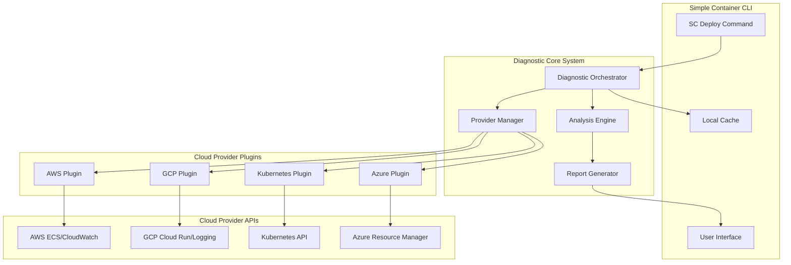

# Technical Architecture: Better Deployment Feedback System

## 🏗️ System Overview

The Better Deployment Feedback System is designed as a modular, extensible architecture that provides real-time deployment diagnostics and intelligent error analysis across multiple cloud providers.



## 📦 Core Components

### 1. Diagnostic Orchestrator

**Responsibility**: Central coordination of diagnostic data collection and analysis

```go
type DiagnosticOrchestrator struct {
    providerManager *ProviderManager
    analysisEngine  *AnalysisEngine
    reportGenerator *ReportGenerator
    cache          *DiagnosticCache
    config         *DiagnosticConfig
}

type DiagnosticRequest struct {
    DeploymentID    string
    CloudProvider   string
    ServiceName     string
    Region          string
    StartTime       time.Time
    TimeoutDuration time.Duration
    Context         map[string]interface{}
}

type DiagnosticResult struct {
    DeploymentID     string
    Status           DiagnosticStatus
    RootCause        *RootCause
    Timeline         []DiagnosticEvent
    Recommendations  []Recommendation
    RawData          map[string]interface{}
    GeneratedAt      time.Time
}

// Main orchestration methods
func (do *DiagnosticOrchestrator) CollectDiagnostics(ctx context.Context, req *DiagnosticRequest) (*DiagnosticResult, error)
func (do *DiagnosticOrchestrator) AnalyzeFailure(ctx context.Context, data *DiagnosticData) (*AnalysisResult, error)
func (do *DiagnosticOrchestrator) GenerateReport(ctx context.Context, result *DiagnosticResult) (*DiagnosticReport, error)
```

### 2. Provider Manager

**Responsibility**: Manage cloud provider-specific diagnostic plugins

```go
type ProviderManager struct {
    providers map[string]DiagnosticProvider
    registry  *ProviderRegistry
    logger    logger.Logger
}

type DiagnosticProvider interface {
    Name() string
    SupportedServices() []string
    CollectLogs(ctx context.Context, req *LogRequest) (*LogData, error)
    CollectMetrics(ctx context.Context, req *MetricRequest) (*MetricData, error)
    CollectEvents(ctx context.Context, req *EventRequest) (*EventData, error)
    GetServiceStatus(ctx context.Context, req *StatusRequest) (*ServiceStatus, error)
}

// Provider management methods
func (pm *ProviderManager) RegisterProvider(provider DiagnosticProvider)
func (pm *ProviderManager) GetProvider(providerName string) (DiagnosticProvider, error)
func (pm *ProviderManager) CollectAllDiagnostics(ctx context.Context, req *DiagnosticRequest) (*DiagnosticData, error)
```

### 3. Analysis Engine

**Responsibility**: Intelligent pattern recognition and root cause analysis

```go
type AnalysisEngine struct {
    patterns       []FailurePattern
    ruleEngine     *RuleEngine
    mlClassifier   *MLClassifier
    knowledgeBase  *KnowledgeBase
}

type FailurePattern struct {
    ID          string
    Name        string
    Description string
    Indicators  []PatternIndicator
    Confidence  func(*DiagnosticData) float64
    Solutions   []Solution
}

type RootCause struct {
    Category     string
    Description  string
    Confidence   float64
    Evidence     []Evidence
    Solutions    []Solution
    LearnMoreURL string
}

// Analysis methods
func (ae *AnalysisEngine) AnalyzeFailure(data *DiagnosticData) (*RootCause, error)
func (ae *AnalysisEngine) IdentifyPatterns(data *DiagnosticData) ([]FailurePattern, error)
func (ae *AnalysisEngine) GenerateRecommendations(rootCause *RootCause) ([]Recommendation, error)
```

### 4. Report Generator

**Responsibility**: Create user-friendly diagnostic reports and summaries

```go
type ReportGenerator struct {
    templates map[string]*template.Template
    formatter *ReportFormatter
}

type DiagnosticReport struct {
    Summary      *ReportSummary
    Timeline     *DeploymentTimeline
    RootCause    *RootCauseReport
    Logs         *LogReport
    Metrics      *MetricReport
    Solutions    *SolutionReport
    ExportFormats []string
}

// Report generation methods
func (rg *ReportGenerator) GenerateReport(result *DiagnosticResult) (*DiagnosticReport, error)
func (rg *ReportGenerator) ExportReport(report *DiagnosticReport, format string) ([]byte, error)
func (rg *ReportGenerator) GenerateSummary(result *DiagnosticResult) (*ReportSummary, error)
```

## 🔌 Cloud Provider Plugin Architecture

### Base Plugin Interface

```go
type BaseCloudProvider struct {
    name        string
    credentials CloudCredentials
    config      ProviderConfig
    client      interface{}
}

// Common plugin functionality
func (bp *BaseCloudProvider) ValidateCredentials() error
func (bp *BaseCloudProvider) EstablishConnection() error
func (bp *BaseCloudProvider) FormatError(err error) *FormattedError
func (bp *BaseCloudProvider) CacheKey(request interface{}) string
```

### AWS ECS Plugin

```go
type AWSECSPlugin struct {
    *BaseCloudProvider
    ecsClient        *ecs.Client
    cloudWatchClient *cloudwatch.Client
    elbClient        *elbv2.Client
    logsClient       *cloudwatchlogs.Client
}

func (aws *AWSECSPlugin) CollectLogs(ctx context.Context, req *LogRequest) (*LogData, error) {
    // Implementation for collecting ECS container logs from CloudWatch
    taskArn := aws.findTaskArn(req.ServiceName)
    logGroups := aws.getLogGroups(taskArn)
    
    var logs []LogEntry
    for _, group := range logGroups {
        logEvents, err := aws.logsClient.FilterLogEvents(ctx, &cloudwatchlogs.FilterLogEventsInput{
            LogGroupName: &group,
            StartTime:    &req.StartTime.Unix(),
            EndTime:      &req.EndTime.Unix(),
        })
        if err != nil {
            return nil, fmt.Errorf("failed to collect logs: %w", err)
        }
        
        logs = append(logs, aws.convertLogEvents(logEvents)...)
    }
    
    return &LogData{
        Source:    "cloudwatch",
        Logs:      logs,
        Metadata:  aws.buildLogMetadata(req),
    }, nil
}

func (aws *AWSECSPlugin) CollectMetrics(ctx context.Context, req *MetricRequest) (*MetricData, error) {
    // Implementation for collecting ECS service and task metrics
    metrics := []string{
        "CPUUtilization",
        "MemoryUtilization", 
        "TaskCount",
        "ServiceConnectClientTLSNegotiationErrorCount",
    }
    
    var metricData []MetricPoint
    for _, metricName := range metrics {
        result, err := aws.cloudWatchClient.GetMetricStatistics(ctx, &cloudwatch.GetMetricStatisticsInput{
            Namespace:  aws.String("AWS/ECS"),
            MetricName: aws.String(metricName),
            StartTime:  &req.StartTime,
            EndTime:    &req.EndTime,
            Period:     aws.Int32(60), // 1-minute intervals
            Statistics: []types.Statistic{types.StatisticAverage, types.StatisticMaximum},
            Dimensions: aws.buildECSMetricDimensions(req.ServiceName),
        })
        
        if err != nil {
            continue // Continue with other metrics if one fails
        }
        
        metricData = append(metricData, aws.convertMetricStatistics(metricName, result)...)
    }
    
    return &MetricData{
        Provider:  "aws-cloudwatch",
        Metrics:   metricData,
        Metadata:  aws.buildMetricMetadata(req),
    }, nil
}

func (aws *AWSECSPlugin) CollectEvents(ctx context.Context, req *EventRequest) (*EventData, error) {
    // Implementation for collecting ECS service events
    serviceEvents, err := aws.ecsClient.DescribeServices(ctx, &ecs.DescribeServicesInput{
        Cluster:  &req.ClusterName,
        Services: []string{req.ServiceName},
        Include:  []types.ServiceField{types.ServiceFieldEvents},
    })
    
    if err != nil {
        return nil, fmt.Errorf("failed to collect service events: %w", err)
    }
    
    var events []DiagnosticEvent
    for _, service := range serviceEvents.Services {
        for _, event := range service.Events {
            events = append(events, DiagnosticEvent{
                Timestamp: *event.CreatedAt,
                Source:    "ecs-service",
                Level:     aws.determineEventLevel(*event.Message),
                Message:   *event.Message,
                Metadata: map[string]interface{}{
                    "service_arn": service.ServiceArn,
                    "event_id":    event.Id,
                },
            })
        }
    }
    
    return &EventData{
        Source: "aws-ecs",
        Events: events,
        Metadata: aws.buildEventMetadata(req),
    }, nil
}
```

### GCP Cloud Run Plugin

```go
type GCPCloudRunPlugin struct {
    *BaseCloudProvider
    runClient     *run.Client
    loggingClient *logging.Client
    monitoringClient *monitoring.MetricClient
}

func (gcp *GCPCloudRunPlugin) CollectLogs(ctx context.Context, req *LogRequest) (*LogData, error) {
    // Implementation for collecting Cloud Run logs
    filter := fmt.Sprintf(
        `resource.type="cloud_run_revision" AND resource.labels.service_name="%s" AND timestamp>="%s" AND timestamp<="%s"`,
        req.ServiceName,
        req.StartTime.Format(time.RFC3339),
        req.EndTime.Format(time.RFC3339),
    )
    
    iter := gcp.loggingClient.Entries(ctx, logging.Filter(filter))
    
    var logs []LogEntry
    for {
        entry, err := iter.Next()
        if err == iterator.Done {
            break
        }
        if err != nil {
            return nil, fmt.Errorf("failed to read log entry: %w", err)
        }
        
        logs = append(logs, LogEntry{
            Timestamp: entry.Timestamp,
            Level:     gcp.convertSeverity(entry.Severity),
            Message:   gcp.formatLogPayload(entry.Payload),
            Source:    "cloud-run",
            Metadata: map[string]interface{}{
                "revision": entry.Resource.Labels["revision_name"],
                "severity": entry.Severity.String(),
            },
        })
    }
    
    return &LogData{
        Source: "gcp-logging",
        Logs:   logs,
        Metadata: gcp.buildLogMetadata(req),
    }, nil
}
```

### Kubernetes Plugin

```go
type KubernetesPlugin struct {
    *BaseCloudProvider
    clientset     *kubernetes.Clientset
    metricsClient metricsv1beta1.Interface
    config        *rest.Config
}

func (k8s *KubernetesPlugin) CollectLogs(ctx context.Context, req *LogRequest) (*LogData, error) {
    // Implementation for collecting pod logs
    pods, err := k8s.clientset.CoreV1().Pods(req.Namespace).List(ctx, metav1.ListOptions{
        LabelSelector: fmt.Sprintf("app=%s", req.ServiceName),
    })
    
    if err != nil {
        return nil, fmt.Errorf("failed to list pods: %w", err)
    }
    
    var logs []LogEntry
    for _, pod := range pods.Items {
        for _, container := range pod.Spec.Containers {
            podLogs, err := k8s.getPodLogs(ctx, pod.Name, container.Name, req)
            if err != nil {
                continue // Continue with other containers if one fails
            }
            logs = append(logs, podLogs...)
        }
    }
    
    return &LogData{
        Source: "kubernetes",
        Logs:   logs,
        Metadata: k8s.buildLogMetadata(req),
    }, nil
}

func (k8s *KubernetesPlugin) CollectEvents(ctx context.Context, req *EventRequest) (*EventData, error) {
    // Implementation for collecting Kubernetes events
    events, err := k8s.clientset.CoreV1().Events(req.Namespace).List(ctx, metav1.ListOptions{
        FieldSelector: fmt.Sprintf("involvedObject.name=%s", req.ServiceName),
    })
    
    if err != nil {
        return nil, fmt.Errorf("failed to collect events: %w", err)
    }
    
    var diagnosticEvents []DiagnosticEvent
    for _, event := range events.Items {
        diagnosticEvents = append(diagnosticEvents, DiagnosticEvent{
            Timestamp: event.CreationTimestamp.Time,
            Source:    "kubernetes-event",
            Level:     k8s.convertEventType(event.Type),
            Message:   event.Message,
            Metadata: map[string]interface{}{
                "reason":    event.Reason,
                "object":    event.InvolvedObject,
                "count":     event.Count,
            },
        })
    }
    
    return &EventData{
        Source: "kubernetes",
        Events: diagnosticEvents,
        Metadata: k8s.buildEventMetadata(req),
    }, nil
}
```

## 🧠 Pattern Recognition & Analysis

### Failure Pattern Definitions

```go
var ECSFailurePatterns = []FailurePattern{
    {
        ID:   "ecs-memory-limit-exceeded",
        Name: "Container Memory Limit Exceeded",
        Description: "Container was killed due to exceeding memory limits",
        Indicators: []PatternIndicator{
            {
                Type: "log-pattern",
                Pattern: regexp.MustCompile(`killed.*oom-killer`),
                Weight: 0.8,
            },
            {
                Type: "exit-code",
                Pattern: "137",
                Weight: 0.7,
            },
            {
                Type: "metric-threshold",
                Metric: "MemoryUtilization",
                Threshold: 95.0,
                Weight: 0.6,
            },
        },
        Confidence: func(data *DiagnosticData) float64 {
            // Calculate confidence score based on indicators
            score := 0.0
            for _, indicator := range this.Indicators {
                if indicator.Matches(data) {
                    score += indicator.Weight
                }
            }
            return math.Min(score, 1.0)
        },
        Solutions: []Solution{
            {
                Title: "Increase Memory Allocation",
                Description: "Your container needs more memory than currently allocated",
                Steps: []string{
                    "Open your client.yaml file",
                    "Increase the 'maxMemory' value in your stack configuration",
                    "Recommended: Set maxMemory to at least 2048 (2GB)",
                    "Run 'sc deploy' to apply the changes",
                },
                ConfigExample: `
stacks:
  production:
    type: single-image
    config:
      maxMemory: 2048  # Increased from 1024`,
            },
        },
    },
    
    {
        ID:   "ecs-port-binding-failure",
        Name: "Port Binding Failure",
        Description: "Container failed to bind to the specified port",
        Indicators: []PatternIndicator{
            {
                Type: "log-pattern",
                Pattern: regexp.MustCompile(`bind.*address already in use|port.*already in use`),
                Weight: 0.9,
            },
            {
                Type: "health-check-failure",
                Pattern: "connection-refused",
                Weight: 0.7,
            },
        },
        Solutions: []Solution{
            {
                Title: "Check Port Configuration",
                Description: "Verify your application is listening on the correct port",
                Steps: []string{
                    "Ensure your application listens on the port specified in client.yaml",
                    "Check that the port matches your application's configuration", 
                    "Verify no other process is using the same port",
                },
            },
        },
    },
}
```

### ML-Based Classification

```go
type MLClassifier struct {
    model     *tensorflow.SavedModel
    features  *FeatureExtractor
    labels    map[int]string
}

func (ml *MLClassifier) ClassifyFailure(data *DiagnosticData) (*ClassificationResult, error) {
    // Extract features from diagnostic data
    features, err := ml.features.Extract(data)
    if err != nil {
        return nil, err
    }
    
    // Run inference
    predictions, err := ml.model.Predict(features)
    if err != nil {
        return nil, err
    }
    
    // Convert predictions to classification result
    return &ClassificationResult{
        PrimaryCategory: ml.labels[predictions.TopClass],
        Confidence:     predictions.Confidence,
        AllCategories:  ml.convertAllPredictions(predictions),
    }, nil
}
```

## 📊 Data Models

### Core Data Structures

```go
type DiagnosticData struct {
    DeploymentID  string
    CloudProvider string
    ServiceName   string
    CollectedAt   time.Time
    Logs          *LogData
    Metrics       *MetricData
    Events        *EventData
    Status        *ServiceStatus
}

type LogData struct {
    Source   string
    Logs     []LogEntry
    Metadata map[string]interface{}
}

type LogEntry struct {
    Timestamp time.Time
    Level     LogLevel
    Message   string
    Source    string
    Metadata  map[string]interface{}
}

type MetricData struct {
    Provider string
    Metrics  []MetricPoint
    Metadata map[string]interface{}
}

type MetricPoint struct {
    Name      string
    Value     float64
    Unit      string
    Timestamp time.Time
    Tags      map[string]string
}

type EventData struct {
    Source   string
    Events   []DiagnosticEvent
    Metadata map[string]interface{}
}

type DiagnosticEvent struct {
    Timestamp time.Time
    Source    string
    Level     EventLevel
    Message   string
    Metadata  map[string]interface{}
}

type ServiceStatus struct {
    State           string
    HealthStatus    string
    TaskCount       int
    RunningTasks    int
    PendingTasks    int
    LastDeployment  *DeploymentInfo
    LoadBalancerStatus *LoadBalancerStatus
}
```

## 🚀 Integration Points

### CLI Integration

```go
// Enhanced deploy command with diagnostic capabilities
func (c *DeployCommand) Run(ctx context.Context, args []string) error {
    // Existing deployment logic...
    
    if deployResult.Failed() {
        // Automatically collect diagnostics on failure
        diagnostics := c.collectDiagnostics(ctx, deployResult)
        
        // Display intelligent error analysis
        c.displayDiagnosticSummary(diagnostics)
        
        // Offer detailed analysis
        if c.shouldShowDetails() {
            c.displayDetailedDiagnostics(diagnostics)
        }
        
        return deployResult.Error
    }
    
    return nil
}
```

### Caching Strategy

```go
type DiagnosticCache struct {
    store  cache.Store
    ttl    time.Duration
    config *CacheConfig
}

func (dc *DiagnosticCache) Get(key string) (*CachedDiagnostic, bool)
func (dc *DiagnosticCache) Set(key string, data *DiagnosticData, ttl time.Duration)
func (dc *DiagnosticCache) Invalidate(deploymentID string)
```

## 🔧 Configuration

### System Configuration

```yaml
# .sc/diagnostics-config.yaml
diagnostics:
  enabled: true
  auto_collect_on_failure: true
  
  providers:
    aws:
      enabled: true
      regions: ["us-east-1", "us-west-2"]
      services: ["ecs", "eks", "lambda"]
      
    gcp:
      enabled: true
      projects: ["my-project"]
      services: ["cloud-run", "gke"]
      
    kubernetes:
      enabled: true
      contexts: ["production", "staging"]
      
  collection:
    timeout: "5m"
    log_lines_limit: 1000
    metric_resolution: "1m"
    event_lookback: "1h"
    
  analysis:
    pattern_matching: true
    ml_classification: false  # Optional AI enhancement
    confidence_threshold: 0.7
    
  output:
    format: "interactive"  # interactive, json, yaml
    export_formats: ["json", "markdown"]
    show_raw_data: false
    
  cache:
    enabled: true
    ttl: "1h"
    max_size: "100MB"
```

---

**Next Steps**: Continue with [`CLOUD_INTEGRATIONS.md`](./CLOUD_INTEGRATIONS.md) for detailed cloud provider integration specifications.
