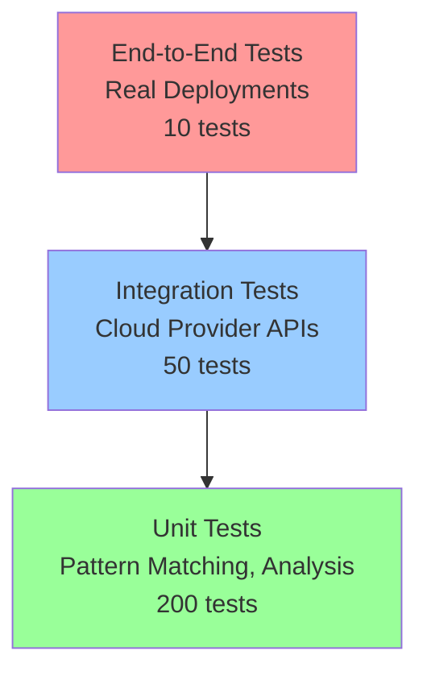

# Testing Strategy: Better Deployment Feedback System

## 🎯 Testing Overview

The Better Deployment Feedback System requires comprehensive testing to ensure reliability, accuracy, and performance across multiple cloud providers and failure scenarios. This document outlines our multi-layered testing approach.

## 🏗️ Testing Architecture

### Testing Pyramid Structure



### Test Categories

```yaml
test_categories:
  unit_tests:
    purpose: "Test individual components in isolation"
    coverage_target: ">95%"
    execution_time: "<30 seconds"
    examples: ["pattern matching", "diagnostic parsing", "confidence scoring"]
    
  integration_tests: 
    purpose: "Test component interactions and cloud provider integrations"
    coverage_target: ">85%"
    execution_time: "<5 minutes"
    examples: ["AWS ECS integration", "GCP Cloud Run integration", "K8s API integration"]
    
  contract_tests:
    purpose: "Ensure cloud provider API compatibility"
    coverage_target: "100% of supported APIs"
    execution_time: "<2 minutes"
    examples: ["ECS API schemas", "CloudWatch response formats", "Kubernetes event formats"]
    
  end_to_end_tests:
    purpose: "Test complete diagnostic workflows with real deployments"  
    coverage_target: ">90% of failure scenarios"
    execution_time: "<15 minutes"
    examples: ["memory limit exceeded", "port binding failure", "database timeout"]
```

## 🧪 Unit Testing Strategy

### Core Component Testing

```go
// Pattern Recognition Testing
func TestFailurePatternMatching(t *testing.T) {
    testCases := []struct {
        name           string
        diagnosticData *DiagnosticData
        expectedPattern string
        expectedConfidence float64
    }{
        {
            name: "ECS Memory Limit Exceeded",
            diagnosticData: &DiagnosticData{
                Logs: &LogData{
                    Logs: []LogEntry{
                        {Message: "killed by oom-killer", Level: LogLevelError},
                    },
                },
                ServiceStatus: &ServiceStatus{
                    TaskExitCode: 137,
                },
                Metrics: &MetricData{
                    Metrics: []MetricPoint{
                        {Name: "MemoryUtilization", Value: 98.5},
                    },
                },
            },
            expectedPattern: "ecs-memory-limit-exceeded",
            expectedConfidence: 0.95,
        },
        {
            name: "Port Binding Failure",
            diagnosticData: &DiagnosticData{
                Logs: &LogData{
                    Logs: []LogEntry{
                        {Message: "bind: address already in use", Level: LogLevelError},
                    },
                },
                ServiceStatus: &ServiceStatus{
                    TaskExitCode: 1,
                },
            },
            expectedPattern: "container-port-binding-failure", 
            expectedConfidence: 0.90,
        },
    }
    
    analyzer := NewPatternAnalyzer()
    
    for _, tc := range testCases {
        t.Run(tc.name, func(t *testing.T) {
            result, err := analyzer.AnalyzeFailure(tc.diagnosticData)
            
            assert.NoError(t, err)
            assert.Equal(t, tc.expectedPattern, result.PrimaryCause.Pattern.ID)
            assert.GreaterOrEqual(t, result.PrimaryCause.Confidence, tc.expectedConfidence)
        })
    }
}

// Provider Plugin Testing
func TestCloudProviderPlugins(t *testing.T) {
    providers := []DiagnosticProvider{
        NewAWSECSPlugin(),
        NewGCPCloudRunPlugin(), 
        NewKubernetesPlugin(),
    }
    
    for _, provider := range providers {
        t.Run(provider.Name(), func(t *testing.T) {
            // Test provider capabilities
            assert.NotEmpty(t, provider.SupportedServices())
            
            // Test provider validation
            err := provider.ValidateConfiguration()
            assert.NoError(t, err)
            
            // Test provider connection (with mocked APIs)
            ctx := context.WithTimeout(context.Background(), 10*time.Second)
            mockRequest := createMockDiagnosticRequest(provider.Name())
            
            result, err := provider.CollectDiagnostics(ctx, mockRequest)
            assert.NoError(t, err)
            assert.NotNil(t, result)
        })
    }
}

// Cache Testing
func TestDiagnosticCache(t *testing.T) {
    cache := NewDiagnosticCache()
    
    // Test cache operations
    key := "test-deployment-123"
    testData := &DiagnosticData{DeploymentID: key}
    
    // Test set
    cache.Set(key, testData, time.Hour)
    
    // Test get
    cachedData, found := cache.Get(key)
    assert.True(t, found)
    assert.Equal(t, testData.DeploymentID, cachedData.DeploymentID)
    
    // Test TTL expiration
    cache.Set(key, testData, time.Millisecond)
    time.Sleep(2 * time.Millisecond)
    _, found = cache.Get(key)
    assert.False(t, found)
    
    // Test cache size limits
    for i := 0; i < 100; i++ {
        cache.Set(fmt.Sprintf("key-%d", i), testData, time.Hour)
    }
    assert.True(t, cache.Size() <= cache.MaxSize())
}
```

### Mock Data Generation

```go
// Test data factory for consistent test scenarios
type TestDataFactory struct {
    scenarios map[string]func() *DiagnosticData
}

func NewTestDataFactory() *TestDataFactory {
    factory := &TestDataFactory{
        scenarios: make(map[string]func() *DiagnosticData),
    }
    
    // Register common failure scenarios
    factory.RegisterScenario("ecs-memory-exceeded", factory.createECSMemoryExceededData)
    factory.RegisterScenario("k8s-pod-crashloop", factory.createK8sPodCrashLoopData)
    factory.RegisterScenario("cloudrun-timeout", factory.createCloudRunTimeoutData)
    factory.RegisterScenario("database-connection-failure", factory.createDatabaseConnectionFailureData)
    
    return factory
}

func (f *TestDataFactory) createECSMemoryExceededData() *DiagnosticData {
    return &DiagnosticData{
        DeploymentID: "test-ecs-memory-001",
        Provider:     "aws-ecs",
        Logs: &LogData{
            Source: "cloudwatch",
            Logs: []LogEntry{
                {
                    Timestamp: time.Now().Add(-5*time.Minute),
                    Level:     LogLevelInfo,
                    Message:   "Starting application...",
                },
                {
                    Timestamp: time.Now().Add(-3*time.Minute),
                    Level:     LogLevelWarn,
                    Message:   "Memory usage at 95%",
                },
                {
                    Timestamp: time.Now().Add(-1*time.Minute),
                    Level:     LogLevelError,
                    Message:   "killed by oom-killer",
                },
            },
        },
        Metrics: &MetricData{
            Provider: "aws-cloudwatch",
            Metrics: []MetricPoint{
                {Name: "MemoryUtilization", Value: 98.5, Timestamp: time.Now().Add(-1*time.Minute)},
                {Name: "CPUUtilization", Value: 45.2, Timestamp: time.Now().Add(-1*time.Minute)},
            },
        },
        ServiceStatus: &ServiceStatus{
            State:        "stopped",
            TaskExitCode: 137,
            TaskCount:    0,
        },
    }
}
```

## 🔗 Integration Testing Strategy

### Cloud Provider Integration Tests

```go
// AWS ECS Integration Tests
func TestAWSECSIntegration(t *testing.T) {
    if testing.Short() {
        t.Skip("Skipping integration test in short mode")
    }
    
    plugin := NewAWSECSPlugin()
    
    // Test with real AWS credentials (if available)
    if !hasAWSCredentials() {
        t.Skip("AWS credentials not available for integration testing")
    }
    
    ctx := context.WithTimeout(context.Background(), 30*time.Second)
    
    testCases := []struct {
        name        string
        serviceName string
        clusterName string
        expectedData []string
    }{
        {
            name:         "Collect ECS Service Logs",
            serviceName:  "test-service-memory-failure",
            clusterName:  "test-cluster",
            expectedData: []string{"logs", "metrics", "events"},
        },
    }
    
    for _, tc := range testCases {
        t.Run(tc.name, func(t *testing.T) {
            req := &DiagnosticRequest{
                ServiceName: tc.serviceName,
                ClusterName: tc.clusterName,
                TimeRange:   TimeRange{Start: time.Now().Add(-1*time.Hour), End: time.Now()},
            }
            
            result, err := plugin.CollectDiagnostics(ctx, req)
            
            // Verify successful collection
            assert.NoError(t, err)
            assert.NotNil(t, result)
            
            // Verify expected data types are present
            for _, dataType := range tc.expectedData {
                switch dataType {
                case "logs":
                    assert.NotNil(t, result.Logs)
                    assert.NotEmpty(t, result.Logs.Logs)
                case "metrics":
                    assert.NotNil(t, result.Metrics)
                    assert.NotEmpty(t, result.Metrics.Metrics)
                case "events":
                    assert.NotNil(t, result.Events)
                    assert.NotEmpty(t, result.Events.Events)
                }
            }
        })
    }
}

// Cross-provider compatibility testing
func TestCrossProviderCompatibility(t *testing.T) {
    providers := []DiagnosticProvider{
        NewAWSECSPlugin(),
        NewGCPCloudRunPlugin(),
        NewKubernetesPlugin(),
    }
    
    // Test that all providers produce compatible diagnostic data formats
    for _, provider := range providers {
        t.Run(fmt.Sprintf("Provider_%s", provider.Name()), func(t *testing.T) {
            mockData := createMockDiagnosticData(provider.Name())
            
            // Test that diagnostic data can be processed by common analyzer
            analyzer := NewPatternAnalyzer()
            result, err := analyzer.AnalyzeFailure(mockData)
            
            assert.NoError(t, err)
            assert.NotNil(t, result)
            
            // Verify common fields are present and compatible
            verifyDiagnosticDataCompatibility(t, mockData)
        })
    }
}
```

### API Contract Testing

```go
// Contract tests ensure API compatibility across versions
func TestCloudProviderAPIContracts(t *testing.T) {
    contracts := []struct {
        provider string
        apiCall  string
        schema   interface{}
    }{
        {"aws", "ecs:DescribeServices", &ECSDescribeServicesResponse{}},
        {"aws", "logs:FilterLogEvents", &CloudWatchLogsResponse{}},
        {"gcp", "run:GetService", &CloudRunServiceResponse{}},
        {"gcp", "logging:ListEntries", &CloudLoggingResponse{}},
        {"k8s", "v1:Pods", &corev1.PodList{}},
        {"k8s", "v1:Events", &corev1.EventList{}},
    }
    
    for _, contract := range contracts {
        t.Run(fmt.Sprintf("%s_%s", contract.provider, contract.apiCall), func(t *testing.T) {
            // Load sample API response
            sampleResponse := loadSampleAPIResponse(contract.provider, contract.apiCall)
            
            // Verify it unmarshals correctly into expected schema
            err := json.Unmarshal(sampleResponse, contract.schema)
            assert.NoError(t, err, "API response should match expected schema")
            
            // Verify required fields are present
            verifyRequiredFields(t, contract.schema)
        })
    }
}
```

## 🚀 End-to-End Testing Strategy

### Real Deployment Testing

```go
// E2E tests with real deployments and induced failures
func TestE2EDeploymentDiagnostics(t *testing.T) {
    if !isE2ETestEnvironment() {
        t.Skip("E2E tests only run in dedicated test environment")
    }
    
    scenarios := []E2ETestScenario{
        {
            Name:         "ECS Memory Limit Failure",
            Provider:     "aws-ecs",
            SetupFunc:    setupECSMemoryLimitFailure,
            CleanupFunc:  cleanupECSTestResources,
            ExpectedPattern: "ecs-memory-limit-exceeded",
            ExpectedSolutions: []string{"increase_memory_allocation"},
        },
        {
            Name:         "Kubernetes Pod CrashLoop",
            Provider:     "kubernetes",
            SetupFunc:    setupK8sPodCrashLoop,
            CleanupFunc:  cleanupK8sTestResources,
            ExpectedPattern: "k8s-pod-crashloop",
            ExpectedSolutions: []string{"fix_container_image", "check_resource_limits"},
        },
    }
    
    orchestrator := NewDiagnosticOrchestrator()
    
    for _, scenario := range scenarios {
        t.Run(scenario.Name, func(t *testing.T) {
            // Setup test deployment that will fail
            testResources, err := scenario.SetupFunc(t)
            require.NoError(t, err)
            defer scenario.CleanupFunc(testResources)
            
            // Wait for deployment to fail
            waitForDeploymentFailure(t, testResources, 5*time.Minute)
            
            // Run diagnostic collection
            diagReq := &DiagnosticRequest{
                DeploymentID: testResources.DeploymentID,
                Provider:     scenario.Provider,
                ServiceName:  testResources.ServiceName,
                TimeRange:    TimeRange{Start: time.Now().Add(-10*time.Minute), End: time.Now()},
            }
            
            ctx := context.WithTimeout(context.Background(), 60*time.Second)
            result, err := orchestrator.CollectDiagnostics(ctx, diagReq)
            
            // Verify diagnostic collection succeeded
            assert.NoError(t, err)
            assert.NotNil(t, result)
            
            // Verify pattern analysis
            analysis, err := orchestrator.AnalyzeFailure(ctx, result)
            assert.NoError(t, err)
            assert.Equal(t, scenario.ExpectedPattern, analysis.PrimaryCause.Pattern.ID)
            
            // Verify solutions are provided
            assert.NotEmpty(t, analysis.PrimaryCause.Solutions)
            for _, expectedSolution := range scenario.ExpectedSolutions {
                found := false
                for _, solution := range analysis.PrimaryCause.Solutions {
                    if strings.Contains(solution.ID, expectedSolution) {
                        found = true
                        break
                    }
                }
                assert.True(t, found, "Expected solution %s not found", expectedSolution)
            }
        })
    }
}

// Performance validation in E2E tests
func TestE2EPerformanceRequirements(t *testing.T) {
    orchestrator := NewDiagnosticOrchestrator()
    
    // Test response time requirements
    start := time.Now()
    
    req := &DiagnosticRequest{
        DeploymentID: "perf-test-001",
        Provider:     "aws-ecs",
        ServiceName:  "test-service",
        TimeRange:    TimeRange{Start: time.Now().Add(-1*time.Hour), End: time.Now()},
    }
    
    ctx := context.WithTimeout(context.Background(), 30*time.Second)
    result, err := orchestrator.CollectDiagnostics(ctx, req)
    
    elapsed := time.Since(start)
    
    // Verify performance requirements
    assert.NoError(t, err)
    assert.NotNil(t, result)
    assert.Less(t, elapsed, 30*time.Second, "Diagnostic collection must complete within 30 seconds")
    
    // Verify comprehensive analysis time
    analysisStart := time.Now()
    analysis, err := orchestrator.AnalyzeFailure(ctx, result)
    analysisElapsed := time.Since(analysisStart)
    
    assert.NoError(t, err)
    assert.NotNil(t, analysis)
    assert.Less(t, analysisElapsed, 5*time.Second, "Pattern analysis must complete within 5 seconds")
}
```

## 🎭 Test Environment Management

### Test Infrastructure

```yaml
test_environments:
  unit_test_env:
    description: "Local development environment with mocked dependencies"
    requirements:
      - go_version: "1.21+"
      - memory: "4GB"
      - cpu_cores: 2
    setup:
      - mock_cloud_providers: true
      - test_database: "sqlite"
      - log_level: "debug"
      
  integration_test_env:
    description: "Dedicated test environment with real cloud provider sandboxes"
    requirements:
      - aws_test_account: true
      - gcp_test_project: true
      - k8s_test_cluster: true
    setup:
      - isolated_resources: true
      - cost_monitoring: true
      - auto_cleanup: true
      
  e2e_test_env:
    description: "Production-like environment for end-to-end validation"
    requirements:
      - multi_cloud_setup: true
      - monitoring_tools: true  
      - load_generation: true
    setup:
      - production_like_scale: true
      - real_failure_injection: true
      - performance_monitoring: true
```

### Test Data Management

```go
type TestDataManager struct {
    scenarios map[string]*TestScenario
    fixtures  map[string][]byte
    cleanup   []func()
}

func (tdm *TestDataManager) LoadFixture(name string) ([]byte, error) {
    if data, exists := tdm.fixtures[name]; exists {
        return data, nil
    }
    
    // Load from embedded test data
    data, err := testdata.FS.ReadFile(fmt.Sprintf("fixtures/%s.json", name))
    if err != nil {
        return nil, err
    }
    
    tdm.fixtures[name] = data
    return data, nil
}

func (tdm *TestDataManager) CreateTestDeployment(scenario string) (*TestDeployment, error) {
    testScenario := tdm.scenarios[scenario]
    if testScenario == nil {
        return nil, fmt.Errorf("unknown test scenario: %s", scenario)
    }
    
    deployment, err := testScenario.Setup()
    if err != nil {
        return nil, err
    }
    
    // Register cleanup function
    tdm.cleanup = append(tdm.cleanup, func() {
        testScenario.Cleanup(deployment)
    })
    
    return deployment, nil
}
```

## 📊 Test Metrics and Reporting

### Test Coverage Requirements

```yaml
coverage_targets:
  unit_tests:
    line_coverage: ">95%"
    branch_coverage: ">90%"  
    function_coverage: ">98%"
    
  integration_tests:
    api_coverage: ">90%"
    provider_coverage: "100%"
    failure_scenario_coverage: ">85%"
    
  e2e_tests:
    critical_path_coverage: "100%"
    failure_pattern_coverage: ">90%"
    performance_requirement_coverage: "100%"
```

### Automated Test Reporting

```go
type TestReporter struct {
    results []TestResult
    metrics TestMetrics
}

type TestMetrics struct {
    TotalTests       int           `json:"total_tests"`
    PassedTests      int           `json:"passed_tests"`
    FailedTests      int           `json:"failed_tests"`
    SkippedTests     int           `json:"skipped_tests"`
    ExecutionTime    time.Duration `json:"execution_time"`
    CodeCoverage     float64       `json:"code_coverage"`
    PerformanceTests int           `json:"performance_tests"`
}

func (tr *TestReporter) GenerateReport() *TestReport {
    return &TestReport{
        Summary: tr.generateSummary(),
        Details: tr.generateDetails(),
        Coverage: tr.generateCoverageReport(),
        Performance: tr.generatePerformanceReport(),
        Recommendations: tr.generateRecommendations(),
    }
}
```

## 🚨 Continuous Testing Strategy

### CI/CD Pipeline Integration

```yaml
testing_pipeline:
  on_pull_request:
    - unit_tests: "always"
    - integration_tests: "always"
    - contract_tests: "always"
    - performance_regression: "always"
    - security_tests: "always"
    
  on_merge_to_main:
    - full_test_suite: "always"
    - e2e_tests: "always"
    - load_tests: "always"
    - compatibility_tests: "always"
    
  nightly_builds:
    - extended_e2e_tests: "always"
    - performance_benchmarks: "always"
    - chaos_engineering: "weekly"
    - security_penetration: "weekly"
    
  release_candidates:
    - full_regression_suite: "always"
    - multi_environment_validation: "always"
    - customer_scenario_validation: "always"
    - performance_validation: "always"
```

### Test Quality Gates

```yaml
quality_gates:
  merge_requirements:
    - unit_test_pass_rate: "100%"
    - integration_test_pass_rate: "100%"
    - code_coverage: ">95%"
    - performance_regression: "none"
    - security_vulnerabilities: "none"
    
  release_requirements:
    - e2e_test_pass_rate: "100%"
    - performance_benchmarks: "within_10%_of_baseline"
    - load_test_success: "required"
    - customer_scenario_validation: "100%"
    - documentation_coverage: ">90%"
```

---

**Status**: This comprehensive testing strategy ensures the Better Deployment Feedback System meets quality, performance, and reliability requirements through rigorous automated testing across all layers of the system architecture.
