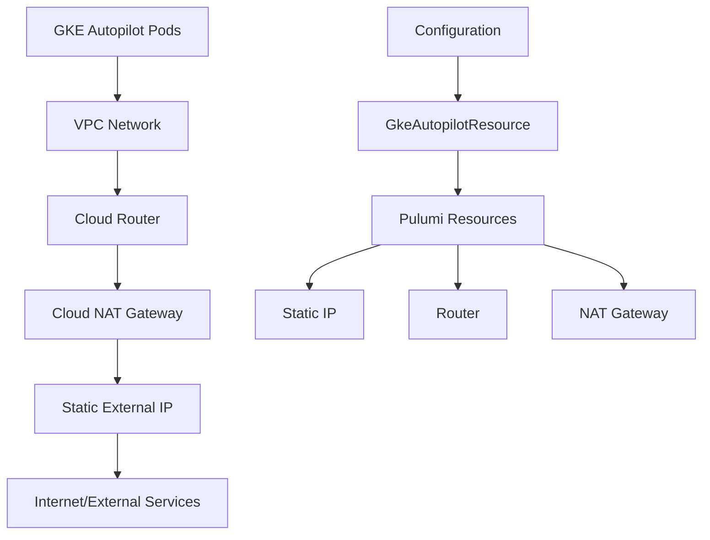

# GKE Autopilot Static Egress IP with Cloud NAT

## Overview

This design document outlines the implementation of Cloud NAT support for GKE Autopilot clusters to provide fixed egress IP addresses for all outbound traffic from the cluster.

## Problem Statement

GKE Autopilot clusters by default use dynamic IP addresses for egress traffic, which can be problematic for:
- **API Integrations**: Third-party services that require IP allowlisting
- **Security Compliance**: Organizations requiring predictable egress IPs for audit trails
- **Network Policies**: Firewall rules that need to allow traffic from specific IP ranges
- **Database Access**: Cloud SQL or external databases with IP-based access controls

## Solution Architecture

### Components Required

1. **Static IP Address**: Reserved external IP address for egress traffic
2. **Cloud Router**: Manages routing for the VPC network
3. **Cloud NAT Gateway**: Provides Network Address Translation using the static IP
4. **VPC Network Configuration**: Ensures proper routing through the NAT gateway

### High-Level Flow



## Configuration Design

### User Configuration Structure

```yaml
# server.yaml
resources:
  gke-cluster:
    type: gcp-gke-autopilot-cluster
    config:
      projectId: "my-project"
      location: "us-central1"
      gkeMinVersion: "1.28"
      
      # NEW: External Egress IP Configuration (Simple!)
      externalEgressIp:
        enabled: true
        # Optional: Use existing static IP, otherwise one will be created automatically
        existing: "projects/my-project/regions/us-central1/addresses/existing-ip"
```

### Configuration Options

#### Simple Configuration
- **`enabled`**: Boolean to enable/disable external egress IP (required)
- **`existing`**: Optional reference to existing static IP address (full GCP resource path)

**That's it!** Simple Container handles all the complexity:
- Automatically creates a static IP if none specified
- Sets up Cloud Router with sensible defaults
- Configures Cloud NAT with production-ready settings
- Uses cluster name for resource naming consistency

## Implementation Plan

### Phase 1: Configuration Structure

1. **Extend GkeAutopilotResource**: Add CloudNat configuration struct
2. **Validation Logic**: Ensure configuration consistency
3. **Default Values**: Provide sensible defaults for optional fields

### Phase 2: Pulumi Resource Implementation

1. **Static IP Resource**: Create or reference external IP address
2. **Cloud Router Resource**: Set up routing infrastructure  
3. **Cloud NAT Resource**: Configure NAT gateway with static IP
4. **Integration**: Wire resources together with proper dependencies

### Phase 3: Testing & Documentation

1. **Unit Tests**: Test configuration parsing and validation
2. **Integration Tests**: Test actual resource creation
3. **User Documentation**: Usage examples and best practices
4. **Migration Guide**: For existing clusters

## Technical Implementation Details

### Resource Dependencies

```
Static IP Address (if create=true)
    ↓
Cloud Router
    ↓  
Cloud NAT Gateway → References Static IP
    ↓
GKE Cluster (uses VPC with NAT)
```

### Pulumi Resource Creation Order

1. **Static IP** (if `create: true`)
2. **Cloud Router** 
3. **Cloud NAT** (depends on Router and Static IP)
4. **GKE Cluster** (existing, no changes needed)

### Network Configuration

- **VPC Network**: Use existing VPC or default network
- **Subnet**: GKE Autopilot manages subnets automatically
- **Routing**: Cloud Router handles routing to NAT gateway
- **Firewall**: No additional rules needed for egress NAT

## Benefits

### For Users
- **Predictable Egress IPs**: All cluster traffic uses known static IP
- **Simple Configuration**: Minimal YAML configuration required
- **Automatic Setup**: All networking components created automatically
- **Cost Effective**: Only pay for NAT gateway usage and static IP reservation

### For Operations
- **Security Compliance**: Easier to implement IP-based security policies
- **Monitoring**: Centralized egress traffic through single IP
- **Troubleshooting**: Simplified network debugging with fixed IP
- **Integration**: Easier third-party service integration

## Considerations

### Limitations
- **Additional Costs**: Cloud NAT and static IP incur additional charges
- **Single Point**: All egress traffic routes through one NAT gateway
- **Regional**: NAT gateway is regional, not global

### Best Practices
- **Monitoring**: Set up monitoring for NAT gateway usage
- **Logging**: Enable logging for troubleshooting
- **Capacity Planning**: Consider port allocation for high-traffic workloads
- **Backup Strategy**: Consider multiple static IPs for high availability

## Migration Strategy

### New Clusters
- Simply add `cloudNat` configuration to server.yaml
- Deploy as normal - NAT resources created automatically

### Existing Clusters  
- Add `cloudNat` configuration to server.yaml
- Run `sc deploy` to create NAT resources
- Existing workloads automatically use new egress path
- No downtime required

## Cost Implications

### Additional Costs
- **Static IP**: ~$1.46/month per reserved IP
- **Cloud NAT**: $0.045/hour per gateway + $0.045/GB processed
- **Data Processing**: $0.045/GB for traffic through NAT

### Cost Optimization
- **Shared NAT**: Multiple clusters can share same NAT gateway
- **Regional Planning**: Place resources in appropriate regions
- **Traffic Monitoring**: Monitor usage to optimize costs

## Security Considerations

### Network Security
- **Egress Control**: All outbound traffic uses predictable IP
- **Firewall Rules**: Can create specific rules for static IP
- **Audit Trail**: Easier to track egress traffic in logs

### Access Control
- **IAM Permissions**: Requires compute.addresses.* and compute.routers.* permissions
- **Network Admin**: May require network admin role for VPC modifications
- **Least Privilege**: Grant minimal required permissions

## Future Enhancements

### Phase 2 Features
- **Multiple Static IPs**: Support for multiple egress IPs with load balancing
- **High Availability**: Multi-region NAT gateway support
- **Advanced Routing**: Custom routing rules and policies

### Integration Features
- **Monitoring Dashboard**: Built-in monitoring for NAT usage
- **Cost Tracking**: Integration with billing APIs
- **Automated Scaling**: Dynamic port allocation based on usage

## References

- [Google Cloud NAT Documentation](https://cloud.google.com/nat/docs)
- [GKE Autopilot Networking](https://cloud.google.com/kubernetes-engine/docs/concepts/autopilot-overview#networking)
- [Cloud Router Documentation](https://cloud.google.com/network-connectivity/docs/router)
- [Static IP Addresses](https://cloud.google.com/compute/docs/ip-addresses/reserve-static-external-ip-address)
