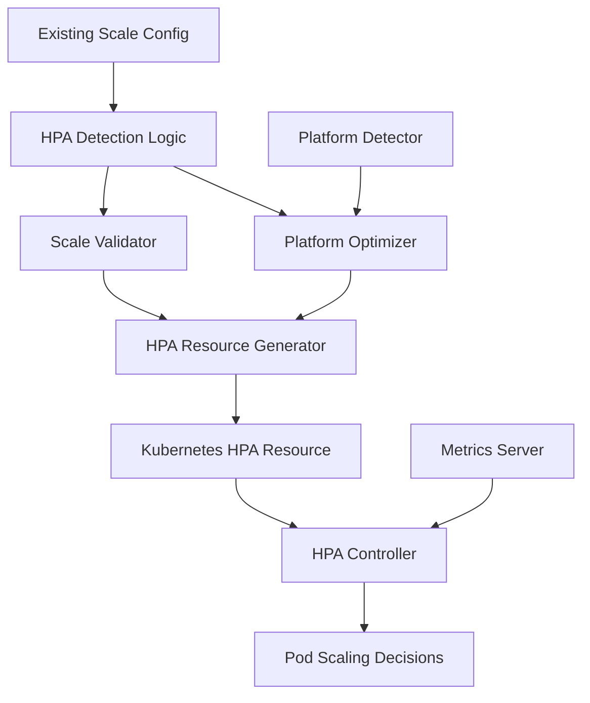
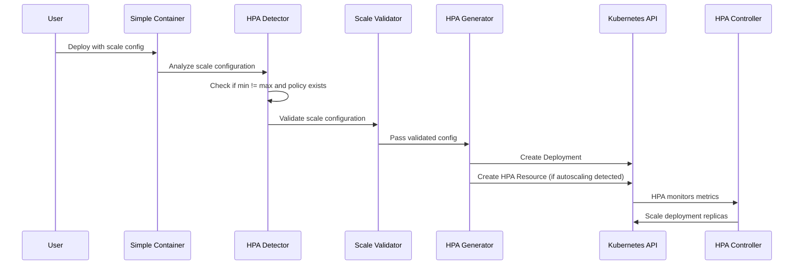

# HPA Technical Architecture - Cloud-Agnostic Approach

## Overview

This document details the technical architecture for implementing Horizontal Pod Autoscaler (HPA) support using Simple Container's existing cloud-agnostic scale configuration. The design leverages existing patterns while providing comprehensive autoscaling capabilities for Kubernetes deployments.

## Current Architecture Analysis

### Existing Scale Infrastructure

```go
// Current configuration in pkg/api/client.go (already exists)
type StackConfigComposeScale struct {
    Min int `yaml:"min" json:"min"`
    Max int `yaml:"max" json:"max"`
    
    Policy *StackConfigComposeScalePolicy `json:"policy" yaml:"policy"`
}

type StackConfigComposeScalePolicy struct {
    Cpu    *StackConfigComposeScaleCpu    `yaml:"cpu" json:"cpu"`
    Memory *StackConfigComposeScaleMemory `yaml:"memory" json:"memory"`
}

type StackConfigComposeScaleCpu struct {
    Max int `yaml:"max" json:"max"`  // CPU utilization percentage threshold
}

type StackConfigComposeScaleMemory struct {
    Max int `yaml:"max" json:"max"`  // Memory utilization percentage threshold
}
```

### Integration Points

1. **Configuration Parsing**: `pkg/api/client.go` - Already implemented
2. **Scale Detection**: `pkg/clouds/k8s/types.go` - ToScale function enhancement
3. **Resource Generation**: `pkg/clouds/pulumi/kubernetes/deployment.go` - HPA creation
4. **Validation**: New validation for scale configuration

## Proposed Architecture

### Core Components



### Data Flow Architecture



## Implementation Architecture

### 1. Configuration Detection Layer

#### Enhanced Scale Processing
```go
// pkg/clouds/k8s/types.go - Enhanced existing function
func ToScale(stack *api.StackConfigCompose) *Scale {
    if stack.Scale != nil {
        // Detect if autoscaling should be enabled
        shouldAutoscale := stack.Scale.Min != stack.Scale.Max && 
                         (stack.Scale.Policy != nil && 
                          (stack.Scale.Policy.Cpu != nil || stack.Scale.Policy.Memory != nil))
        
        return &Scale{
            Replicas:     stack.Scale.Min, // Use min as base replica count
            EnableHPA:    shouldAutoscale,
            MinReplicas:  stack.Scale.Min,
            MaxReplicas:  stack.Scale.Max,
            CPUTarget:    getCPUTarget(stack.Scale.Policy),
            MemoryTarget: getMemoryTarget(stack.Scale.Policy),
        }
    }
    return nil
}

// Helper functions for extracting targets
func getCPUTarget(policy *api.StackConfigComposeScalePolicy) *int {
    if policy != nil && policy.Cpu != nil {
        return &policy.Cpu.Max
    }
    return nil
}

func getMemoryTarget(policy *api.StackConfigComposeScalePolicy) *int {
    if policy != nil && policy.Memory != nil {
        return &policy.Memory.Max
    }
    return nil
}
```

#### Enhanced Scale Structure
```go
type Scale struct {
    // Existing fields
    Replicas int `json:"replicas" yaml:"replicas"`
    
    // New HPA detection fields
    EnableHPA    bool `json:"enableHPA" yaml:"enableHPA"`
    MinReplicas  int  `json:"minReplicas" yaml:"minReplicas"`
    MaxReplicas  int  `json:"maxReplicas" yaml:"maxReplicas"`
    CPUTarget    *int `json:"cpuTarget" yaml:"cpuTarget"`
    MemoryTarget *int `json:"memoryTarget" yaml:"memoryTarget"`
}
```

### 2. Validation Layer

#### Scale Configuration Validation
```go
// pkg/clouds/k8s/scale_validation.go (new file)
type ScaleValidator struct {
    logger logger.Logger
}

func NewScaleValidator(logger logger.Logger) *ScaleValidator {
    return &ScaleValidator{logger: logger}
}

func (v *ScaleValidator) ValidateConfiguration(
    scale *api.StackConfigComposeScale, 
    resources *Resources,
) error {
    if scale == nil {
        return nil
    }
    
    if err := v.validateBasicConfiguration(scale); err != nil {
        return err
    }
    
    // If autoscaling is configured, validate resource requirements
    if scale.Min != scale.Max && scale.Policy != nil {
        if err := v.validateAutoscalingRequirements(scale.Policy, resources); err != nil {
            return err
        }
    }
    
    return nil
}

func (v *ScaleValidator) validateBasicConfiguration(scale *api.StackConfigComposeScale) error {
    if scale.Min <= 0 {
        return errors.New("scale.min must be greater than 0")
    }
    
    if scale.Max < scale.Min {
        return errors.New("scale.max must be greater than or equal to scale.min")
    }
    
    return nil
}

func (v *ScaleValidator) validateAutoscalingRequirements(
    policy *api.StackConfigComposeScalePolicy, 
    resources *Resources,
) error {
    if policy.Cpu != nil {
        if policy.Cpu.Max <= 0 || policy.Cpu.Max > 100 {
            return errors.New("CPU scaling threshold must be between 1 and 100")
        }
        
        if resources == nil || resources.Requests["cpu"] == "" {
            return errors.New("CPU resource requests must be defined when using CPU-based scaling")
        }
    }
    
    if policy.Memory != nil {
        if policy.Memory.Max <= 0 || policy.Memory.Max > 100 {
            return errors.New("Memory scaling threshold must be between 1 and 100")
        }
        
        if resources == nil || resources.Requests["memory"] == "" {
            return errors.New("Memory resource requests must be defined when using memory-based scaling")
        }
    }
    
    return nil
}
```

### 3. Resource Generation Layer

#### HPA Resource Generator
```go
// pkg/clouds/pulumi/kubernetes/hpa.go (new file)
type HPAArgs struct {
    Name         string
    Namespace    string
    Deployment   *appsv1.Deployment
    MinReplicas  int
    MaxReplicas  int
    CPUTarget    *int
    MemoryTarget *int
    Labels       map[string]string
}

type HPAResult struct {
    HPA *autoscalingv2.HorizontalPodAutoscaler
}

func CreateHPA(ctx *pulumi.Context, args *HPAArgs, opts ...pulumi.ResourceOption) (*HPAResult, error) {
    hpaName := fmt.Sprintf("%s-hpa", args.Name)
    
    // Build metrics from CPU and Memory targets
    var metrics []autoscalingv2.MetricSpecArgs
    
    if args.CPUTarget != nil {
        metrics = append(metrics, autoscalingv2.MetricSpecArgs{
            Type: pulumi.String("Resource"),
            Resource: &autoscalingv2.ResourceMetricSourceArgs{
                Name: pulumi.String("cpu"),
                Target: &autoscalingv2.MetricTargetArgs{
                    Type:               pulumi.String("Utilization"),
                    AverageUtilization: pulumi.IntPtr(*args.CPUTarget),
                },
            },
        })
    }
    
    if args.MemoryTarget != nil {
        metrics = append(metrics, autoscalingv2.MetricSpecArgs{
            Type: pulumi.String("Resource"),
            Resource: &autoscalingv2.ResourceMetricSourceArgs{
                Name: pulumi.String("memory"),
                Target: &autoscalingv2.MetricTargetArgs{
                    Type:               pulumi.String("Utilization"),
                    AverageUtilization: pulumi.IntPtr(*args.MemoryTarget),
                },
            },
        })
    }
    
    // Create HPA resource
    hpa, err := autoscalingv2.NewHorizontalPodAutoscaler(ctx, hpaName, &autoscalingv2.HorizontalPodAutoscalerArgs{
        Metadata: &metav1.ObjectMetaArgs{
            Name:      pulumi.String(hpaName),
            Namespace: pulumi.String(args.Namespace),
            Labels:    pulumi.ToStringMap(args.Labels),
        },
        Spec: &autoscalingv2.HorizontalPodAutoscalerSpecArgs{
            ScaleTargetRef: &autoscalingv2.CrossVersionObjectReferenceArgs{
                ApiVersion: pulumi.String("apps/v1"),
                Kind:       pulumi.String("Deployment"),
                Name:       args.Deployment.Metadata.Name(),
            },
            MinReplicas: pulumi.Int(args.MinReplicas),
            MaxReplicas: pulumi.Int(args.MaxReplicas),
            Metrics:     autoscalingv2.MetricSpecArray(metrics),
        },
    }, opts...)
    
    if err != nil {
        return nil, errors.Wrapf(err, "failed to create HPA %s", hpaName)
    }
    
    return &HPAResult{HPA: hpa}, nil
}
```

### 4. Integration Layer

#### Deployment Integration
```go
// pkg/clouds/pulumi/kubernetes/deployment.go - Enhanced existing function
type DeploymentResult struct {
    Deployment *appsv1.Deployment
    Service    *corev1.Service
    HPA        *autoscalingv2.HorizontalPodAutoscaler // New field
    // ... other existing fields
}

func CreateDeployment(ctx *pulumi.Context, args *DeploymentArgs, opts ...pulumi.ResourceOption) (*DeploymentResult, error) {
    // ... existing deployment creation logic ...
    
    result := &DeploymentResult{
        Deployment: deployment,
        Service:    service,
    }
    
    // Create HPA if autoscaling is enabled
    if args.Deployment.Scale != nil && args.Deployment.Scale.EnableHPA {
        // Validate scale configuration
        validator := NewScaleValidator(args.Logger)
        if err := validator.ValidateConfiguration(
            // Convert Scale back to StackConfigComposeScale for validation
            &api.StackConfigComposeScale{
                Min: args.Deployment.Scale.MinReplicas,
                Max: args.Deployment.Scale.MaxReplicas,
                Policy: buildPolicyFromTargets(args.Deployment.Scale.CPUTarget, args.Deployment.Scale.MemoryTarget),
            },
            args.Deployment.Containers[0].Resources, // Use first container's resources
        ); err != nil {
            return nil, errors.Wrapf(err, "Scale configuration validation failed")
        }
        
        // Create HPA resource
        hpaArgs := &HPAArgs{
            Name:         deploymentName,
            Namespace:    args.Namespace,
            Deployment:   deployment,
            MinReplicas:  args.Deployment.Scale.MinReplicas,
            MaxReplicas:  args.Deployment.Scale.MaxReplicas,
            CPUTarget:    args.Deployment.Scale.CPUTarget,
            MemoryTarget: args.Deployment.Scale.MemoryTarget,
            Labels:       args.Labels,
        }
        
        hpaResult, err := CreateHPA(ctx, hpaArgs, opts...)
        if err != nil {
            return nil, errors.Wrapf(err, "failed to create HPA for deployment %s", deploymentName)
        }
        
        result.HPA = hpaResult.HPA
        
        // Export HPA information
        ctx.Export(fmt.Sprintf("%s-hpa-name", deploymentName), hpaResult.HPA.Metadata.Name())
        ctx.Export(fmt.Sprintf("%s-hpa-min-replicas", deploymentName), pulumi.Int(args.Deployment.Scale.MinReplicas))
        ctx.Export(fmt.Sprintf("%s-hpa-max-replicas", deploymentName), pulumi.Int(args.Deployment.Scale.MaxReplicas))
    }
    
    return result, nil
}
```

## Platform-Specific Optimizations

### 1. GKE Optimization Layer

```go
// pkg/clouds/gcp/gke_scale_optimizer.go (new file)
type GKEScaleOptimizer struct {
    clusterInfo *GKEClusterInfo
    logger      logger.Logger
}

type GKEClusterInfo struct {
    IsAutopilot bool
    Region      string
    ProjectID   string
}

func (g *GKEScaleOptimizer) OptimizeScale(scale *Scale) (*Scale, error) {
    if !scale.EnableHPA {
        return scale, nil
    }
    
    optimized := *scale
    
    if g.clusterInfo.IsAutopilot {
        optimized = g.optimizeForAutopilot(optimized)
    }
    
    return &optimized, nil
}

func (g *GKEScaleOptimizer) optimizeForAutopilot(scale Scale) Scale {
    // Autopilot-specific optimizations
    // Nodes take longer to provision, so be more conservative with thresholds
    
    if scale.CPUTarget != nil && *scale.CPUTarget < 60 {
        g.logger.Info("Adjusting CPU threshold for GKE Autopilot: %d -> 60", *scale.CPUTarget)
        newTarget := 60
        scale.CPUTarget = &newTarget
    }
    
    if scale.MemoryTarget != nil && *scale.MemoryTarget < 70 {
        g.logger.Info("Adjusting Memory threshold for GKE Autopilot: %d -> 70", *scale.MemoryTarget)
        newTarget := 70
        scale.MemoryTarget = &newTarget
    }
    
    return scale
}
```

## Error Handling Architecture

### Error Types
```go
// pkg/clouds/k8s/scale_errors.go (new file)
type ScaleError struct {
    Type    ScaleErrorType
    Message string
    Field   string
    Cause   error
}

type ScaleErrorType string

const (
    ScaleErrorValidation     ScaleErrorType = "validation"
    ScaleErrorResourceCreate ScaleErrorType = "resource_creation"
    ScaleErrorConfiguration  ScaleErrorType = "configuration"
)

func (e *ScaleError) Error() string {
    if e.Field != "" {
        return fmt.Sprintf("Scale %s error in field '%s': %s", e.Type, e.Field, e.Message)
    }
    return fmt.Sprintf("Scale %s error: %s", e.Type, e.Message)
}

func NewValidationError(field, message string) *ScaleError {
    return &ScaleError{
        Type:    ScaleErrorValidation,
        Field:   field,
        Message: message,
    }
}
```

## Testing Architecture

### Unit Testing Structure
```go
// pkg/clouds/k8s/scale_test.go (new file)
func TestScaleDetection(t *testing.T) {
    tests := []struct {
        name           string
        scaleConfig    *api.StackConfigComposeScale
        expectedHPA    bool
        expectedMin    int
        expectedMax    int
        expectedCPU    *int
        expectedMemory *int
    }{
        {
            name: "static scaling - no HPA",
            scaleConfig: &api.StackConfigComposeScale{
                Min: 3,
                Max: 3,
            },
            expectedHPA: false,
        },
        {
            name: "CPU-based autoscaling",
            scaleConfig: &api.StackConfigComposeScale{
                Min: 2,
                Max: 10,
                Policy: &api.StackConfigComposeScalePolicy{
                    Cpu: &api.StackConfigComposeScaleCpu{Max: 70},
                },
            },
            expectedHPA: true,
            expectedMin: 2,
            expectedMax: 10,
            expectedCPU: intPtr(70),
        },
        // ... more test cases
    }
    
    for _, tt := range tests {
        t.Run(tt.name, func(t *testing.T) {
            stackConfig := &api.StackConfigCompose{Scale: tt.scaleConfig}
            result := ToScale(stackConfig)
            
            assert.Equal(t, tt.expectedHPA, result.EnableHPA)
            if tt.expectedHPA {
                assert.Equal(t, tt.expectedMin, result.MinReplicas)
                assert.Equal(t, tt.expectedMax, result.MaxReplicas)
                assert.Equal(t, tt.expectedCPU, result.CPUTarget)
                assert.Equal(t, tt.expectedMemory, result.MemoryTarget)
            }
        })
    }
}
```

## Performance Considerations

### Resource Overhead
- HPA controller adds minimal CPU/memory overhead
- Metrics collection frequency impacts performance (default: 15 seconds)
- Scale detection logic is O(1) - no performance impact

### Scaling Performance
- Metrics collection latency affects scaling speed
- Node provisioning time (especially in GKE Autopilot)
- Default stabilization prevents thrashing

### Optimization Strategies
```go
// Default configurations optimized for performance and stability
var DefaultScaleThresholds = map[string]int{
    "cpu":    70, // Conservative default
    "memory": 80, // Conservative default
}

var AutopilotScaleThresholds = map[string]int{
    "cpu":    60, // More conservative for slower node provisioning
    "memory": 70, // More conservative for slower node provisioning
}
```

## Security Considerations

### RBAC Requirements
The HPA controller requires specific permissions that are typically available in standard Kubernetes clusters. No additional RBAC configuration needed for Simple Container deployments.

### Service Account Configuration
Simple Container deployments use the default service account, which has sufficient permissions for HPA operations in most clusters.

## Key Architectural Benefits

### ✅ **Zero Configuration Overhead**
- Leverages existing Simple Container scale configuration
- No new fields or complex configuration required
- Automatic detection based on configuration patterns

### ✅ **Cloud-Agnostic Design**
- Same configuration works for Kubernetes HPA, ECS autoscaling, and static deployments
- Maintains Simple Container's platform independence
- No Kubernetes-specific concepts exposed to users

### ✅ **Backward Compatibility**
- All existing scale configurations continue working unchanged
- Gradual migration path available
- No breaking changes to existing APIs or workflows

### ✅ **Production Ready**
- Comprehensive validation and error handling
- Platform-specific optimizations where beneficial
- Follows Simple Container's established patterns and reliability standards

This technical architecture provides a robust foundation for implementing HPA support while maintaining Simple Container's core principles of simplicity, cloud-agnostic design, and backward compatibility.
