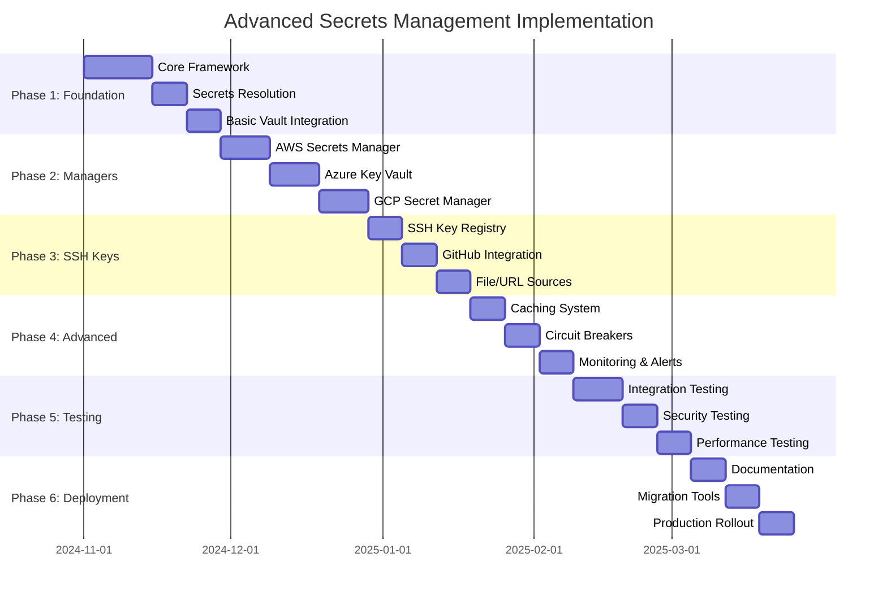

# Implementation Roadmap: Advanced Secrets Management System

## 🗓️ Implementation Timeline (12 Weeks)



## 🏗️ Phase 1: Foundation & Core Framework (Weeks 1-3)

### Week 1-2: Core Architecture

**Objectives:**
- Establish base interfaces and architecture
- Implement secrets resolution engine
- Create manager factory pattern
- Basic error handling and logging

**Deliverables:**

#### 1. Core Interfaces
```go
// File: pkg/secrets/interfaces.go
type SecretsManager interface {
    GetSecret(ctx context.Context, key string) (*SecretValue, error)
    SetSecret(ctx context.Context, key string, value *SecretValue) error
    DeleteSecret(ctx context.Context, key string) error
    ListSecrets(ctx context.Context, prefix string) ([]string, error)
    HealthCheck(ctx context.Context) error
    Close() error
}

type SSHKeyRegistry interface {
    GetAuthorizedKeys(ctx context.Context) ([]SSHKey, error)
    RefreshKeys(ctx context.Context) error
    ValidateKey(ctx context.Context, key SSHKey) error
}
```

#### 2. Secrets Resolver Engine
```go
// File: pkg/secrets/resolver.go
type SecretsResolver struct {
    managers    []SecretsManager
    fallback    FallbackStore
    cache       SecretsCache
    metrics     MetricsCollector
    logger      Logger
}

func (sr *SecretsResolver) ResolveSecret(ctx context.Context, key string) (*SecretValue, error) {
    // Implementation with fallback hierarchy
}
```

#### 3. Configuration Schema
```yaml
# server.yaml extension
secrets:
  managers:
    - type: vault
      priority: 1
      config:
        address: https://vault.company.com
        auth:
          type: kubernetes
          role: simple-container
    - type: aws-secrets-manager
      priority: 2
      config:
        region: us-east-1
        prefix: simple-container/
  
  ssh_keys:
    sources:
      - type: github-org
        org: company-name
        teams: [platform, devops]
```

#### 4. Integration Points
- Modify `pkg/api/secrets.go` to use new resolver
- Update `${secret:...}` placeholder resolution
- Maintain backward compatibility with `secrets.yaml`

### Week 3: Basic Vault Integration

**Objectives:**
- Implement HashiCorp Vault integration
- Support multiple authentication methods
- Handle token renewal and rotation

**Deliverables:**

#### 1. Vault Manager Implementation
```go
// File: pkg/secrets/managers/vault/manager.go
type VaultManager struct {
    client      *vaultapi.Client
    config      *VaultConfig
    authMethod  AuthMethod
}

func (vm *VaultManager) GetSecret(ctx context.Context, key string) (*SecretValue, error) {
    // KV v1/v2 support
    // Path construction
    // Error handling
}
```

#### 2. Authentication Methods
- **Kubernetes Service Account**: Primary method for K8s deployments
- **Token Authentication**: For development and testing
- **AppRole Authentication**: For VM/container deployments
- **AWS IAM Authentication**: For AWS environments

#### 3. Testing Infrastructure
```go
// File: pkg/secrets/managers/vault/manager_test.go
func TestVaultIntegration(t *testing.T) {
    // Integration tests with Vault dev server
    // Authentication method tests
    // Error scenario handling
}
```

**Security Considerations:**
- Token storage and renewal
- TLS certificate validation
- Namespace support for Vault Enterprise
- Audit logging for secret access

---

## 📊 Phase 2: External Secrets Managers (Weeks 4-7)

### Week 4-5: AWS Secrets Manager

**Objectives:**
- Implement AWS Secrets Manager integration
- Support IAM role-based authentication
- Handle automatic secret rotation

**Deliverables:**

#### 1. AWS Manager Implementation
```go
// File: pkg/secrets/managers/aws/manager.go
type AWSSecretsManager struct {
    client  *secretsmanager.Client
    config  *AWSConfig
}

func (asm *AWSSecretsManager) GetSecret(ctx context.Context, key string) (*SecretValue, error) {
    // GetSecretValue API integration
    // Version handling
    // Error translation
}
```

#### 2. Authentication Support
- **IAM Roles**: Primary method for EC2/ECS/EKS
- **Access Keys**: For development environments
- **STS Assume Role**: Cross-account access
- **Instance Profile**: EC2 instance authentication

#### 3. Advanced Features
- **Secret Rotation**: Handle rotation states and versions
- **Cross-Region Support**: Multi-region secret replication
- **KMS Integration**: Custom encryption keys
- **Resource Policies**: Fine-grained access control

### Week 5-6: Azure Key Vault

**Objectives:**
- Implement Azure Key Vault integration
- Support managed identity authentication
- Handle certificates, keys, and secrets

**Deliverables:**

#### 1. Azure Manager Implementation
```go
// File: pkg/secrets/managers/azure/manager.go
type AzureKeyVaultManager struct {
    client  *azcore.Client
    config  *AzureConfig
}

func (akvm *AzureKeyVaultManager) GetSecret(ctx context.Context, key string) (*SecretValue, error) {
    // Key Vault API integration
    // Version management
    // Permission handling
}
```

#### 2. Authentication Methods
- **Managed Identity**: Primary method for Azure resources
- **Service Principal**: Application authentication
- **Azure CLI**: Development environment
- **Client Certificate**: Certificate-based authentication

#### 3. Enterprise Features
- **Key Vault Access Policies**: RBAC integration
- **Network ACLs**: VNet integration
- **Hardware Security Modules**: HSM support
- **Certificate Management**: X.509 certificate handling

### Week 6-7: Google Cloud Secret Manager

**Objectives:**
- Implement GCP Secret Manager integration
- Support service account authentication
- Handle versioned secrets and IAM policies

**Deliverables:**

#### 1. GCP Manager Implementation
```go
// File: pkg/secrets/managers/gcp/manager.go
type GCPSecretManager struct {
    client  *secretmanager.Client
    config  *GCPConfig
}

func (gsm *GCPSecretManager) GetSecret(ctx context.Context, key string) (*SecretValue, error) {
    // Secret Manager API integration
    // Version handling
    // IAM policy evaluation
}
```

#### 2. Authentication Support
- **Service Accounts**: JSON key files and Workload Identity
- **Application Default Credentials**: Automatic credential discovery
- **Workload Identity**: Kubernetes service account binding
- **Impersonation**: Cross-project access

#### 3. GCP-Specific Features
- **Regional Secrets**: Data residency compliance
- **Automatic Replication**: Multi-region availability
- **Customer-Managed Encryption**: CMEK support
- **VPC Service Controls**: Private network access

---

## 🔑 Phase 3: SSH Key Registry System (Weeks 8-10)

### Week 8: SSH Key Registry Core

**Objectives:**
- Implement SSH key registry framework
- Support multiple key sources
- Key validation and deduplication

**Deliverables:**

#### 1. Registry Implementation
```go
// File: pkg/secrets/sshkeys/registry.go
type SSHKeyRegistry struct {
    sources       []SSHKeySource
    cache         *KeyCache
    authorizedKeys map[string]SSHKey
}

func (skr *SSHKeyRegistry) RefreshKeys(ctx context.Context) error {
    // Multi-source key collection
    // Validation and deduplication
    // Fingerprint calculation
}
```

#### 2. Key Source Interface
```go
type SSHKeySource interface {
    GetKeys(ctx context.Context) ([]SSHKey, error)
    SourceType() string
    SourceID() string
    NeedsRefresh() bool
    GetRefreshInterval() time.Duration
}
```

#### 3. Key Validation
- **Format Validation**: OpenSSH key format parsing
- **Cryptographic Validation**: Key strength and algorithm support
- **Fingerprint Generation**: SHA256 fingerprints
- **Expiration Handling**: Time-based key expiration

### Week 9: GitHub Integration

**Objectives:**
- Implement GitHub organization/team integration
- Support public key retrieval from users
- Handle API rate limiting and authentication

**Deliverables:**

#### 1. GitHub Organization Source
```go
// File: pkg/secrets/sshkeys/sources/github.go
type GitHubOrgSource struct {
    client *github.Client
    config *GitHubOrgConfig
}

func (gos *GitHubOrgSource) GetKeys(ctx context.Context) ([]SSHKey, error) {
    // Organization member enumeration
    // Team member filtering
    // Public key retrieval
    // Rate limiting handling
}
```

#### 2. Configuration Options
```yaml
ssh_keys:
  sources:
    - type: github-org
      org: company-name
      teams: [platform, devops, sre]
      include_admins: true
      include_outside_collaborators: false
      api_token: ${secret:github-api-token}
      cache_duration: 30m
```

#### 3. GitHub Enterprise Support
- **Custom Base URL**: GitHub Enterprise Server support
- **SAML/OIDC Integration**: Enterprise authentication
- **Team Synchronization**: LDAP/AD team mapping
- **Audit Logging**: User access tracking

### Week 10: File and URL Sources

**Objectives:**
- Implement file-based key sources
- Support HTTP/HTTPS URL sources
- Handle dynamic updates and file watching

**Deliverables:**

#### 1. File Source Implementation
```go
// File: pkg/secrets/sshkeys/sources/file.go
type FileSource struct {
    config  *FileConfig
    watcher *fsnotify.Watcher
}

func (fs *FileSource) GetKeys(ctx context.Context) ([]SSHKey, error) {
    // File reading and parsing
    // Directory traversal
    // Format detection
}
```

#### 2. URL Source Implementation
```go
// File: pkg/secrets/sshkeys/sources/url.go
type URLSource struct {
    client  *http.Client
    config  *URLConfig
}

func (us *URLSource) GetKeys(ctx context.Context) ([]SSHKey, error) {
    // HTTP request execution
    // Response parsing
    // Authentication headers
    // Error handling
}
```

#### 3. Dynamic Updates
- **File System Watching**: `fsnotify` integration for real-time updates
- **HTTP Polling**: Configurable refresh intervals
- **Webhook Support**: Push-based updates
- **Change Detection**: ETag and Last-Modified headers

---

## ⚡ Phase 4: Advanced Features (Weeks 11-12)

### Week 11: Caching and Performance

**Objectives:**
- Implement multi-level caching system
- Optimize performance for high-throughput scenarios
- Add cache encryption and security

**Deliverables:**

#### 1. Cache Implementation
```go
// File: pkg/secrets/cache/cache.go
type SecretsCache struct {
    memoryCache *bigcache.BigCache
    diskCache   *DiskCache
    encryption  *EncryptionManager
}
```

#### 2. Cache Strategies
- **L1 Memory Cache**: High-speed in-memory storage with TTL
- **L2 Disk Cache**: Persistent encrypted cache
- **Cache Warming**: Proactive secret prefetching
- **Cache Invalidation**: Event-driven cache updates

#### 3. Performance Optimizations
- **Connection Pooling**: HTTP client optimization
- **Parallel Requests**: Concurrent secret resolution
- **Batch Operations**: Multi-secret retrieval
- **Compression**: Response compression support

### Week 12: Circuit Breakers and Resilience

**Objectives:**
- Implement circuit breaker pattern
- Add retry logic and exponential backoff
- Health check monitoring

**Deliverables:**

#### 1. Circuit Breaker Implementation
```go
// File: pkg/secrets/circuit/breaker.go
type CircuitBreaker struct {
    state        State
    failures     int
    resetTimeout time.Duration
}

func (cb *CircuitBreaker) Execute(operation func() error) error {
    // State management
    // Failure counting
    // Timeout handling
}
```

#### 2. Resilience Features
- **Exponential Backoff**: Intelligent retry scheduling
- **Jittered Delays**: Avoid thundering herd
- **Health Monitoring**: Continuous service health checks
- **Graceful Degradation**: Fallback strategies

#### 3. Monitoring and Observability
```go
type MetricsCollector interface {
    IncrementSecretResolution(source string, status string)
    RecordLatency(operation string, duration time.Duration)
    IncrementCacheHit(cacheType string)
    IncrementCacheMiss()
}
```

---

## 🧪 Phase 5: Testing and Validation (Week 13-15)

### Integration Testing Framework

#### 1. Secrets Manager Testing
```go
// File: pkg/secrets/integration_test.go
func TestVaultIntegration(t *testing.T) {
    // Vault dev server setup
    // Authentication testing
    // Secret CRUD operations
    // Error scenario handling
}

func TestAWSSecretsManagerIntegration(t *testing.T) {
    // LocalStack setup
    // IAM role simulation
    // Secret rotation testing
}
```

#### 2. SSH Key Registry Testing
```go
func TestGitHubOrgIntegration(t *testing.T) {
    // GitHub API mocking
    // Rate limiting simulation
    // Team membership changes
}

func TestSSHKeyValidation(t *testing.T) {
    // Key format validation
    // Security algorithm testing
    // Fingerprint verification
}
```

### Security Testing

#### 1. Penetration Testing
- **Secret Exposure**: Verify no secrets in logs or errors
- **Authentication Bypass**: Test authentication failure scenarios
- **Privilege Escalation**: Verify RBAC enforcement
- **Network Security**: TLS validation and certificate pinning

#### 2. Compliance Testing
- **Audit Logging**: Verify comprehensive audit trails
- **Access Control**: Test RBAC and policy enforcement
- **Encryption**: Validate encryption at rest and in transit
- **Key Rotation**: Test secret and key rotation workflows

### Performance Testing

#### 1. Load Testing
```bash
# Concurrent secret resolution testing
sc secrets perf-test \
  --concurrent-users 100 \
  --secrets-per-user 50 \
  --duration 10m \
  --managers vault,aws,azure
```

#### 2. Cache Performance
- **Cache Hit Rates**: Target 80%+ cache hit ratio
- **Memory Usage**: Monitor memory consumption under load
- **Disk I/O**: Measure disk cache performance
- **Network Latency**: External service dependency testing

---

## 🚀 Phase 6: Production Deployment (Week 16-18)

### Migration Strategy

#### 1. Backward Compatibility
```go
// Gradual migration approach
func (sr *SecretsResolver) ResolveSecret(ctx context.Context, key string) (*SecretValue, error) {
    // Try new secrets managers first
    for _, manager := range sr.managers {
        if secret, err := manager.GetSecret(ctx, key); err == nil {
            return secret, nil
        }
    }
    
    // Fallback to existing secrets.yaml
    return sr.fallback.GetSecret(ctx, key)
}
```

#### 2. Migration Tools
```bash
# Migration command for existing deployments
sc secrets migrate \
  --from secrets.yaml \
  --to vault \
  --vault-path secret/simple-container \
  --dry-run
```

#### 3. Feature Flags
```yaml
secrets:
  features:
    external_managers: true
    ssh_key_registry: false  # Gradual rollout
    cache_encryption: true
```

### Documentation and Training

#### 1. User Documentation
- **Configuration Guide**: Complete setup instructions
- **Migration Guide**: Step-by-step migration process
- **Troubleshooting**: Common issues and solutions
- **Best Practices**: Security and operational recommendations

#### 2. Administrator Documentation
- **Architecture Overview**: System design and components
- **Monitoring Guide**: Metrics and alerting setup
- **Security Guide**: Hardening and compliance
- **Disaster Recovery**: Backup and recovery procedures

### Production Rollout

#### 1. Canary Deployment
- **Phase 1**: Enable for 5% of deployments
- **Phase 2**: Expand to 25% after 1 week
- **Phase 3**: Full rollout after 2 weeks

#### 2. Monitoring and Alerts
```yaml
alerts:
  - name: secrets-manager-failure
    condition: secrets_resolution_error_rate > 5%
    severity: critical
    
  - name: ssh-key-sync-failure
    condition: ssh_key_refresh_failures > 0
    severity: warning
```

## 📊 Success Metrics

### Technical Metrics
- **Secret Resolution Time**: <100ms p95
- **Cache Hit Rate**: >80%
- **System Availability**: >99.9%
- **Authentication Success Rate**: >99.5%

### Business Metrics
- **Migration Completion**: 90% of projects using new system within 3 months
- **Security Incidents**: 0 secret exposure incidents
- **Developer Satisfaction**: >90% positive feedback
- **Operational Efficiency**: 50% reduction in manual secret management

### Security Metrics
- **Audit Compliance**: 100% audit trail coverage
- **Secret Rotation**: <24 hour rotation time
- **Access Violations**: 0 unauthorized secret access
- **Key Management**: 95% automated SSH key management

---

**Status**: This implementation roadmap provides a structured approach to delivering enterprise-grade secrets management while maintaining system reliability and security throughout the development process.
