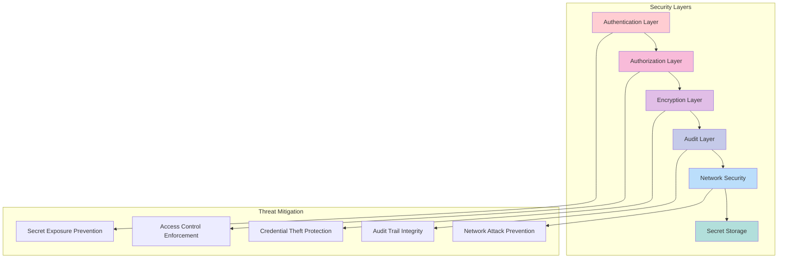

# Security Framework: Advanced Secrets Management System

## 🔐 Security Overview

The Advanced Secrets Management System for Simple Container is designed with security as the primary concern, implementing defense-in-depth strategies, zero-trust principles, and compliance with enterprise security standards.

## 🛡️ Security Architecture



## 🔒 Core Security Principles

### 1. Zero Trust Architecture

**Principle**: Never trust, always verify
- **Identity Verification**: Every request requires authentication
- **Least Privilege Access**: Minimal permissions for each operation
- **Continuous Validation**: Real-time security posture assessment
- **Micro-Segmentation**: Isolated security boundaries

**Implementation**:
```go
type SecurityContext struct {
    Identity      *Identity       `json:"identity"`
    Permissions   []Permission    `json:"permissions"`
    RequestID     string         `json:"request_id"`
    Timestamp     time.Time      `json:"timestamp"`
    TrustScore    float64        `json:"trust_score"`
}

func (sc *SecurityContext) ValidateAccess(resource string, action string) error {
    // Identity verification
    if !sc.Identity.IsVerified() {
        return ErrUnverifiedIdentity
    }
    
    // Permission check
    if !sc.HasPermission(resource, action) {
        return ErrInsufficientPermissions
    }
    
    // Trust score evaluation
    if sc.TrustScore < sc.RequiredTrustScore(resource) {
        return ErrLowTrustScore
    }
    
    return nil
}
```

### 2. Defense in Depth

**Multiple Security Layers**:
- **Perimeter Security**: Network firewalls and VPC isolation
- **Authentication**: Multi-factor authentication and strong credentials
- **Authorization**: Role-based access control (RBAC)
- **Encryption**: End-to-end encryption for all secrets
- **Monitoring**: Real-time threat detection and response
- **Incident Response**: Automated breach detection and containment

### 3. Principle of Least Privilege

**Access Control Implementation**:
```yaml
rbac_policies:
  developer:
    secrets:
      - action: read
        resources: ["applications/*"]
        conditions:
          environment: ["staging", "development"]
  
  devops:
    secrets:
      - action: "*"
        resources: ["applications/*", "infrastructure/*"]
        conditions:
          environment: ["*"]
          
  production_deploy:
    secrets:
      - action: read
        resources: ["applications/*/production"]
        conditions:
          time_window: "09:00-17:00"
          approval_required: true
```

## 🔐 Authentication Framework

### 1. Multi-Factor Authentication

**Supported Methods**:
- **Service Account Keys**: Cryptographic key-based authentication
- **Managed Identities**: Cloud provider identity services
- **Certificate-Based**: X.509 client certificates
- **Token-Based**: JWT and OAuth2 tokens
- **Hardware Security Modules**: HSM-backed authentication

**Implementation Example**:
```go
type AuthenticationMethod interface {
    Authenticate(ctx context.Context, credentials Credentials) (*Identity, error)
    Validate(ctx context.Context, identity *Identity) error
    Refresh(ctx context.Context, identity *Identity) (*Identity, error)
    RequiresMFA() bool
}

type ServiceAccountAuth struct {
    keyProvider   KeyProvider
    validator     SignatureValidator
    trustStore    TrustStore
}

func (saa *ServiceAccountAuth) Authenticate(ctx context.Context, creds Credentials) (*Identity, error) {
    // Validate service account key
    publicKey, err := saa.keyProvider.GetPublicKey(creds.KeyID)
    if err != nil {
        return nil, fmt.Errorf("invalid key ID: %w", err)
    }
    
    // Verify signature
    if !saa.validator.Verify(creds.Signature, creds.Payload, publicKey) {
        return nil, ErrInvalidSignature
    }
    
    // Build identity
    identity := &Identity{
        ID:          creds.ServiceAccountID,
        Type:        IdentityTypeServiceAccount,
        Permissions: saa.getPermissions(creds.ServiceAccountID),
        ExpiresAt:   time.Now().Add(1 * time.Hour),
    }
    
    return identity, nil
}
```

### 2. Kubernetes Integration

**Service Account Authentication**:
```go
type KubernetesAuth struct {
    kubeClient    kubernetes.Interface
    tokenReviewer TokenReviewer
    namespace     string
}

func (ka *KubernetesAuth) Authenticate(ctx context.Context, token string) (*Identity, error) {
    // Review token with Kubernetes API
    review := &authenticationv1.TokenReview{
        Spec: authenticationv1.TokenReviewSpec{
            Token: token,
        },
    }
    
    result, err := ka.kubeClient.AuthenticationV1().
        TokenReviews().
        Create(ctx, review, metav1.CreateOptions{})
    if err != nil {
        return nil, fmt.Errorf("token review failed: %w", err)
    }
    
    if !result.Status.Authenticated {
        return nil, ErrTokenInvalid
    }
    
    // Extract service account information
    identity := &Identity{
        ID:        result.Status.User.Username,
        Groups:    result.Status.User.Groups,
        Namespace: ka.extractNamespace(result.Status.User.Username),
    }
    
    return identity, nil
}
```

### 3. External Identity Providers

**OIDC Integration**:
```go
type OIDCAuth struct {
    provider     oidc.Provider
    clientID     string
    clientSecret string
    validator    oidc.IDTokenValidator
}

func (oa *OIDCAuth) ValidateToken(ctx context.Context, tokenString string) (*Identity, error) {
    // Parse and validate ID token
    token, err := oa.validator.Validate(ctx, tokenString)
    if err != nil {
        return nil, fmt.Errorf("token validation failed: %w", err)
    }
    
    // Extract claims
    var claims struct {
        Subject   string   `json:"sub"`
        Email     string   `json:"email"`
        Groups    []string `json:"groups"`
        ExpiresAt int64    `json:"exp"`
    }
    
    if err := token.Claims(&claims); err != nil {
        return nil, fmt.Errorf("failed to extract claims: %w", err)
    }
    
    identity := &Identity{
        ID:        claims.Subject,
        Email:     claims.Email,
        Groups:    claims.Groups,
        ExpiresAt: time.Unix(claims.ExpiresAt, 0),
    }
    
    return identity, nil
}
```

## 🔑 Authorization and Access Control

### 1. Role-Based Access Control (RBAC)

**Policy Engine**:
```go
type PolicyEngine struct {
    policies    []Policy
    evaluator   PolicyEvaluator
    cache       PolicyCache
}

type Policy struct {
    ID          string      `json:"id"`
    Version     string      `json:"version"`
    Subjects    []Subject   `json:"subjects"`
    Resources   []Resource  `json:"resources"`
    Actions     []Action    `json:"actions"`
    Conditions  []Condition `json:"conditions"`
    Effect      Effect      `json:"effect"`
}

func (pe *PolicyEngine) Authorize(ctx context.Context, request *AuthzRequest) (*AuthzResult, error) {
    // Policy evaluation
    applicablePolicies := pe.findApplicablePolicies(request)
    
    var decisions []PolicyDecision
    for _, policy := range applicablePolicies {
        decision, err := pe.evaluator.Evaluate(ctx, policy, request)
        if err != nil {
            return nil, fmt.Errorf("policy evaluation failed: %w", err)
        }
        decisions = append(decisions, decision)
    }
    
    // Decision aggregation
    result := pe.aggregateDecisions(decisions)
    
    // Audit logging
    pe.auditDecision(ctx, request, result)
    
    return result, nil
}
```

### 2. Attribute-Based Access Control (ABAC)

**Dynamic Policy Evaluation**:
```go
type AttributeBasedPolicy struct {
    PolicyID    string                 `json:"policy_id"`
    Rules       []AttributeRule        `json:"rules"`
    Context     map[string]interface{} `json:"context"`
}

type AttributeRule struct {
    Attribute   string      `json:"attribute"`
    Operator    Operator    `json:"operator"`
    Value       interface{} `json:"value"`
    Required    bool        `json:"required"`
}

func (abp *AttributeBasedPolicy) Evaluate(ctx context.Context, attributes map[string]interface{}) (bool, error) {
    for _, rule := range abp.Rules {
        match, err := abp.evaluateRule(rule, attributes)
        if err != nil {
            return false, err
        }
        
        if rule.Required && !match {
            return false, nil
        }
    }
    
    return true, nil
}

// Example policy evaluation
func ExampleTimeBasedAccess() {
    policy := &AttributeBasedPolicy{
        Rules: []AttributeRule{
            {
                Attribute: "time.hour",
                Operator:  OperatorBetween,
                Value:     []int{9, 17}, // 9 AM to 5 PM
                Required:  true,
            },
            {
                Attribute: "user.department",
                Operator:  OperatorEquals,
                Value:     "engineering",
                Required:  true,
            },
            {
                Attribute: "resource.environment",
                Operator:  OperatorNotEquals,
                Value:     "production",
                Required:  false,
            },
        },
    }
    
    attributes := map[string]interface{}{
        "time.hour":              14,
        "user.department":        "engineering",
        "resource.environment":   "staging",
    }
    
    allowed, _ := policy.Evaluate(context.Background(), attributes)
    // allowed == true
}
```

## 🔐 Encryption and Data Protection

### 1. Encryption at Rest

**Secret Storage Encryption**:
```go
type EncryptionManager struct {
    keyProvider    KeyProvider
    encryptionAlg  EncryptionAlgorithm
    keyRotation    KeyRotationManager
}

type EncryptedSecret struct {
    EncryptedData    []byte            `json:"encrypted_data"`
    KeyID           string            `json:"key_id"`
    Algorithm       string            `json:"algorithm"`
    IV              []byte            `json:"iv"`
    AuthTag         []byte            `json:"auth_tag,omitempty"`
    Metadata        map[string]string `json:"metadata"`
    EncryptedAt     time.Time         `json:"encrypted_at"`
}

func (em *EncryptionManager) Encrypt(ctx context.Context, plaintext []byte) (*EncryptedSecret, error) {
    // Get current encryption key
    key, err := em.keyProvider.GetCurrentKey(ctx)
    if err != nil {
        return nil, fmt.Errorf("failed to get encryption key: %w", err)
    }
    
    // Generate random IV
    iv := make([]byte, 16)
    if _, err := rand.Read(iv); err != nil {
        return nil, fmt.Errorf("failed to generate IV: %w", err)
    }
    
    // Encrypt data using AES-256-GCM
    ciphertext, authTag, err := em.encryptionAlg.Encrypt(key.Data, plaintext, iv)
    if err != nil {
        return nil, fmt.Errorf("encryption failed: %w", err)
    }
    
    encrypted := &EncryptedSecret{
        EncryptedData: ciphertext,
        KeyID:        key.ID,
        Algorithm:    "AES-256-GCM",
        IV:           iv,
        AuthTag:      authTag,
        EncryptedAt:  time.Now(),
    }
    
    return encrypted, nil
}
```

### 2. Encryption in Transit

**TLS Configuration**:
```go
type TLSConfig struct {
    MinVersion         uint16            `yaml:"min_version"`
    CipherSuites       []uint16          `yaml:"cipher_suites"`
    CertificateFile    string            `yaml:"certificate_file"`
    PrivateKeyFile     string            `yaml:"private_key_file"`
    ClientAuth         ClientAuthType    `yaml:"client_auth"`
    ClientCAs          []string          `yaml:"client_cas"`
    InsecureSkipVerify bool              `yaml:"insecure_skip_verify"`
}

func (tc *TLSConfig) BuildTLSConfig() (*tls.Config, error) {
    cert, err := tls.LoadX509KeyPair(tc.CertificateFile, tc.PrivateKeyFile)
    if err != nil {
        return nil, fmt.Errorf("failed to load certificate: %w", err)
    }
    
    config := &tls.Config{
        Certificates: []tls.Certificate{cert},
        MinVersion:   tc.MinVersion,
        CipherSuites: tc.CipherSuites,
        ClientAuth:   tls.ClientAuthType(tc.ClientAuth),
    }
    
    // Load client CAs for mutual TLS
    if len(tc.ClientCAs) > 0 {
        clientCAPool := x509.NewCertPool()
        for _, caFile := range tc.ClientCAs {
            caCert, err := os.ReadFile(caFile)
            if err != nil {
                return nil, fmt.Errorf("failed to read CA file %s: %w", caFile, err)
            }
            clientCAPool.AppendCertsFromPEM(caCert)
        }
        config.ClientCAs = clientCAPool
    }
    
    return config, nil
}
```

### 3. Key Management

**HSM Integration**:
```go
type HSMKeyProvider struct {
    client      HSMClient
    keyLabel    string
    keyType     KeyType
    keySize     int
}

func (hkp *HSMKeyProvider) GenerateKey(ctx context.Context) (*Key, error) {
    // Generate key in HSM
    keyHandle, err := hkp.client.GenerateKey(ctx, &GenerateKeyRequest{
        Label:     hkp.keyLabel,
        KeyType:   hkp.keyType,
        KeySize:   hkp.keySize,
        Exportable: false, // Key never leaves HSM
    })
    if err != nil {
        return nil, fmt.Errorf("HSM key generation failed: %w", err)
    }
    
    key := &Key{
        ID:        keyHandle.ID,
        Label:     hkp.keyLabel,
        Type:      hkp.keyType,
        CreatedAt: time.Now(),
        HSMBacked: true,
    }
    
    return key, nil
}

func (hkp *HSMKeyProvider) Encrypt(ctx context.Context, keyID string, plaintext []byte) ([]byte, error) {
    // Encryption performed within HSM
    return hkp.client.Encrypt(ctx, &EncryptRequest{
        KeyID:     keyID,
        Plaintext: plaintext,
        Algorithm: AlgorithmAES256GCM,
    })
}
```

## 🔍 Audit and Compliance

### 1. Comprehensive Audit Logging

**Audit Event Structure**:
```go
type AuditEvent struct {
    EventID      string                 `json:"event_id"`
    Timestamp    time.Time              `json:"timestamp"`
    EventType    AuditEventType         `json:"event_type"`
    Actor        *Identity              `json:"actor"`
    Resource     *Resource              `json:"resource"`
    Action       string                 `json:"action"`
    Result       AuditResult            `json:"result"`
    Context      map[string]interface{} `json:"context"`
    Metadata     map[string]interface{} `json:"metadata"`
    IPAddress    string                 `json:"ip_address"`
    UserAgent    string                 `json:"user_agent"`
    SessionID    string                 `json:"session_id"`
}

type AuditLogger struct {
    storage    AuditStorage
    formatter  AuditFormatter
    filter     AuditFilter
    encryption AuditEncryption
}

func (al *AuditLogger) LogSecretAccess(ctx context.Context, event *SecretAccessEvent) error {
    auditEvent := &AuditEvent{
        EventID:   generateEventID(),
        Timestamp: time.Now(),
        EventType: AuditEventTypeSecretAccess,
        Actor:     event.Identity,
        Resource: &Resource{
            Type: ResourceTypeSecret,
            ID:   event.SecretKey,
        },
        Action:    event.Action, // read, write, delete
        Result:    event.Result, // success, failure, denied
        Context:   event.Context,
        IPAddress: extractIPAddress(ctx),
        UserAgent: extractUserAgent(ctx),
        SessionID: extractSessionID(ctx),
    }
    
    // Format and encrypt audit log
    formatted, err := al.formatter.Format(auditEvent)
    if err != nil {
        return fmt.Errorf("audit formatting failed: %w", err)
    }
    
    encrypted, err := al.encryption.Encrypt(formatted)
    if err != nil {
        return fmt.Errorf("audit encryption failed: %w", err)
    }
    
    // Store audit log
    return al.storage.Store(ctx, encrypted)
}
```

### 2. Compliance Frameworks

**SOC 2 Type II Compliance**:
```yaml
compliance_controls:
  soc2:
    cc6.1: # Logical and Physical Access Controls
      - authentication_required: true
      - mfa_enforced: true
      - access_reviews: quarterly
      
    cc6.2: # System Operation
      - monitoring_enabled: true
      - incident_response: automated
      - capacity_planning: true
      
    cc6.3: # Change Management
      - approval_required: true
      - testing_mandatory: true
      - rollback_procedures: documented
```

**GDPR Compliance**:
```go
type GDPRController struct {
    dataProcessor   DataProcessor
    consentManager  ConsentManager
    retentionPolicy RetentionPolicy
}

func (gc *GDPRController) ProcessDataRequest(ctx context.Context, request *DataRequest) error {
    switch request.Type {
    case DataRequestTypeAccess:
        return gc.handleDataAccess(ctx, request)
    case DataRequestTypeRectification:
        return gc.handleDataRectification(ctx, request)
    case DataRequestTypeErasure:
        return gc.handleDataErasure(ctx, request)
    case DataRequestTypePortability:
        return gc.handleDataPortability(ctx, request)
    default:
        return fmt.Errorf("unsupported data request type: %s", request.Type)
    }
}
```

## 🚨 Threat Detection and Response

### 1. Anomaly Detection

**Behavioral Analysis**:
```go
type AnomalyDetector struct {
    baseline      BaselineModel
    mlModel       MachineLearningModel
    thresholds    DetectionThresholds
    alertManager  AlertManager
}

func (ad *AnomalyDetector) AnalyzeSecretAccess(ctx context.Context, event *SecretAccessEvent) error {
    // Calculate risk score
    features := ad.extractFeatures(event)
    riskScore := ad.mlModel.Predict(features)
    
    // Check against thresholds
    if riskScore > ad.thresholds.HighRisk {
        alert := &SecurityAlert{
            Type:        AlertTypeHighRiskAccess,
            Severity:    SeverityCritical,
            Event:       event,
            RiskScore:   riskScore,
            Timestamp:   time.Now(),
        }
        
        return ad.alertManager.TriggerAlert(ctx, alert)
    }
    
    return nil
}

func (ad *AnomalyDetector) extractFeatures(event *SecretAccessEvent) []float64 {
    return []float64{
        ad.timeOfDayFeature(event.Timestamp),
        ad.frequencyFeature(event.Actor.ID, event.Resource.ID),
        ad.locationFeature(event.IPAddress),
        ad.deviceFeature(event.UserAgent),
        ad.accessPatternFeature(event.Action),
    }
}
```

### 2. Incident Response

**Automated Response System**:
```go
type IncidentResponse struct {
    playbooks    []ResponsePlaybook
    orchestrator ResponseOrchestrator
    notifier     NotificationManager
}

type ResponsePlaybook struct {
    TriggerConditions []Condition       `json:"trigger_conditions"`
    Actions          []ResponseAction   `json:"actions"`
    Escalation       EscalationPolicy   `json:"escalation"`
    Timeout          time.Duration      `json:"timeout"`
}

func (ir *IncidentResponse) HandleSecurityIncident(ctx context.Context, incident *SecurityIncident) error {
    // Find applicable playbooks
    playbooks := ir.findApplicablePlaybooks(incident)
    
    for _, playbook := range playbooks {
        // Execute response actions
        if err := ir.executePlaybook(ctx, playbook, incident); err != nil {
            return fmt.Errorf("playbook execution failed: %w", err)
        }
    }
    
    // Notify stakeholders
    return ir.notifier.NotifyIncident(ctx, incident)
}

func (ir *IncidentResponse) executePlaybook(ctx context.Context, playbook *ResponsePlaybook, incident *SecurityIncident) error {
    for _, action := range playbook.Actions {
        switch action.Type {
        case ActionTypeRevokeAccess:
            if err := ir.revokeAccess(ctx, action, incident); err != nil {
                return err
            }
        case ActionTypeRotateCredentials:
            if err := ir.rotateCredentials(ctx, action, incident); err != nil {
                return err
            }
        case ActionTypeIsolateSystem:
            if err := ir.isolateSystem(ctx, action, incident); err != nil {
                return err
            }
        }
    }
    
    return nil
}
```

## 📊 Security Metrics and KPIs

### 1. Security Dashboard

**Key Security Metrics**:
```go
type SecurityMetrics struct {
    AuthenticationSuccessRate  float64 `json:"auth_success_rate"`
    AuthorizationDenialRate    float64 `json:"authz_denial_rate"`
    AnomalousAccessAttempts    int     `json:"anomalous_access_attempts"`
    SecretRotationCompliance   float64 `json:"secret_rotation_compliance"`
    IncidentResponseTime       time.Duration `json:"incident_response_time"`
    AuditLogIntegrity         float64 `json:"audit_log_integrity"`
}

func (sm *SecurityMetrics) CalculateSecurityScore() float64 {
    weights := map[string]float64{
        "auth_success":     0.20,
        "authz_denial":     0.15,
        "anomaly_detection": 0.25,
        "rotation_compliance": 0.20,
        "response_time":    0.10,
        "audit_integrity":  0.10,
    }
    
    score := 0.0
    score += sm.AuthenticationSuccessRate * weights["auth_success"]
    score += (1.0 - sm.AuthorizationDenialRate) * weights["authz_denial"]
    score += sm.calculateAnomalyScore() * weights["anomaly_detection"]
    score += sm.SecretRotationCompliance * weights["rotation_compliance"]
    score += sm.calculateResponseTimeScore() * weights["response_time"]
    score += sm.AuditLogIntegrity * weights["audit_integrity"]
    
    return score
}
```

### 2. Compliance Reporting

**Automated Compliance Reports**:
```go
type ComplianceReporter struct {
    frameworks    []ComplianceFramework
    collector     MetricsCollector
    generator     ReportGenerator
    scheduler     ReportScheduler
}

func (cr *ComplianceReporter) GenerateSOC2Report(ctx context.Context, period *ReportPeriod) (*ComplianceReport, error) {
    controls := cr.getSOC2Controls()
    
    report := &ComplianceReport{
        Framework:    "SOC 2 Type II",
        Period:       period,
        GeneratedAt:  time.Now(),
        Controls:     make([]ControlAssessment, len(controls)),
    }
    
    for i, control := range controls {
        assessment, err := cr.assessControl(ctx, control, period)
        if err != nil {
            return nil, fmt.Errorf("control assessment failed: %w", err)
        }
        report.Controls[i] = *assessment
    }
    
    // Calculate overall compliance score
    report.ComplianceScore = cr.calculateComplianceScore(report.Controls)
    
    return report, nil
}
```

## 🔧 Security Configuration

### 1. Hardening Guidelines

**System Hardening Checklist**:
```yaml
security_hardening:
  network:
    - disable_unnecessary_ports: true
    - enable_firewall: true
    - restrict_outbound_connections: true
    - use_private_endpoints: true
    
  authentication:
    - enforce_mfa: true
    - require_strong_passwords: true
    - implement_account_lockout: true
    - rotate_service_accounts: quarterly
    
  encryption:
    - encrypt_all_data: true
    - use_strong_ciphers: true
    - implement_key_rotation: true
    - disable_weak_protocols: true
    
  monitoring:
    - enable_audit_logging: true
    - implement_anomaly_detection: true
    - configure_security_alerts: true
    - perform_regular_assessments: true
```

### 2. Security Validation

**Continuous Security Testing**:
```bash
#!/bin/bash
# Security validation script

# Test authentication mechanisms
sc security test-auth --all-methods

# Validate encryption
sc security test-encryption --algorithms all

# Check access controls
sc security test-rbac --policies security-policies.yaml

# Verify audit logging
sc security test-audit --completeness --integrity

# Run penetration tests
sc security pentest --scope secrets-management
```

---

**Status**: This security framework provides comprehensive protection for the Advanced Secrets Management System, ensuring enterprise-grade security posture with defense-in-depth strategies, continuous monitoring, and automated incident response capabilities.
