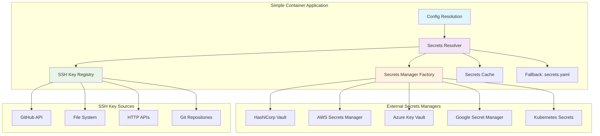

# Technical Architecture: Advanced Secrets Management System

## 🏗️ System Architecture Overview



## 🔧 Core Components

### 1. Secrets Resolver Engine

```go
package secrets

type ResolverConfig struct {
    Managers      []ManagerConfig     `yaml:"managers"`
    Cache         CacheConfig         `yaml:"cache"`
    Fallback      FallbackConfig      `yaml:"fallback"`
    SSHKeys       SSHKeyConfig        `yaml:"ssh_keys"`
    Security      SecurityConfig      `yaml:"security"`
    Observability ObservabilityConfig `yaml:"observability"`
}

type SecretsResolver struct {
    managers         []SecretsManager
    sshKeyRegistry   SSHKeyRegistry
    cache           SecretsCache
    fallback        FallbackStore
    metrics         MetricsCollector
    logger          Logger
    circuitBreaker  CircuitBreaker
    
    // Configuration
    config          *ResolverConfig
    encryptionKey   []byte
    
    // Runtime state
    mu              sync.RWMutex
    healthStatus    map[string]HealthStatus
    lastSync        time.Time
}

// Core resolution method with comprehensive error handling
func (sr *SecretsResolver) ResolveSecret(ctx context.Context, key string) (*SecretValue, error) {
    // Validate input
    if key == "" {
        return nil, errors.New("secret key cannot be empty")
    }
    
    // Check cache first
    if cached, found := sr.cache.Get(key); found {
        sr.metrics.IncrementCacheHit(key)
        return cached, nil
    }
    sr.metrics.IncrementCacheMiss(key)
    
    // Try each configured secrets manager
    for i, manager := range sr.managers {
        managerName := fmt.Sprintf("manager-%d", i)
        
        // Check if manager is healthy
        if !sr.isHealthy(managerName) {
            sr.logger.Warn("Skipping unhealthy secrets manager", "manager", managerName)
            continue
        }
        
        // Create context with timeout
        resolveCtx, cancel := context.WithTimeout(ctx, sr.config.Security.RequestTimeout)
        defer cancel()
        
        // Attempt resolution
        secret, err := sr.resolveWithCircuitBreaker(resolveCtx, manager, key, managerName)
        if err == nil {
            // Cache successful resolution
            sr.cache.Set(key, secret, secret.TTL())
            sr.metrics.RecordSecretResolution(key, managerName, "success")
            return secret, nil
        }
        
        sr.logger.Debug("Failed to resolve secret from manager", "manager", managerName, "error", err)
        sr.metrics.RecordSecretResolution(key, managerName, "failure")
    }
    
    // Fallback to secrets.yaml
    if secret, err := sr.fallback.GetSecret(ctx, key); err == nil {
        sr.metrics.RecordSecretResolution(key, "fallback", "success")
        return secret, nil
    }
    
    return nil, fmt.Errorf("secret %s not found in any configured source", key)
}

func (sr *SecretsResolver) resolveWithCircuitBreaker(ctx context.Context, manager SecretsManager, key, managerName string) (*SecretValue, error) {
    return sr.circuitBreaker.Execute(ctx, managerName, func() (*SecretValue, error) {
        return manager.GetSecret(ctx, key)
    })
}
```

### 2. Secrets Manager Factory & Registry

```go
package managers

type ManagerFactory struct {
    builders map[string]ManagerBuilder
    metrics  MetricsCollector
}

type ManagerBuilder interface {
    Build(config map[string]interface{}) (SecretsManager, error)
    ValidateConfig(config map[string]interface{}) error
    ManagerType() string
}

// Registry of supported managers
func NewManagerFactory() *ManagerFactory {
    factory := &ManagerFactory{
        builders: make(map[string]ManagerBuilder),
    }
    
    // Register built-in managers
    factory.Register("vault", &VaultManagerBuilder{})
    factory.Register("aws-secrets-manager", &AWSSecretsManagerBuilder{})
    factory.Register("azure-keyvault", &AzureKeyVaultBuilder{})
    factory.Register("gcp-secret-manager", &GCPSecretManagerBuilder{})
    factory.Register("kubernetes", &KubernetesSecretsBuilder{})
    
    return factory
}

func (mf *ManagerFactory) CreateManager(managerType string, config map[string]interface{}) (SecretsManager, error) {
    builder, exists := mf.builders[managerType]
    if !exists {
        return nil, fmt.Errorf("unsupported manager type: %s", managerType)
    }
    
    // Validate configuration first
    if err := builder.ValidateConfig(config); err != nil {
        return nil, fmt.Errorf("invalid config for %s: %w", managerType, err)
    }
    
    // Build manager instance
    manager, err := builder.Build(config)
    if err != nil {
        return nil, fmt.Errorf("failed to build %s manager: %w", managerType, err)
    }
    
    // Wrap with instrumentation
    return NewInstrumentedManager(manager, mf.metrics), nil
}
```

### 3. HashiCorp Vault Integration

```go
package vault

type VaultManager struct {
    client      *vaultapi.Client
    config      *VaultConfig
    authMethod  AuthMethod
    metrics     MetricsCollector
    logger      Logger
    
    // Token management
    tokenRenewer *vaultapi.Renewer
    tokenMu      sync.RWMutex
    token        string
    
    // Connection management  
    httpClient   *http.Client
    retryClient  *retryablehttp.Client
}

type VaultConfig struct {
    Address         string            `yaml:"address"`
    Namespace       string            `yaml:"namespace,omitempty"`
    Mount           string            `yaml:"mount"`
    PathTemplate    string            `yaml:"path_template"`    // Template for context-aware paths
    Auth            AuthConfig        `yaml:"auth"`
    TLS             TLSConfig         `yaml:"tls"`
    RequestTimeout  time.Duration     `yaml:"request_timeout"`
    MaxRetries      int               `yaml:"max_retries"`
    RetryWaitMin    time.Duration     `yaml:"retry_wait_min"`
    RetryWaitMax    time.Duration     `yaml:"retry_wait_max"`
}

// Context-aware path resolution
type SecretContext struct {
    ParentStack     string `json:"parent_stack"`     // e.g., "yourorg/infrastructure"
    ClientStack     string `json:"client_stack"`     // e.g., "production-api"
    Environment     string `json:"environment"`      // e.g., "production"
    Organization    string `json:"organization"`     // e.g., "yourorg"
}

type AuthMethod interface {
    Authenticate(ctx context.Context, client *vaultapi.Client) (*vaultapi.Secret, error)
    NeedsRenewal() bool
}

func (vm *VaultManager) GetSecretWithContext(ctx context.Context, key string, secretCtx *SecretContext) (*SecretValue, error) {
    // Ensure valid authentication
    if err := vm.ensureAuthenticated(ctx); err != nil {
        return nil, fmt.Errorf("authentication failed: %w", err)
    }
    
    // Build context-aware secret path using template
    secretPath, err := vm.buildSecretPath(key, secretCtx)
    if err != nil {
        return nil, fmt.Errorf("failed to build secret path: %w", err)
    }
    
    // Read secret from Vault
    secret, err := vm.client.Logical().ReadWithContext(ctx, secretPath)
    if err != nil {
        return nil, fmt.Errorf("failed to read secret from Vault: %w", err)
    }
    
    if secret == nil {
        return nil, ErrSecretNotFound
    }
    
    // Handle KV v1 vs v2 engine differences
    secretData, err := vm.extractSecretData(secret)
    if err != nil {
        return nil, fmt.Errorf("failed to extract secret data: %w", err)
    }
    
    return vm.convertToSecretValue(secretData, secret)
}

// buildSecretPath constructs context-aware paths for secrets
func (vm *VaultManager) buildSecretPath(key string, secretCtx *SecretContext) (string, error) {
    // Default path template if none specified
    pathTemplate := vm.config.PathTemplate
    if pathTemplate == "" {
        pathTemplate = "{{.Organization}}/{{.ClientStack}}/{{.Environment}}/{{.Key}}"
    }
    
    // Template data for path construction
    templateData := map[string]string{
        "Organization": secretCtx.Organization,
        "ParentStack":  secretCtx.ParentStack,
        "ClientStack":  secretCtx.ClientStack,
        "Environment":  secretCtx.Environment,
        "Key":          key,
    }
    
    // Parse and execute template
    tmpl, err := template.New("secret-path").Parse(pathTemplate)
    if err != nil {
        return "", fmt.Errorf("invalid path template: %w", err)
    }
    
    var pathBuffer strings.Builder
    if err := tmpl.Execute(&pathBuffer, templateData); err != nil {
        return "", fmt.Errorf("failed to execute path template: %w", err)
    }
    
    secretPath := pathBuffer.String()
    
    // Add mount prefix if specified
    if vm.config.Mount != "" {
        secretPath = path.Join(vm.config.Mount, secretPath)
    }
    
    return secretPath, nil
}

// Kubernetes Service Account authentication
type KubernetesAuth struct {
    Role            string `yaml:"role"`
    ServiceAccount  string `yaml:"service_account"`
    TokenPath       string `yaml:"token_path"`
}

func (ka *KubernetesAuth) Authenticate(ctx context.Context, client *vaultapi.Client) (*vaultapi.Secret, error) {
    // Read service account token
    tokenBytes, err := os.ReadFile(ka.TokenPath)
    if err != nil {
        return nil, fmt.Errorf("failed to read service account token: %w", err)
    }
    
    // Authenticate with Vault
    authData := map[string]interface{}{
        "role": ka.Role,
        "jwt":  string(tokenBytes),
    }
    
    return client.Logical().WriteWithContext(ctx, "auth/kubernetes/login", authData)
}
```

### 4. AWS Secrets Manager Integration

```go
package aws

type AWSSecretsManager struct {
    client     *secretsmanager.Client
    config     *AWSConfig
    metrics    MetricsCollector
    logger     Logger
    
    // Connection pooling
    httpClient *http.Client
}

type AWSConfig struct {
    Region           string        `yaml:"region"`
    SecretNameTemplate string      `yaml:"secret_name_template"`  // Template for context-aware naming
    KMSKeyID         string        `yaml:"kms_key_id,omitempty"`
    RequestTimeout   time.Duration `yaml:"request_timeout"`
    MaxRetries       int           `yaml:"max_retries"`
    
    // Authentication options
    AccessKeyID     string `yaml:"access_key_id,omitempty"`
    SecretAccessKey string `yaml:"secret_access_key,omitempty"`
    SessionToken    string `yaml:"session_token,omitempty"`
    RoleARN         string `yaml:"role_arn,omitempty"`
    Profile         string `yaml:"profile,omitempty"`
}

func (asm *AWSSecretsManager) GetSecretWithContext(ctx context.Context, key string, secretCtx *SecretContext) (*SecretValue, error) {
    // Build context-aware secret name using template
    secretName, err := asm.buildSecretName(key, secretCtx)
    if err != nil {
        return nil, fmt.Errorf("failed to build secret name: %w", err)
    }
    
    // Get secret value
    input := &secretsmanager.GetSecretValueInput{
        SecretId: aws.String(secretName),
    }
    
    result, err := asm.client.GetSecretValue(ctx, input)
    if err != nil {
        var resourceNotFoundErr *types.ResourceNotFoundException
        if errors.As(err, &resourceNotFoundErr) {
            return nil, ErrSecretNotFound
        }
        return nil, fmt.Errorf("failed to get secret from AWS: %w", err)
    }
    
    // Convert to standard format
    secretValue := &SecretValue{
        Value: aws.ToString(result.SecretString),
        Metadata: map[string]string{
            "arn":          aws.ToString(result.ARN),
            "created_date": result.CreatedDate.Format(time.RFC3339),
            "version_id":   aws.ToString(result.VersionId),
            "version_stage": strings.Join(result.VersionStages, ","),
            "context_path": secretName,
        },
        Version: aws.ToString(result.VersionId),
    }
    
    return secretValue, nil
}

// buildSecretName constructs context-aware secret names
func (asm *AWSSecretsManager) buildSecretName(key string, secretCtx *SecretContext) (string, error) {
    // Default naming template if none specified
    nameTemplate := asm.config.SecretNameTemplate
    if nameTemplate == "" {
        nameTemplate = "{{.Organization}}/{{.ClientStack}}/{{.Environment}}/{{.Key}}"
    }
    
    // Template data for name construction
    templateData := map[string]string{
        "Organization": secretCtx.Organization,
        "ParentStack":  secretCtx.ParentStack,
        "ClientStack":  secretCtx.ClientStack,
        "Environment":  secretCtx.Environment,
        "Key":          key,
    }
    
    // Parse and execute template
    tmpl, err := template.New("secret-name").Parse(nameTemplate)
    if err != nil {
        return "", fmt.Errorf("invalid name template: %w", err)
    }
    
    var nameBuffer strings.Builder
    if err := tmpl.Execute(&nameBuffer, templateData); err != nil {
        return "", fmt.Errorf("failed to execute name template: %w", err)
    }
    
    return nameBuffer.String(), nil
}

func (asm *AWSSecretsManager) SetSecret(ctx context.Context, key string, value *SecretValue) error {
    secretName := key
    if asm.config.Prefix != "" {
        secretName = asm.config.Prefix + key
    }
    
    // Check if secret exists
    _, err := asm.client.DescribeSecret(ctx, &secretsmanager.DescribeSecretInput{
        SecretId: aws.String(secretName),
    })
    
    if err != nil {
        var resourceNotFoundErr *types.ResourceNotFoundException
        if errors.As(err, &resourceNotFoundErr) {
            // Create new secret
            createInput := &secretsmanager.CreateSecretInput{
                Name:         aws.String(secretName),
                SecretString: aws.String(value.Value),
            }
            
            if asm.config.KMSKeyID != "" {
                createInput.KmsKeyId = aws.String(asm.config.KMSKeyID)
            }
            
            _, err = asm.client.CreateSecret(ctx, createInput)
            return err
        }
        return err
    }
    
    // Update existing secret
    updateInput := &secretsmanager.UpdateSecretInput{
        SecretId:     aws.String(secretName),
        SecretString: aws.String(value.Value),
    }
    
    _, err = asm.client.UpdateSecret(ctx, updateInput)
    return err
}
```

### 5. SSH Key Registry Implementation

```go
package sshkeys

type SSHKeyRegistry struct {
    sources       []SSHKeySource
    cache         *KeyCache
    config        *SSHKeyConfig
    metrics       MetricsCollector
    logger        Logger
    
    // Synchronization
    mu            sync.RWMutex
    lastSync      time.Time
    syncInterval  time.Duration
    
    // Current keys
    authorizedKeys map[string]SSHKey
    
    // Background refresh
    refreshTicker *time.Ticker
    stopCh        chan struct{}
}

type SSHKeySource interface {
    GetKeys(ctx context.Context) ([]SSHKey, error)
    SourceType() string
    SourceID() string
    NeedsRefresh() bool
    GetRefreshInterval() time.Duration
}

func (skr *SSHKeyRegistry) GetAuthorizedKeys(ctx context.Context) ([]SSHKey, error) {
    skr.mu.RLock()
    defer skr.mu.RUnlock()
    
    keys := make([]SSHKey, 0, len(skr.authorizedKeys))
    for _, key := range skr.authorizedKeys {
        // Check if key has expired
        if key.ExpiresAt != nil && time.Now().After(*key.ExpiresAt) {
            continue
        }
        keys = append(keys, key)
    }
    
    return keys, nil
}

func (skr *SSHKeyRegistry) RefreshKeys(ctx context.Context) error {
    skr.logger.Info("Starting SSH keys refresh")
    
    allKeys := make(map[string]SSHKey)
    var refreshErrors []error
    
    // Collect keys from all sources
    for _, source := range skr.sources {
        sourceCtx, cancel := context.WithTimeout(ctx, time.Minute)
        
        keys, err := source.GetKeys(sourceCtx)
        cancel()
        
        if err != nil {
            skr.logger.Error("Failed to refresh keys from source", 
                "source", source.SourceID(), 
                "type", source.SourceType(), 
                "error", err)
            refreshErrors = append(refreshErrors, fmt.Errorf("source %s: %w", source.SourceID(), err))
            continue
        }
        
        // Process and deduplicate keys
        for _, key := range keys {
            // Validate SSH key format
            if err := skr.validateSSHKey(key); err != nil {
                skr.logger.Warn("Invalid SSH key from source", 
                    "source", source.SourceID(),
                    "fingerprint", key.Fingerprint,
                    "error", err)
                continue
            }
            
            // Use fingerprint as unique identifier
            allKeys[key.Fingerprint] = key
        }
        
        skr.metrics.RecordKeysFromSource(source.SourceType(), len(keys))
    }
    
    // Update registry
    skr.mu.Lock()
    skr.authorizedKeys = allKeys
    skr.lastSync = time.Now()
    skr.mu.Unlock()
    
    skr.logger.Info("SSH keys refresh completed", 
        "total_keys", len(allKeys),
        "sources", len(skr.sources),
        "errors", len(refreshErrors))
    
    skr.metrics.RecordKeyRefresh(len(allKeys), len(refreshErrors))
    
    if len(refreshErrors) > 0 {
        return fmt.Errorf("refresh completed with %d errors: %v", len(refreshErrors), refreshErrors)
    }
    
    return nil
}

func (skr *SSHKeyRegistry) validateSSHKey(key SSHKey) error {
    // Parse SSH key to validate format
    publicKey, comment, options, rest, err := ssh.ParseAuthorizedKey([]byte(key.Key))
    if err != nil {
        return fmt.Errorf("invalid SSH key format: %w", err)
    }
    
    // Verify fingerprint matches
    expectedFingerprint := ssh.FingerprintSHA256(publicKey)
    if key.Fingerprint != "" && key.Fingerprint != expectedFingerprint {
        return fmt.Errorf("fingerprint mismatch: expected %s, got %s", expectedFingerprint, key.Fingerprint)
    }
    
    // Update fingerprint if not set
    if key.Fingerprint == "" {
        key.Fingerprint = expectedFingerprint
    }
    
    // Validate key type
    supportedTypes := []string{"ssh-rsa", "ssh-ed25519", "ecdsa-sha2-nistp256", "ecdsa-sha2-nistp384", "ecdsa-sha2-nistp521"}
    keyType := publicKey.Type()
    
    isSupported := false
    for _, supportedType := range supportedTypes {
        if keyType == supportedType {
            isSupported = true
            break
        }
    }
    
    if !isSupported {
        return fmt.Errorf("unsupported key type: %s", keyType)
    }
    
    // Check for unused fields (security validation)
    if len(rest) > 0 {
        return fmt.Errorf("unexpected data after SSH key")
    }
    
    // Validate options (if any)
    if len(options) > 0 {
        skr.logger.Debug("SSH key has options", "options", options)
    }
    
    return nil
}
```

### 6. GitHub SSH Key Source

```go
package github

type GitHubOrgSource struct {
    client       *github.Client
    config       *GitHubOrgConfig
    httpClient   *http.Client
    logger       Logger
}

type GitHubOrgConfig struct {
    Organization    string   `yaml:"org"`
    Teams          []string `yaml:"teams,omitempty"`
    IncludeAdmins  bool     `yaml:"include_admins"`
    IncludeOutside bool     `yaml:"include_outside_collaborators"`
    APIToken       string   `yaml:"api_token"`
    BaseURL        string   `yaml:"base_url,omitempty"`  // For GitHub Enterprise
    CacheDuration  time.Duration `yaml:"cache_duration"`
}

func (gos *GitHubOrgSource) GetKeys(ctx context.Context) ([]SSHKey, error) {
    var allKeys []SSHKey
    usersSeen := make(map[string]bool)
    
    // Get users from teams (if specified)
    if len(gos.config.Teams) > 0 {
        for _, team := range gos.config.Teams {
            users, err := gos.getTeamMembers(ctx, team)
            if err != nil {
                return nil, fmt.Errorf("failed to get team %s members: %w", team, err)
            }
            
            for _, user := range users {
                if usersSeen[user] {
                    continue
                }
                usersSeen[user] = true
                
                userKeys, err := gos.getUserKeys(ctx, user)
                if err != nil {
                    gos.logger.Warn("Failed to get keys for user", "user", user, "error", err)
                    continue
                }
                
                allKeys = append(allKeys, userKeys...)
            }
        }
    } else {
        // Get all organization members
        users, err := gos.getOrgMembers(ctx)
        if err != nil {
            return nil, fmt.Errorf("failed to get organization members: %w", err)
        }
        
        for _, user := range users {
            userKeys, err := gos.getUserKeys(ctx, user)
            if err != nil {
                gos.logger.Warn("Failed to get keys for user", "user", user, "error", err)
                continue
            }
            
            allKeys = append(allKeys, userKeys...)
        }
    }
    
    return allKeys, nil
}

func (gos *GitHubOrgSource) getUserKeys(ctx context.Context, username string) ([]SSHKey, error) {
    keys, _, err := gos.client.Users.ListKeys(ctx, username, nil)
    if err != nil {
        return nil, err
    }
    
    var sshKeys []SSHKey
    for _, key := range keys {
        sshKey := SSHKey{
            Key:     key.GetKey(),
            Type:    gos.extractKeyType(key.GetKey()),
            Comment: fmt.Sprintf("%s@github", username),
            Source:  fmt.Sprintf("github-org:%s", gos.config.Organization),
            Metadata: map[string]string{
                "username":       username,
                "github_key_id":  fmt.Sprintf("%d", key.GetID()),
                "organization":   gos.config.Organization,
            },
            AddedAt: time.Now(),
        }
        
        // Calculate fingerprint
        if publicKey, _, _, _, err := ssh.ParseAuthorizedKey([]byte(sshKey.Key)); err == nil {
            sshKey.Fingerprint = ssh.FingerprintSHA256(publicKey)
        }
        
        sshKeys = append(sshKeys, sshKey)
    }
    
    return sshKeys, nil
}

func (gos *GitHubOrgSource) getTeamMembers(ctx context.Context, teamSlug string) ([]string, error) {
    var allMembers []string
    
    opt := &github.TeamListTeamMembersOptions{
        ListOptions: github.ListOptions{PerPage: 100},
    }
    
    for {
        members, resp, err := gos.client.Teams.ListTeamMembersBySlug(ctx, gos.config.Organization, teamSlug, opt)
        if err != nil {
            return nil, err
        }
        
        for _, member := range members {
            allMembers = append(allMembers, member.GetLogin())
        }
        
        if resp.NextPage == 0 {
            break
        }
        opt.Page = resp.NextPage
    }
    
    return allMembers, nil
}
```

### 7. Caching Layer

```go
package cache

type SecretsCache struct {
    // L1: In-memory cache
    memoryCache *bigcache.BigCache
    
    // L2: Encrypted disk cache
    diskCache   *DiskCache
    
    // Configuration
    config      *CacheConfig
    metrics     MetricsCollector
    logger      Logger
    
    // Encryption
    encryptionKey []byte
    
    // Statistics
    stats       *CacheStats
}

type CacheConfig struct {
    Memory      MemoryCacheConfig `yaml:"memory"`
    Disk        DiskCacheConfig   `yaml:"disk"`
    Encryption  EncryptionConfig  `yaml:"encryption"`
    DefaultTTL  time.Duration     `yaml:"default_ttl"`
    MaxSize     int               `yaml:"max_size"`
}

type CachedSecret struct {
    Value     *SecretValue `json:"value"`
    CachedAt  time.Time    `json:"cached_at"`
    ExpiresAt time.Time    `json:"expires_at"`
    Source    string       `json:"source"`
    TTL       time.Duration `json:"ttl"`
}

func (sc *SecretsCache) Get(key string) (*SecretValue, bool) {
    // Try L1 cache first
    if entry, err := sc.memoryCache.Get(key); err == nil {
        var cached CachedSecret
        if err := json.Unmarshal(entry, &cached); err == nil {
            if time.Now().Before(cached.ExpiresAt) {
                sc.metrics.IncrementCacheHit("memory")
                return cached.Value, true
            }
        }
    }
    
    // Try L2 disk cache
    if sc.diskCache != nil {
        if cached, found := sc.diskCache.Get(key); found {
            if time.Now().Before(cached.ExpiresAt) {
                // Promote to L1 cache
                sc.setMemoryCache(key, cached)
                sc.metrics.IncrementCacheHit("disk")
                return cached.Value, true
            }
        }
    }
    
    sc.metrics.IncrementCacheMiss()
    return nil, false
}

func (sc *SecretsCache) Set(key string, value *SecretValue, ttl time.Duration) {
    if ttl == 0 {
        ttl = sc.config.DefaultTTL
    }
    
    cached := CachedSecret{
        Value:     value,
        CachedAt:  time.Now(),
        ExpiresAt: time.Now().Add(ttl),
        TTL:       ttl,
    }
    
    // Set in L1 cache
    sc.setMemoryCache(key, &cached)
    
    // Set in L2 cache if enabled
    if sc.diskCache != nil {
        sc.diskCache.Set(key, &cached)
    }
    
    sc.metrics.IncrementCacheSet()
}

type DiskCache struct {
    directory     string
    encryptionKey []byte
    maxSize       int64
    currentSize   int64
    mu            sync.RWMutex
}

func (dc *DiskCache) Get(key string) (*CachedSecret, bool) {
    dc.mu.RLock()
    defer dc.mu.RUnlock()
    
    filename := dc.getFilename(key)
    data, err := os.ReadFile(filename)
    if err != nil {
        return nil, false
    }
    
    // Decrypt data
    decrypted, err := dc.decrypt(data)
    if err != nil {
        return nil, false
    }
    
    var cached CachedSecret
    if err := json.Unmarshal(decrypted, &cached); err != nil {
        return nil, false
    }
    
    return &cached, true
}

func (dc *DiskCache) Set(key string, cached *CachedSecret) error {
    dc.mu.Lock()
    defer dc.mu.Unlock()
    
    // Serialize and encrypt
    data, err := json.Marshal(cached)
    if err != nil {
        return err
    }
    
    encrypted, err := dc.encrypt(data)
    if err != nil {
        return err
    }
    
    // Write to disk
    filename := dc.getFilename(key)
    if err := os.MkdirAll(filepath.Dir(filename), 0700); err != nil {
        return err
    }
    
    if err := os.WriteFile(filename, encrypted, 0600); err != nil {
        return err
    }
    
    dc.currentSize += int64(len(encrypted))
    
    // Cleanup if over size limit
    if dc.currentSize > dc.maxSize {
        dc.cleanup()
    }
    
    return nil
}
```

### 8. Circuit Breaker Implementation

```go
package circuit

type CircuitBreaker struct {
    name           string
    maxFailures    int
    resetTimeout   time.Duration
    
    mu             sync.RWMutex
    state          State
    failures       int
    lastFailTime   time.Time
    successCount   int
    
    metrics        MetricsCollector
}

type State int

const (
    StateClosed State = iota
    StateOpen
    StateHalfOpen
)

func (cb *CircuitBreaker) Execute(ctx context.Context, operation string, fn func() (*SecretValue, error)) (*SecretValue, error) {
    if !cb.canExecute() {
        return nil, ErrCircuitOpen
    }
    
    start := time.Now()
    result, err := fn()
    duration := time.Since(start)
    
    if err != nil {
        cb.recordFailure()
        cb.metrics.RecordOperation(operation, "failure", duration)
        return nil, err
    }
    
    cb.recordSuccess()
    cb.metrics.RecordOperation(operation, "success", duration)
    return result, nil
}

func (cb *CircuitBreaker) canExecute() bool {
    cb.mu.RLock()
    defer cb.mu.RUnlock()
    
    switch cb.state {
    case StateClosed:
        return true
    case StateOpen:
        return time.Since(cb.lastFailTime) > cb.resetTimeout
    case StateHalfOpen:
        return true
    default:
        return false
    }
}

func (cb *CircuitBreaker) recordFailure() {
    cb.mu.Lock()
    defer cb.mu.Unlock()
    
    cb.failures++
    cb.lastFailTime = time.Now()
    cb.successCount = 0
    
    if cb.state == StateHalfOpen {
        cb.state = StateOpen
        return
    }
    
    if cb.failures >= cb.maxFailures {
        cb.state = StateOpen
    }
}

func (cb *CircuitBreaker) recordSuccess() {
    cb.mu.Lock()
    defer cb.mu.Unlock()
    
    cb.successCount++
    
    if cb.state == StateHalfOpen {
        if cb.successCount >= 3 { // Require 3 successes to close
            cb.state = StateClosed
            cb.failures = 0
        }
        return
    }
    
    if cb.state == StateOpen && time.Since(cb.lastFailTime) > cb.resetTimeout {
        cb.state = StateHalfOpen
        cb.successCount = 1
    }
}
```

---

**Status**: This technical architecture provides a comprehensive foundation for implementing enterprise-grade secrets management with robust error handling, performance optimization, and security considerations.
