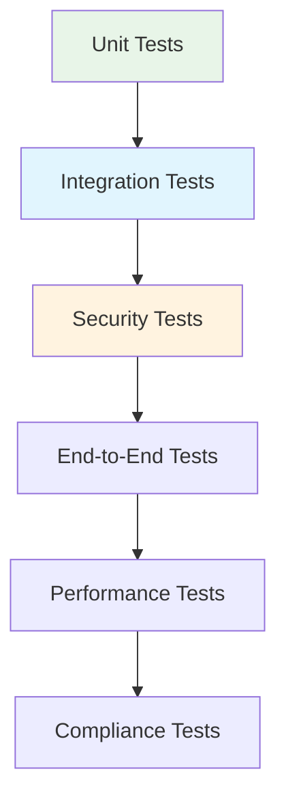

# Testing Strategy: Advanced Secrets Management System

## 🎯 Testing Overview

The Advanced Secrets Management System requires comprehensive testing to ensure security, reliability, and compatibility across multiple secrets managers and SSH key sources.

## 🧪 Testing Architecture



## 🔬 Unit Testing Strategy

### Core Component Testing

```go
// Secrets Manager Tests
func TestVaultManager_GetSecret(t *testing.T) {
    tests := []struct {
        name           string
        key            string
        mockResponse   *vaultapi.Secret
        expectedResult *SecretValue
        expectedError  string
    }{
        {
            name: "successful secret retrieval",
            key:  "database-password",
            mockResponse: &vaultapi.Secret{
                Data: map[string]interface{}{
                    "data": map[string]interface{}{
                        "value": "secure-password-123",
                    },
                },
            },
            expectedResult: &SecretValue{
                Value: "secure-password-123",
                Metadata: map[string]string{
                    "source": "vault",
                },
            },
        },
        {
            name:          "secret not found",
            key:           "non-existent-key",
            expectedError: "secret not found",
        },
    }
    // Test implementation...
}

// SSH Key Registry Tests
func TestSSHKeyRegistry_ValidateKey(t *testing.T) {
    tests := []struct {
        name          string
        key           SSHKey
        expectedError string
    }{
        {
            name: "valid RSA key",
            key: SSHKey{
                Key:  "ssh-rsa AAAAB3NzaC1yc2EAAAADAQABAAABgQC... user@host",
                Type: "ssh-rsa",
            },
        },
        {
            name: "invalid key format",
            key: SSHKey{
                Key: "invalid-key-format",
            },
            expectedError: "invalid SSH key format",
        },
    }
    // Test implementation...
}
```

### Cache Layer Testing

```go
func TestSecretsCache_SetAndGet(t *testing.T) {
    cache := NewSecretsCache(&CacheConfig{
        DefaultTTL: 5 * time.Minute,
        MaxSize:    100,
    })
    
    secret := &SecretValue{
        Value: "test-secret-value",
    }
    
    // Test cache operations
    cache.Set("test-key", secret, time.Minute)
    cachedSecret, found := cache.Get("test-key")
    
    assert.True(t, found)
    assert.Equal(t, secret.Value, cachedSecret.Value)
}
```

## 🔗 Integration Testing Strategy

### Secrets Manager Integration

```go
func TestVaultIntegration(t *testing.T) {
    if testing.Short() {
        t.Skip("Skipping integration test in short mode")
    }
    
    // Start Vault dev server for testing
    vaultContainer := StartVaultDevServer(t)
    defer vaultContainer.Stop()
    
    manager := NewVaultManager(&VaultConfig{
        Address: vaultContainer.GetAddress(),
        Auth: AuthConfig{
            Type:  "token",
            Token: vaultContainer.GetRootToken(),
        },
    })
    
    // Test CRUD operations
    testSecret := &SecretValue{Value: "test-value"}
    
    err := manager.SetSecret(context.Background(), "test-key", testSecret)
    assert.NoError(t, err)
    
    retrieved, err := manager.GetSecret(context.Background(), "test-key")
    assert.NoError(t, err)
    assert.Equal(t, testSecret.Value, retrieved.Value)
}

func TestAWSSecretsManagerIntegration(t *testing.T) {
    // Use LocalStack for testing AWS integration
    localstack := StartLocalStackContainer(t)
    defer localstack.Stop()
    
    manager := NewAWSSecretsManager(&AWSConfig{
        Region:   "us-east-1",
        Endpoint: localstack.GetEndpoint(),
    })
    
    // Test AWS Secrets Manager operations
}
```

### SSH Key Source Integration

```go
func TestGitHubOrgIntegration(t *testing.T) {
    if os.Getenv("GITHUB_API_TOKEN") == "" {
        t.Skip("No GitHub API token provided")
    }
    
    source := &GitHubOrgSource{
        config: &GitHubOrgConfig{
            Organization: os.Getenv("GITHUB_TEST_ORG"),
            APIToken:     os.Getenv("GITHUB_API_TOKEN"),
        },
    }
    
    keys, err := source.GetKeys(context.Background())
    assert.NoError(t, err)
    assert.NotEmpty(t, keys)
    
    // Validate key formats
    for _, key := range keys {
        assert.NotEmpty(t, key.Key)
        assert.NotEmpty(t, key.Fingerprint)
    }
}
```

## 🛡️ Security Testing Strategy

### Authentication Security Tests

```go
func TestAuthenticationSecurity(t *testing.T) {
    tests := []struct {
        name        string
        authConfig  AuthConfig
        shouldFail  bool
    }{
        {
            name: "valid token",
            authConfig: AuthConfig{
                Type:  "token",
                Token: "valid-token",
            },
            shouldFail: false,
        },
        {
            name: "invalid token",
            authConfig: AuthConfig{
                Type:  "token",
                Token: "invalid-token",
            },
            shouldFail: true,
        },
    }
    // Test implementation...
}

func TestSSHKeyValidationSecurity(t *testing.T) {
    registry := &SSHKeyRegistry{}
    
    // Test malicious key injection attempts
    maliciousKeys := []string{
        "ssh-rsa AAAAB... user@host; rm -rf /",
        "ssh-rsa invalid-base64-data user@host",
        "ssh-dss AAAAB3NzaC1kc3M... user@host", // Weak DSA
    }
    
    for _, keyStr := range maliciousKeys {
        key := SSHKey{Key: keyStr}
        err := registry.validateSSHKey(key)
        assert.Error(t, err)
    }
}
```

### Encryption Security Tests

```go
func TestEncryptionAtRest(t *testing.T) {
    encryptionKey := make([]byte, 32)
    rand.Read(encryptionKey)
    
    encManager := NewEncryptionManager(encryptionKey)
    
    // Test data encryption
    sensitiveData := "super-secret-password"
    encrypted, err := encManager.Encrypt(context.Background(), []byte(sensitiveData))
    assert.NoError(t, err)
    
    // Verify no plaintext in encrypted data
    assert.NotContains(t, string(encrypted.EncryptedData), sensitiveData)
    
    // Test decryption
    decrypted, err := encManager.Decrypt(context.Background(), encrypted)
    assert.NoError(t, err)
    assert.Equal(t, sensitiveData, string(decrypted))
    
    // Test tamper detection
    tampered := *encrypted
    tampered.EncryptedData[0] ^= 0x01
    
    _, err = encManager.Decrypt(context.Background(), &tampered)
    assert.Error(t, err)
}
```

## 🚀 End-to-End Testing Strategy

### Complete Workflow Tests

```go
func TestE2ESecretsWorkflow(t *testing.T) {
    // Setup test environment with multiple managers
    testEnv := SetupTestEnvironment(t)
    defer testEnv.Cleanup()
    
    resolver := NewSecretsResolver(&ResolverConfig{
        Managers: []ManagerConfig{
            {Type: "vault", Priority: 1, Config: testEnv.VaultConfig},
            {Type: "aws-secrets-manager", Priority: 2, Config: testEnv.AWSConfig},
        },
    })
    
    // Test primary manager
    testSecret := &SecretValue{Value: "e2e-test-value"}
    
    err := testEnv.VaultManager.SetSecret(context.Background(), "test-key", testSecret)
    assert.NoError(t, err)
    
    retrieved, err := resolver.ResolveSecret(context.Background(), "test-key")
    assert.NoError(t, err)
    assert.Equal(t, testSecret.Value, retrieved.Value)
    
    // Test fallback scenario
    testEnv.StopVault()
    
    err = testEnv.AWSManager.SetSecret(context.Background(), "fallback-key", testSecret)
    assert.NoError(t, err)
    
    retrieved, err = resolver.ResolveSecret(context.Background(), "fallback-key")
    assert.NoError(t, err)
    assert.Equal(t, testSecret.Value, retrieved.Value)
}
```

## 📊 Performance Testing Strategy

### Load Testing

```bash
#!/bin/bash
# Performance test script

# Concurrent secret resolution test
sc secrets perf-test \
  --concurrent-requests 100 \
  --secrets-per-request 50 \
  --duration 10m \
  --managers vault,aws,azure

# SSH key refresh performance
sc secrets ssh-key-perf-test \
  --sources github-org,file,url \
  --concurrent-sources 5 \
  --duration 5m
```

### Cache Performance

```go
func TestCachePerformance(t *testing.T) {
    cache := NewSecretsCache(&CacheConfig{
        MaxSize:    1000,
        DefaultTTL: time.Hour,
    })
    
    // Test cache hit performance
    start := time.Now()
    for i := 0; i < 10000; i++ {
        key := fmt.Sprintf("perf-test-%d", i%100) // 1% unique keys
        cache.Get(key)
    }
    elapsed := time.Since(start)
    
    // Should achieve >80% cache hit rate
    hitRate := cache.GetStats().HitRate
    assert.Greater(t, hitRate, 0.8)
    
    // Should complete within performance target
    assert.Less(t, elapsed, 100*time.Millisecond)
}
```

## 🏥 Health Check Testing

### System Health Validation

```go
func TestHealthChecks(t *testing.T) {
    healthChecker := NewHealthChecker(&HealthConfig{
        Checks: []HealthCheckConfig{
            {Name: "vault-connectivity", Type: "secrets_manager"},
            {Name: "aws-connectivity", Type: "secrets_manager"},
            {Name: "ssh-key-sources", Type: "ssh_keys"},
        },
    })
    
    status := healthChecker.CheckHealth(context.Background())
    
    assert.Equal(t, "healthy", status.Overall)
    for _, check := range status.Checks {
        assert.True(t, check.Healthy)
    }
}
```

## 🔍 Test Environment Setup

### Docker Test Environment

```yaml
# docker-compose.test.yml
version: '3.8'
services:
  vault:
    image: vault:latest
    environment:
      VAULT_DEV_ROOT_TOKEN_ID: test-token
      VAULT_DEV_LISTEN_ADDRESS: 0.0.0.0:8200
    ports:
      - "8200:8200"
      
  localstack:
    image: localstack/localstack:latest
    environment:
      SERVICES: secretsmanager
      DEBUG: 1
    ports:
      - "4566:4566"
      
  postgres:
    image: postgres:13
    environment:
      POSTGRES_PASSWORD: test-password
    ports:
      - "5432:5432"
```

### Test Data Management

```go
type TestDataManager struct {
    vaultClient *vaultapi.Client
    awsClient   *secretsmanager.Client
    testSecrets map[string]*SecretValue
}

func (tdm *TestDataManager) SeedTestData() error {
    // Populate test secrets across different managers
    for key, secret := range tdm.testSecrets {
        // Add to Vault
        err := tdm.storeInVault(key, secret)
        if err != nil {
            return err
        }
        
        // Add to AWS Secrets Manager
        err = tdm.storeInAWS(key, secret)
        if err != nil {
            return err
        }
    }
    return nil
}
```

## ✅ Test Coverage Requirements

### Coverage Targets

```yaml
coverage_requirements:
  unit_tests:
    line_coverage: ">95%"
    branch_coverage: ">90%"
    
  integration_tests:
    secrets_managers: "100%"
    ssh_key_sources: "100%"
    authentication_methods: "100%"
    
  security_tests:
    encryption_algorithms: "100%"
    authentication_flows: "100%"
    input_validation: ">95%"
    
  e2e_tests:
    critical_workflows: "100%"
    failure_scenarios: ">90%"
    performance_requirements: "100%"
```

### Continuous Testing

```yaml
testing_pipeline:
  pr_validation:
    - unit_tests
    - security_tests
    - integration_tests
    
  merge_validation:
    - full_test_suite
    - performance_tests
    - e2e_tests
    
  nightly_tests:
    - extended_integration_tests
    - security_penetration_tests
    - performance_regression_tests
    
  release_validation:
    - comprehensive_test_suite
    - compliance_validation
    - security_audit
```

---

**Status**: This testing strategy provides comprehensive validation for the Advanced Secrets Management System, ensuring security, performance, and reliability across all supported secrets managers and SSH key sources.
