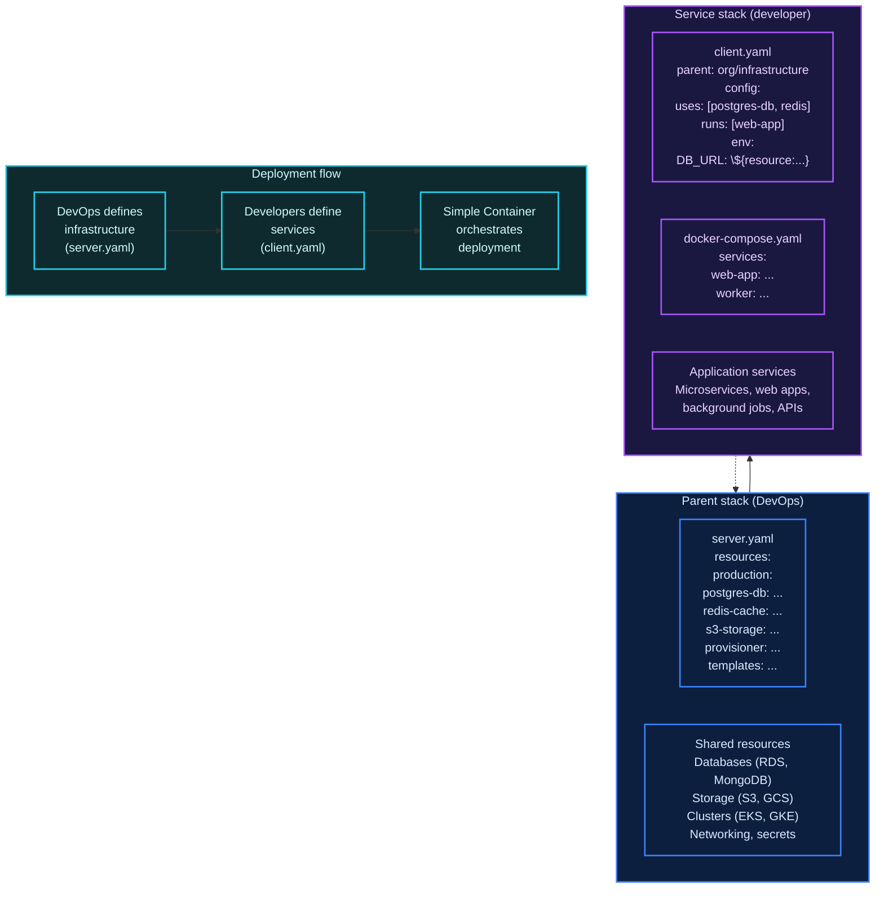

# Parent stacks and service stacks

Simple Container splits a deployment into two layers:

- A **parent stack** (`server.yaml`) defines shared infrastructure — databases,
  message queues, secret backends, DNS registrar, deployment templates. It's
  written and maintained by whoever owns cloud-account state (usually DevOps
  or a platform team).
- A **service stack** (`client.yaml`) defines one service that consumes the
  parent. It references its parent by name, names which shared resources it
  uses, and ships a runtime image plus configuration. It's written and
  maintained by the team owning that service.

This separation is the load-bearing design decision. Everything else in SC
follows from it.

## Architecture overview


```mermaid
graph TB
    subgraph PS ["Parent stack (DevOps)"]
        SY["server.yaml<br/>resources:<br/>  production:<br/>    postgres-db: ...<br/>    redis-cache: ...<br/>    s3-storage: ...<br/>provisioner: ...<br/>templates: ..."]
        IR["Shared resources<br/>Databases (RDS, MongoDB)<br/>Storage (S3, GCS)<br/>Clusters (EKS, GKE)<br/>Networking, secrets"]
    end

    subgraph SS ["Service stack (developer)"]
        CY["client.yaml<br/>parent: org/infrastructure<br/>config:<br/>  uses: [postgres-db, redis]<br/>  runs: [web-app]<br/>  env:<br/>    DB_URL: \${resource:...}"]
        DC["docker-compose.yaml<br/>services:<br/>  web-app: ...<br/>  worker: ..."]
        AS["Application services<br/>Microservices, web apps,<br/>background jobs, APIs"]
    end

    subgraph DF ["Deployment flow"]
        S1["DevOps defines<br/>infrastructure<br/>(server.yaml)"]
        S2["Developers define<br/>services<br/>(client.yaml)"]
        S3["Simple Container<br/>orchestrates<br/>deployment"]

        S1 --> S2
        S2 --> S3
    end

    PS --> SS
    SS -.-> PS

    classDef parentStack fill:#0c1f3f,stroke:#3b82f6,stroke-width:2px,color:#dbeafe
    classDef serviceStack fill:#1a1740,stroke:#a855f7,stroke-width:2px,color:#e9d5ff
    classDef deployFlow fill:#0f2a2e,stroke:#22d3ee,stroke-width:2px,color:#cffafe

    class PS,SY,IR parentStack
    class SS,CY,DC,AS serviceStack
    class DF,S1,S2,S3 deployFlow
```

## What's in a parent stack

A parent stack owns cloud-account state. Concretely:

- Cloud infrastructure — Kubernetes clusters, ECS clusters, databases, storage, networking
- Secret backends (AWS Secrets Manager, GCP Secret Manager, Kubernetes Secrets)
- Centralized state (consistent across environments)
- Shared resources that multiple services use (databases, queues, registrars)

The parent stack changes only when infrastructure changes — new database engine,
additional environment, new cloud account. It does *not* change for each new
service deployment.

## What's in a service stack

A service stack owns one service. It declares:

- Which parent stack it belongs to (`parent: <name>`)
- Which shared resources it uses (`uses: [postgres-db, redis]`)
- What runs (container image, docker-compose, or static bundle)
- Per-environment configuration and secrets

A service stack changes every time the service is updated. It never touches
cloud-account state directly — that's the parent's job.

## Comparison

| Aspect | Parent stack | Service stack |
|---|---|---|
| **Purpose** | Defines shared infrastructure | Defines one service deployment |
| **Owned by** | Platform / DevOps | Application developers |
| **Config file** | `server.yaml` | `client.yaml` |
| **Changes when** | Infrastructure topology changes (new DB, env, cluster) | Service code or config changes |
| **Includes** | Databases, queues, registrars, templates, secret backends | Image, runtime config, env vars, resource references |

## Resource sharing

The parent stack's `resources` section can define multiple instances of the
same resource type, and child stacks pick which one they want via `uses`.
A common pattern: a shared resource pool for standard tenants, dedicated
resources for premium tenants.

```yaml
# server.yaml
resources:
  resources:
    production:
      resources:
        mongodb-shared-us:
          type: mongodb-atlas
          config:
            clusterName: shared-us
            instanceSize: M30
        mongodb-enterprise-1:
          type: mongodb-atlas
          config:
            clusterName: enterprise-1
            instanceSize: M80
```

```yaml
# client.yaml — standard tenant
stacks:
  customer-acme:
    parent: org/infrastructure
    config:
      uses: [mongodb-shared-us]

# client.yaml — enterprise tenant
stacks:
  customer-megacorp:
    parent: org/infrastructure
    config:
      uses: [mongodb-enterprise-1]
```

Switching a tenant between resource pools is a one-line `client.yaml` change.
The migration happens at the next deploy.

Note: the nesting in `resources` is intentional — three levels deep
(`resources.resources.<env>.resources.<resourceName>`). The outer
`resources` is the per-stack container; the inner `resources` is the
per-environment map; the innermost is the resource map. See
[supported-resources](../reference/supported-resources.md) for the full schema.

## Programmatic access

Both file shapes are stable: SC's Go types in `pkg/api/` (`ServerDescriptor`,
`ClientDescriptor`) define the canonical schema. Tools that emit SC YAML
programmatically can target these structures directly. [Forge](https://simple-forge.com)
consumes the same primitives via the MCP server — when a Forge workflow run
needs a deployment, it produces `server.yaml` / `client.yaml` of the same
shape documented here.
